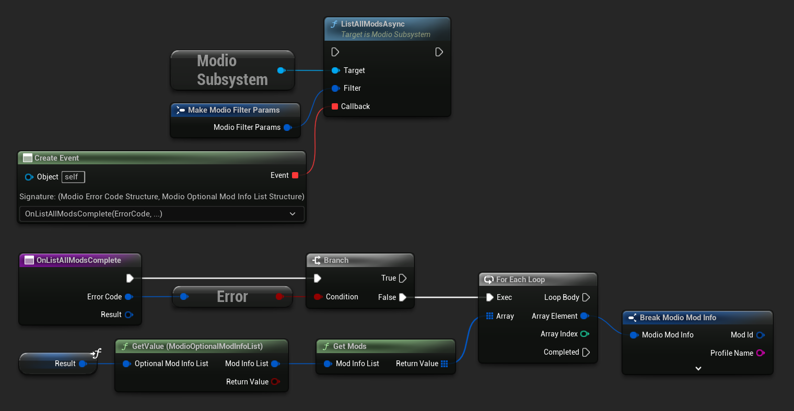
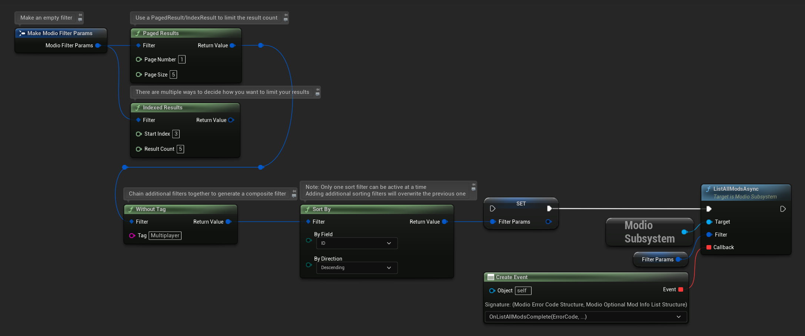

import Tabs from '@theme/Tabs';
import TabItem from '@theme/TabItem';

After [initializing the plugin](initialization) and [authenticating a user](user-authentication), you can query the available mods using [`ListAllModsAsync`](/unreal/refdocs/#listallmodsasync). 

`ListAllModsAsync` supports filtering by name, tag, author, mature content, and more using [`ModioFilterParams`](/unreal/refdocs/#modiofilterparams).  You can sort results as specified by `ModioSortFieldType`, and request paginated or indexed results. By default, `ModioFilterParams` asks for the first 100 results (the maximum number returnable in a query) sorted by `ModioModID`.

<Tabs group-id="languages">
  <TabItem value="blueprint" label="Blueprint">
The primary way this is done is through [K2_ListAllModsAsync](/unreal/refdocs/#listallmodsasync).



To search for a specific query string, sort in a different order, or combine different filters, you can use a [ModioFilterParams](/unreal/refdocs/#modiofilterparams) object like this:



  </TabItem>
  <TabItem value="c++" label="C++" default>
 ```cpp
void UModioManagerSubsystem::ListAllMods()
{
	if (UModioSubsystem* Subsystem = GEngine->GetEngineSubsystem<UModioSubsystem>())
	{
		FModioFilterParams Filter;
		// Build the filter by chaining together multiple calls
		Filter.PagedResults(1, 5).IndexedResults(3, 5).WithTags("Multiplayer").SortBy(EModioSortFieldType::ID, EModioSortDirection::Descending);

		Subsystem->ListAllModsAsync(Filter, FOnListAllModsDelegateFast::CreateUObject(this, &UModioManagerSubsystem::OnListAllModsComplete));
	}
}

void UModioManagerSubsystem::OnListAllModsComplete(FModioErrorCode ErrorCode, TOptional<FModioModInfoList> OptionalModList)
{
	// Ensure ListAllModsAsync was successful
	if (!ErrorCode)
	{
		// ModList is guaranteed to be valid if there is no error
		TArray<FModioModInfo> ModInfoArray = OptionalModList.GetValue().GetRawList();

		// Do something with ModInfoArray

		// You can use OptionalModList().GetValue().Paged related methods to make further paginated requests if required
	}
}

 ```
  </TabItem>
</Tabs>