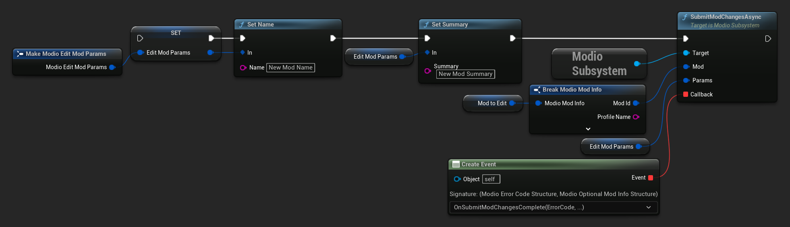

import Tabs from '@theme/Tabs';
import TabItem from '@theme/TabItem';

Mod details can be edited in-game using [`SubmitModChangesAsync`](/unreal/refdocs/#submitmodchangesasync-1).  This function allows you to edit multiple parameters with a single call.  It takes a [`ModioModID`](/unreal/refdocs/#modiomodid) of the mod to edit, a [`ModioEditModParams`](/unreal/refdocs/#modioeditmodparams) containing one or more parameters to be altered, and a callback that will contain an optional updated [`ModioModInfo`](/unreal/refdocs/#modiomodinfo) object on success.

:::note
To update the mod file itself, use [**`SubmitNewModFileForMod`**](/unreal/refdocs/#submitnewmodfileformod).  See **[Submitting a file for a mod](submit-mods#submitting-a-file-for-a-mod)** for more information.
:::

<Tabs group-id="languages">
  <TabItem value="blueprint" label="Blueprint">


  </TabItem>
  <TabItem value="c++" label="C++" default>

Note that it would be more appropriate to pass an [`FModioEditModParams`](/unreal/refdocs/#modioeditmodparams) with your desired parameters into `UModioManagerSubsystem::EditMod()`. This example shows their creation within the function to illustrate their use.

 ```cpp
void UModioManagerSubsystem::EditMod(FModioModID ModID)
{
	if (UModioSubsystem* Subsystem = GEngine->GetEngineSubsystem<UModioSubsystem>())
	{
		FModioEditModParams EditParams;

		// Add one or more parameters to edit
		EditParams.Name = TEXT("My Edited Mod Name");
		EditParams.Summary = TEXT("My edited summary");
		
		Subsystem->SubmitModChangesAsync(ModID, EditParams, FOnGetModInfoDelegateFast::CreateUObject(this, &UModioManagerSubsystem::OnSubmitModChangesComplete));
	}
}

void UModioManagerSubsystem::OnSubmitModChangesComplete(FModioErrorCode ErrorCode, FModioOptionalModInfo UpdatedInfo)
{
	if (!ErrorCode)
	{
		// Mod successfully updated. Can display new details from UpdatedInfo etc.
	}
}

```

  </TabItem>
</Tabs>