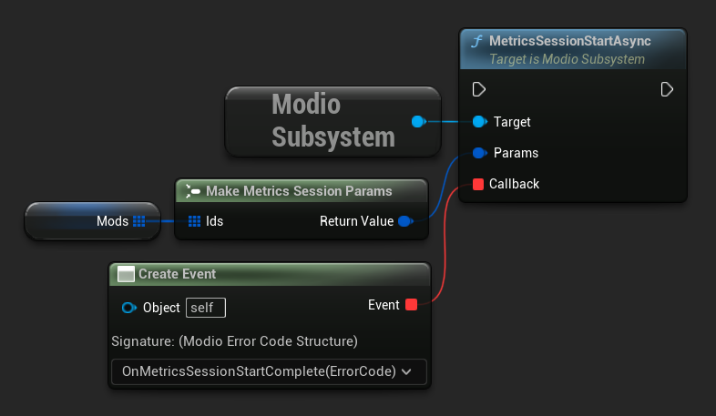
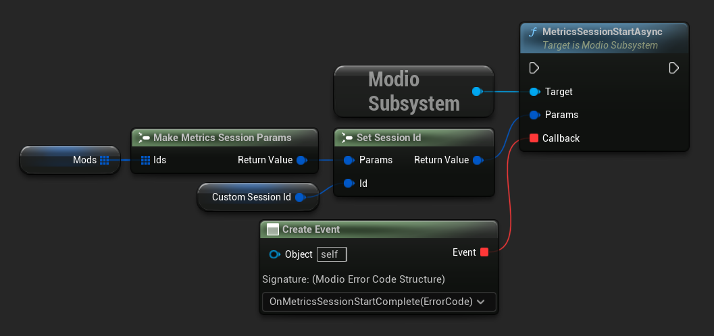
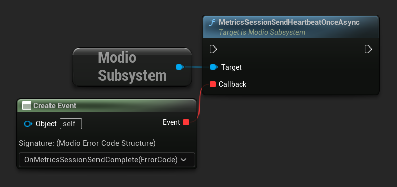
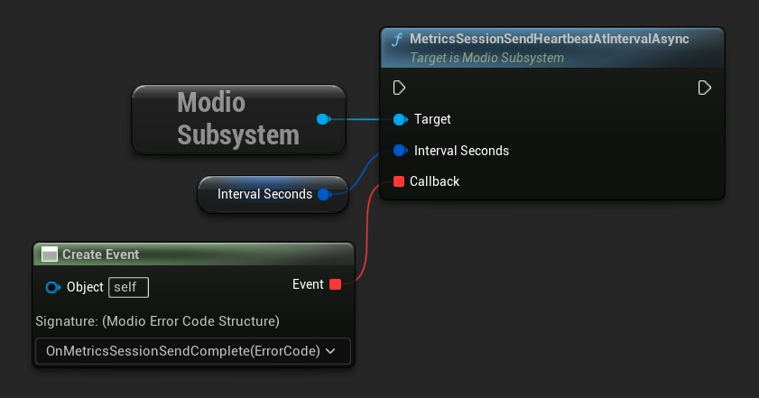
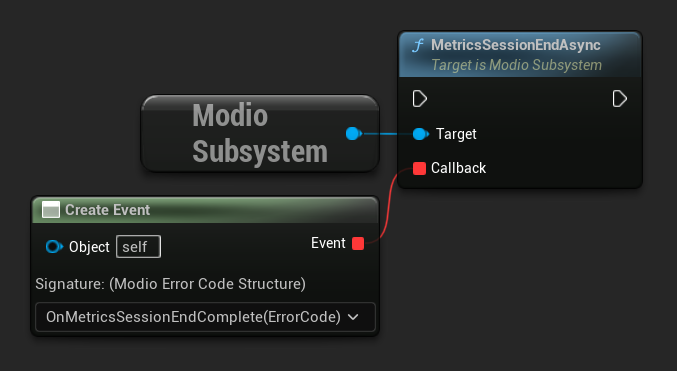

import Tabs from '@theme/Tabs';
import TabItem from '@theme/TabItem';

The mod.io Unreal Engine Plugin supports all of the mod.io metrics features, allowing you to start a metrics play sesion, keeping that session alive via a heartbeat (automatically called, or manually handled) and then ending that session. Metric sessions allow you to track which mods your players interact with most frequently. Visit https://docs.mod.io/metrics/ for an overview of the mod.io metrics system.

:::note
Running metrics play sessions is a premium feature. If you are interested in mod.io premium features, please contact developers@mod.io.
:::

The Metrics session functionality is all accessible through the `ModioSubsystem` class.

Metrics based on the platform and portal, are transparently taken care of with no additional consideration needed when using the SDK.

#### Initialization

The mod.io metrics features are enabled as part of generating a Metrics Secret Key your API settings in your game dashboard, e.g. https://mod.io/g/game-name/admin/api-key. Once this key has been generated, you need to pass it in as an ExtendedInitializationParameters entry in your InitializeOptions when Initializing the mod.io SDK, e.g.:


```cpp
FModioInitializeOptions initializeOptions;
initializeOptions.ExtendedInitializationParameters.Add("MetricsSecretKey", "00000000-1111-2222-3333-444444444444");
```

Failing to set up the Metrics Secret Key will result in a `SessionNotInitialized`` error being returned when using the metrics functionality.

#### Starting a Metrics Session

You can call [MetricsSessionStartAsync](/unreal/refdocs/#metricssessionstartasync) to start a new session tracking the usage of mods in the context of your game. You'll notice that `MetricsSessionStartAsync` takes a [MetricsSessionParams](/unreal/refdocs/#modiometricssessionparams) struct as its parameter. This contains an optional Session Id, as well as a required vector of mods to track.

:::note
If a Session Id is not provided, a random one will be created for you.
:::

<Tabs group-id="languages">
  <TabItem value="blueprint" label="Blueprint">

  

:::note
Use the `SetSessionId` node if you want to associate your own Id with this session.
:::

  

  </TabItem>
  <TabItem value="c++" label="C++" default>

```cpp
FModioMetricsSessionParams Params = FModioMetricsSessionParams(ModIds);

void UModioManager::MetricsSessionStart(const FModioMetricsSessionParams& Params)
{
	GEngine->GetEngineSubsystem<UModioSubsystem>()->MetricsSessionStartAsync(
		Params, FOnErrorOnlyDelegateFast::CreateUObject(this, &UModioManager::MetricsSessionStartCallback));
}
```

</TabItem>
</Tabs>

The Metrics Session Params accepts an optional Session Id in the form of a `FModioGuid` which you may want to use to associate the new session with any supplementary telemetry you are gathering in your game.

#### Metrics heartbeat

To ensure that the session is kept alive, a heartbeat is required to be submitted at most every 5 minutes. We recommend doing this a bit earlier than the threshold to ensure you do not miss the window.

There are two methods provided to control the behaviour of the heart beat, [MetricsSessionSendHeartbeatOnceAsync](/unreal/refdocs/#metricssessionsendheartbeatonceasync) which you can call at your desired precision, as well as a single call and forget [MetricsSessionSendHeartbeatAtIntervalAsync](/unreal/refdocs/#metricssessionsendheartbeatatintervalasync) with a desired interval.

Calling `MetricsSessionSendHeartbeatOnceAsync` will submit a single heartbeat, and return an error code if something went wrong. If no error has occured, the heartbeat has been successfully sent.

<Tabs group-id="languages">
  <TabItem value="blueprint" label="Blueprint">


  

  </TabItem>
  <TabItem value="c++" label="C++" default>

```cpp
void UModioManager::MetricsSessionHeartbeat()
{
	GEngine->GetEngineSubsystem<UModioSubsystem>()->MetricsSessionSendHeartbeatOnceAsync(
		FOnErrorOnlyDelegateFast::CreateUObject(this, &UModioManager::MetricsSessionHeartbeatCallback));
}
```

</TabItem>
</Tabs>

Calling `MetricsSessionSendHeartbeatAtIntervalAsync` requires a parameter with the desired interval frequency in seconds. An error code will be returned if something went wrong, otherwise you will receive a false-y error if the interval loop has been shut down successfully (such as ending a session).

<Tabs group-id="languages">
  <TabItem value="blueprint" label="Blueprint">


  

  </TabItem>
  <TabItem value="c++" label="C++" default>

```cpp
const FModioUnsigned64 IntervalSeconds(150);

void UModioManager::MetricsSessionHeartbeat(const FModioUnsigned64& IntervalSeconds)
{
	GEngine->GetEngineSubsystem<UModioSubsystem>()->MetricsSessionSendHeartbeatAtIntervalAsync(
		IntervalSeconds, 
		FOnErrorOnlyDelegateFast::CreateUObject(this, &UModioManager::MetricsSessionHeartbeatCallback));
}
```

</TabItem>
</Tabs>

#### Ending a Metrics Session

To complete a session, for example when finishing a match, or quitting out of your game, you can call [MetricsSessionEndAsync](/unreal/refdocs/#metricssessionendasync).
As with the other calls, you will receive an error if anything has gone wrong, otherwise the operation successfully completed.

<Tabs group-id="languages">
  <TabItem value="blueprint" label="Blueprint">


  

  </TabItem>
  <TabItem value="c++" label="C++" default>


```cpp
void UModioManager::MetricsSessionHeartbeat()
{
	GEngine->GetEngineSubsystem<UModioSubsystem>()->MetricsSessionEndAsync(
		FOnErrorOnlyDelegateFast::CreateUObject(this, &UModioManager::MetricsSessionHeartbeatCallback));
}
```

</TabItem>
</Tabs>