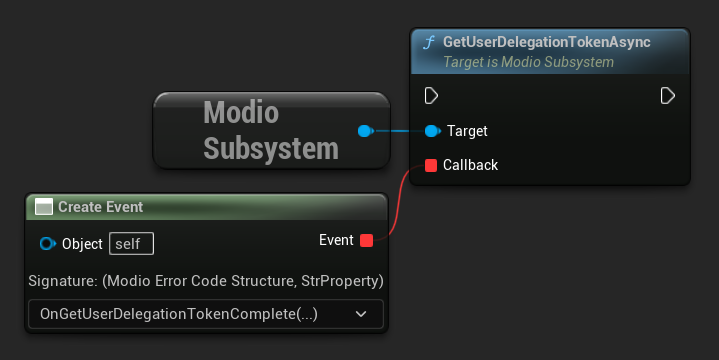

import Tabs from '@theme/Tabs';
import TabItem from '@theme/TabItem';

The mod.io Unreal Engine Plugin supports a range of monetization features, allowing you to sell a per-game virtual currency to your players that they can use to purchase mods, with a share of the revenue split between creators and your studio. An overview of the mod.io monetization system is available [here](/monetization/).

Every platform requires specific setup for monetization features to work, particularly with respect to the virtual currency configuration and API calls.  The following documentation is generically applicable.  Platform-specific information is available in the relevant [platform documentation section](/platforms/).

## Initialization

The mod.io monetization features are enabled during the onboarding process on your [game profile](https://mod.io/g). 

Ensure that you have set the appropriate `Portal` when [initializing the plugin](initialization). For instance, on Steam you must initialize with `EModioPortal::Steam` to redeem entitlements for Steam.

## Getting the user's wallet

On startup, you can make a call to `UModioSubsystem::GetUserWalletBalanceAsync` to get the balance of the current user's wallet. If no wallet exists for the user, one will be automatically created for them. This call returns the user's wallet balance for the current game. 

The only time you need to make this call is on start-up.  We recommend that you cache the value of this result in your game code rather than making consistent calls to `UModioSubsystem::GetUserWalletBalanceAsync`, and update your local state from the return values of other calls that affect wallet balance.

<Tabs group-id="languages">
  <TabItem value="blueprint" label="Blueprint">

  

  </TabItem>
  <TabItem value="c++" label="C++" default>

 ```cpp
void UModioManagerSubsystem::GetUserWallet()
{
	if (UModioSubsystem* Subsystem = GEngine->GetEngineSubsystem<UModioSubsystem>())
	{
		Subsystem->GetUserWalletBalanceAsync(FOnGetUserWalletBalanceDelegate::CreateUObject(this, &UModioManagerSubsystem::OnGetUserWalletComplete));
	}
}

void UModioManagerSubsystem::OnGetUserWalletComplete(FModioErrorCode ErrorCode, FModioOptionalUInt64 WalletBalance)
{
	if (!ErrorCode)
	{
		// Wallet balance successfully retrieved
	}
}
```

</TabItem>
</Tabs>

## Querying mods

As part `UModioSubsystem::ListAllModsAsync`, you can include an additional filter for whether you list paid mods. By default, only free mods are shown.  Set `RevenueType` on the `ModioFilterParams` object passed to `UModioSubsystem::ListAllModsAsync` to include free and paid content, or just paid content. All mods returned will have a `Price` property, indicating the virtual currency price that must be paid to purchase that mod.

Filtering for Paid/Unpaid content is not currently exposed to Blueprint.

## Purchasing mods

Call `UModioSubsystem::PurchaseModAsync` to purchase a specified mod. `PurchaseModAsync` takes two parameters: the `ModioModID` of the mod to purchase, and the `ExpectedPrice`, which is the price displayed to the user from `UModioSubsystem::ListAllModsAsync`. You must include this parameter for safety so the user is not charged more or less than the price displayed to them, in case the price of the mod has changed between the call to `ListAllModsAsync` and purchase time.

Once a mod is purchased, it is automatically subscribed to for the user.

You should validate that the user has enough virtual currency to make the purchase by comparing it to the balance you received from `UModioSubsystem::GetUserWalletBalanceAsync`. This is purely for user experience (e.g. for graying out the purchase button in the UI, or upselling the user a virtual currency pack); `UModioSubsystem::PurchaseModAsync` will return an error if the user has insufficient funds in their wallet.

An updated wallet balance (with the purchase amount subtracted) is returned in the callback of `UModioSubsystem::PurchaseModAsync`.

<Tabs group-id="languages">
  <TabItem value="blueprint" label="Blueprint">

  

  </TabItem>
  <TabItem value="c++" label="C++" default>

 ```cpp
void UModioManagerSubsystem::PurchaseMod(FModioModID ModId, FModioUnsigned64 ExpectedPrice)
{
	if (UModioSubsystem* Subsystem = GEngine->GetEngineSubsystem<UModioSubsystem>())
	{
		Subsystem->PurchaseModAsync(ModId, ExpectedPrice, FOnPurchaseModDelegate::CreateUObject(this, &UModioManagerSubsystem::OnPurchaseModComplete));
	}
}

void UModioManagerSubsystem::OnPurchaseModComplete(FModioErrorCode ErrorCode, FModioOptionalTransactionRecord Transaction)
{
	if (!ErrorCode)
	{
		// Mod purchase successful
	}
}
```

</TabItem>
</Tabs>

## Showing user purchases

While purchased mods are automatically subscribed and installed at purchase time, the user can freely unsubscribe and uninstall purchased mods and they and they will remain owned and purchased by the user. They must re-subscribe to the mod to have it re-installed. Use `UModioSubsystem::FetchUserPurchasesAsync` to fetch an updated list of a user's purchased mods from the server. After a successful call, you can then display the user's purchased mods with `UModioSubsystem::QueryUserPurchasedMods`, allowing re-subscription as desired.

<Tabs group-id="languages">
  <TabItem value="blueprint" label="Blueprint">

  

  </TabItem>
  <TabItem value="c++" label="C++" default>

 ```cpp
void UModioManagerSubsystem::FetchUserPurchases()
{
	if (UModioSubsystem* Subsystem = GEngine->GetEngineSubsystem<UModioSubsystem>())
	{
		Subsystem->FetchUserPurchasesAsync(FOnFetchUserPurchasesDelegate::CreateUObject(this, &UModioManagerSubsystem::OnFetchUserPurchasesComplete));
	}
}

void UModioManagerSubsystem::OnFetchUserPurchasesComplete(FModioErrorCode ErrorCode)
{
	if (!ErrorCode)
	{
		// Purchases Successfully Fetched
		if (UModioSubsystem* Subsystem = GEngine->GetEngineSubsystem<UModioSubsystem>())
		{
			// We can now access the list of purchased mods directly
			TMap<FModioModID, FModioModInfo> PurchasedMods = Subsystem->QueryUserPurchasedMods();
		}
	}
}
```

</TabItem>
</Tabs>

## Getting a user delegation token

User delegation tokens can be used by a backend server for S2S (Server to Server) transactions. You can get one for the current user by calling `UModioSubsystem::GetUserDelegationTokenAsync`, the callback for which contains the token as an `FString`.

<Tabs group-id="languages">
  <TabItem value="blueprint" label="Blueprint">


  

  </TabItem>
  <TabItem value="c++" label="C++" default>

 ```cpp
void UModioManagerSubsystem::GetUserDelegationToken()
{
	if (UModioSubsystem* Subsystem = GEngine->GetEngineSubsystem<UModioSubsystem>())
	{
		Subsystem->GetUserDelegationTokenAsync(FOnGetUserDelegationTokenDelegateFast::CreateUObject(this, &UModioManagerSubsystem::OnGetUserDelegationTokenCallback));
	}
}

void UModioManagerSubsystem::OnGetUserDelegationTokenCallback(FModioErrorCode ErrorCode, FString UserDelegationToken)
{
	if (!ErrorCode)
	{
		// Successfully got User Delegation Token
	}
}
```

</TabItem>
</Tabs>


## Listing and Purchasing Premium Currency

The Monetization premium features mod.io includes the ability to show the relevant platform store (where possible), which allows the user to purchase virtual currency, top up their wallet, and purchase Premium UGC all without leaving the game.

While Unreal provides built-in methods for accessing a given platform's storefront, not all platforms are fully supported, and as such the Component UI framework provides an alternative for unsupported platform, with the following logic:


### Displaying the Native Platform Store

The recommended method is to simply call `UModioUISubsystem::RequestShowTokenPurchaseUIWithHandler` which will attempt to show the appropriate Platform Native storefront via Unreal's `IOnlineSubsystem`. This function will return an `EModioOpenStoreResult` indicating whether call succeeded or not.

`FailedInactive` indicates that the Monetization feature is disabled in the base Mod.io plugin settings.

`FailedUnsupportedPlatform` means that the current platform has not implemented its native storefront in the Unreal Engine Online Subsystem, and so you will have to implement your own method for getting and displaying purchasable items. An example/template of this can be found in the ComponentUI reference design, see below for more information.

`FailedUnknown` is a catch-all for other error types, such as inactive online subsystems, network issues, etc, and you should check the relevant logs for any pertinent information.

`Success` means that the platform store UI is being displayed, and you can then listen for the `Callback` to handle any resulting purchases. This `Callback` only indicates whether the Store was opened and closed successfully, not whether the user made a purchase or not. There is also `UModioUISubsystem::RequestShowTokenPurchaseUI` for instances where a Callback is not needed.

<Tabs group-id="languages">
  <TabItem value="blueprint" label="Blueprint">


  

  </TabItem>
</Tabs>

### Displaying Component UI Store Offers

In cases where native store display is not supported, there is a provided template UI component for displaying and listing product offers within the Component UI itself.

Found at `ModioComponentUI/Content/UI/Templates/Default/WBP_ModioDefaultTokenPackBrowser` this Widget provides a framework and example of querying a set of product offers, displaying them, and purchasing them through the platform store.

NOTE: With either the Native or Component UI methods, the refreshing and consumption of purchased Entitlements, as well as the updating of the user's Wallet Balance, is left up to you the developer due to platform limitations.

## Consuming User Entitlements

User Entitlements are virtual currency packs/products that the user can purchase through their relevant platform store. These Entitlements can then be consumed; in the case of virtual currency, adding balance to their mod.io wallet for use purchasing UGC.

Once a user has purchased a virtual currency pack on a given store those entitlements must be consumed before they can be used. To do so you can call `UModioSubsystem::RefreshUserEntitlementsAsync` which takes in `FModioEntitlementParams` and a `FOnRefreshUserEntitlementsDelegateFast` as a Callback, returning an `FModioErrorCode` and `TOptional<FModioEntitlementConsumptionStatusList>` indicating the status of the user’s entitlements.

`FModioEntitlementParams` is to be populated with the Delegation Token received from `UModioSubsystem::GetUserDelegationTokenAsync`.

<Tabs group-id="languages">
	<TabItem value="blueprint" label="Blueprint">
  
	</TabItem>
	<TabItem value="c++" label="C++" default>

```cpp
// Get the relevant platform authentication token prior to making this call.
void UModioManager::RefreshUserEntitlements(const FString& PlatformAuthToken)
{
	if (GEngine->GetEngineSubsystem<UModioSubsystem>())
	{
		FModioEntitlementParams Params;
		Params.ExtendedParams.Add("auth_code", PlatformAuthToken);
		GEngine->GetEngineSubsystem<UModioSubsystem>()->RefreshUserEntitlementsAsync(Params, FOnRefreshUserEntitlementsDelegateFast::CreateUObject(this, &UModioManager::OnRefreshUserEntitlementsCallback));
	}
}

void UModioManager::OnRefreshUserEntitlementsCallback(FModioErrorCode ErrorCode, TOptional<FModioEntitlementConsumptionStatusList> ConsumptionStatusList)
{
	if (ErrorCode == false)
	{
		// Successfully refreshed entitlements.
	}
}
```

</TabItem>
</Tabs>

After entitlements are refreshed successfully any classes properly implementing the `ModioUIWalletBalanceUpdatedEventReceiver` interface will receive the updated balance.

