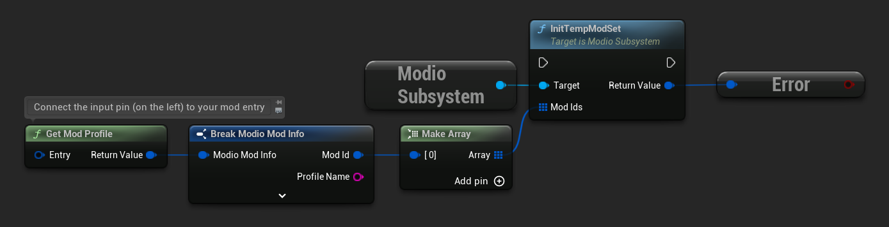

import Tabs from '@theme/Tabs';
import TabItem from '@theme/TabItem';

In some situations, you may want mods to only exist on a temporary basis. For instance, in multiplayer environments where you don't want to subscribe a user to a piece of content. Temporary mod sets allow management of these transient pieces of content separately from subscriptions. Temp mod sets do not require authentication, however mod management must still be enabled.

Temp mods are downloaded to a separate folder from subscriptions, and are not updated or handled when you call `FetchExternalUpdatesAsync`. That means you can prioritize download and installation of temp mods outside of the regular subscription flow.

To use temp mods, you can start a `TempModSet` by calling `InitTempModSet` and passing a list of `ModioModIDs` to be downloaded and extracted. At any time while a `TempModSet` is open, you can call [`AddToTempModSet`](/unreal/refdocs/#addtotempmodset) to add mods to the set.  These will be instantly downloaded and extracted. If you no longer need a mod, you can call [`RemoveFromTempModSet`](/unreal/refdocs/#removefromtempmodset) which will remove the file. Once you have finished with a `TempModSet`, call [`CloseTempModSet`](/unreal/refdocs/#closetempmodset) which will delete all temporary mods. Temporary mods are also deleted the next time you re-initialize the mod.io plugin.

Like regular mods, temp mods can be queried using [`QueryTempModSet`](/unreal/refdocs/#querytempmodset) to get a `ModioModCollectionEntry` with an installation path.

### Installing Temporary Mods

<Tabs group-id="languages">
  <TabItem value="blueprint" label="Blueprint">



  </TabItem>
  <TabItem value="c++" label="C++" default>
 ```cpp
Modio::EnableModManagement([](Modio::ModManagementEvent ModEvent)
{
    if (ModEvent.Status && ModEvent.Event == Modio::ModManagementEvent::EventType::Installed)
    {
        std::cout << "Mod with ID: " << ModEvent.ID << " is installed" << std::endl;
    }
    else 
    {
        std::cout << "Mod with ID: " << ModEvent.ID << " failed to install: " << ModEvent.Status.message() << std::endl;
    }
});

std::vector<Modio::ModID> ModIds = {8, 4, 5};

Modio::InitTempModSet(ModIds);

while(Modio::IsModManagementBusy())
{
    Modio::RunPendingHandlers();
}
```

</TabItem>
</Tabs>

This call will start a `TempModSet` and install mods with IDs 8, 4 and 5.

:::note 
If you add a mod to `TempModSet` that is already subscribed, it will not be downloaded; the player will already have that content. If you try to unsubscribe from it while it's in `TempModSet`, the plugin will wait for it to be removed from `TempModSet` before processing the unsubscribe.
:::
