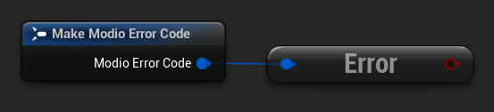
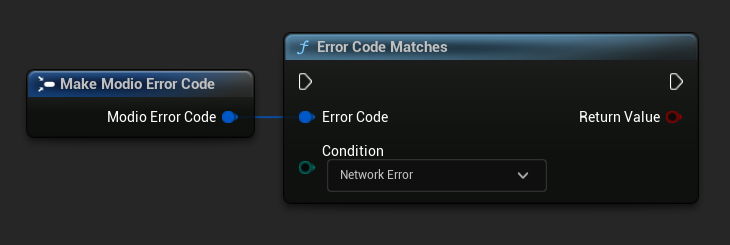
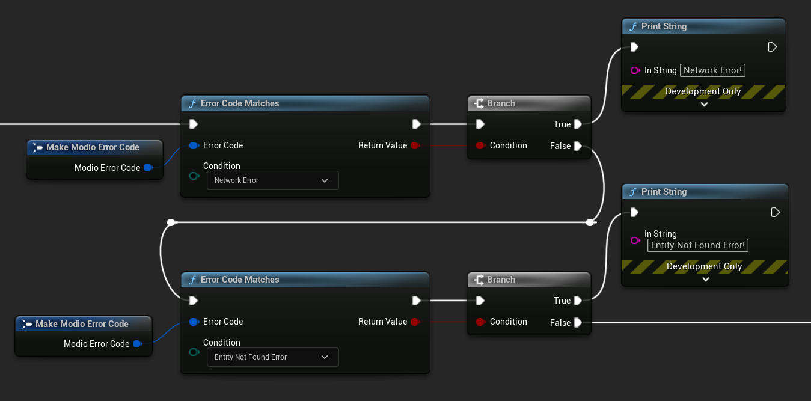
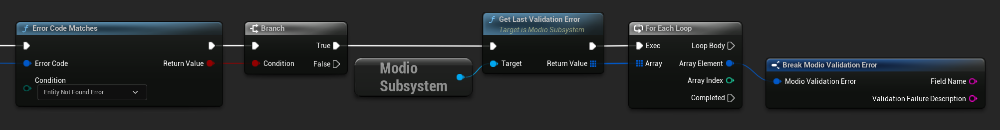

import Tabs from '@theme/Tabs';
import TabItem from '@theme/TabItem';

:::note
Error handling in Blueprint is still undergoing improvement. Please let us know if you have any feedback or suggestions for improving it!
:::

Many of the plugin's functions utilize the [`ModioErrorCode`](/unreal/refdocs/#modioerrorcode) type.  For example, all [async](/unreal/getting-started/plugin-structure/#non-blocking-asynchronous-interface) functions take a `ModioErrorCode` as the first parameter for the function's delegate. This is essentially an opaque wrapper around a numeric error code with a category and an associated string message. 

### Checking for errors

A "truthy" error code represents an error.  In Blueprint, you can check if a `ModioErrorCode` represents a success or failure by using the `IsError` node.


<Tabs group-id="languages">
  <TabItem value="blueprint" label="Blueprint">

  </TabItem>
  <TabItem value="c++" label="C++" default>
 ```cpp
void UModioManagerSubsystem::MyCallback(FModioErrorCode ErrorCode)
{
	if (ErrorCode)
    {
        // Failure
    }
    else
    {
        // Success
    }
}
```
  </TabItem>
</Tabs>

### Inspecting `ModioErrorCode` more deeply

Sometimes this information will be all that is required; just a simple 'success/fail' that you can handle. 

In many cases, however, you will want to perform some degree of inspection on an `ModioErrorCode` to determine specific information about that error - if nothing else, so that you can display a reason for the failure to the end user.

#### Semantic queries

In your application, there are many errors that will likely be handled the same way.  For example, you probably don’t need to handle different network errors in different ways. The semantics of networking errors are largely "try the function again later".

This is where [`ErrorCodeMatches`](/unreal/refdocs/#error-code-matches) comes in. It allows you to query if the error satisfies a particular condition, such as "does this code represent some kind of networking error", without needing to explicitly check the code against all the individual errors in the category.



By querying if an error meets a specific condition, you can focus on handling a family of errors (in this case, network transmission errors) without needing to deal with individual errors within that group. No more manually checking against individual HttpError values, just a single query.

These semantic checks help you to consolidate your error handling into limited set of generic error handlers rather than dealing with each potential outcome individually. 



### Parameter validation errors

Some of the plugin functions may return errors that indicate a parameter or data validation failure. For these cases, the plugin parses the error response from the mod.io API and stores the information about which parameters failed validation until the next network request is performed. If a plugin function returns an error which matches `EModioErrorCondition::InvalidArgsError`, you can call `GetLastValidationError` in your callback to retrieve those errors and display appropriate feedback to the end user. 

