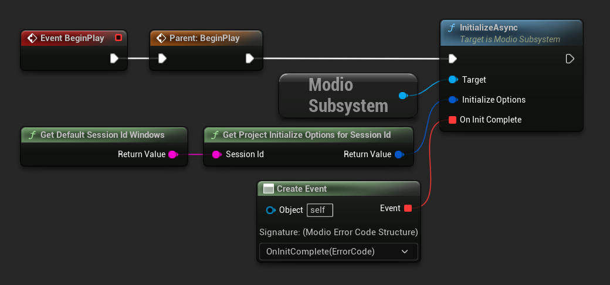
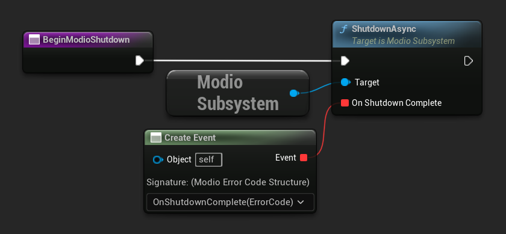

import Tabs from '@theme/Tabs';
import TabItem from '@theme/TabItem';

## Best practices

This guide describes the mod.io Unreal Engine plugin's basic event loop, intialization, and shutdown functions.  Ideally, you should wrap these functions in a separate subsystem (e.g. `ModioManagerSubsystem`) which is responsible for managing the full initialization and authentication flow for your game.  

For more information, see our [User Authentication](user-authentication) quick-start guide.

## Calling RunPendingHandlers
Before initializing the plugin, ensure [`RunPendingHandlers`](/unreal/refdocs/#run-pending-handlers) is being continually called. You can do this yourself in your project’s main loop, or by setting [`Use Background Thread`](/unreal/installation-and-setup/#using-a-background-thread) to true in the mod.io project settings.  For best performance, `RunPendingHandlers` should be called at least once per frame. See [Maintaining the plugin event loop](/unreal/getting-started/plugin-structure/#maintaining-the-plugin-event-loop) for additional information.

## Initialization
The mod.io Unreal Engine plugin is initialized by calling [`InitializeAsync`](/unreal/refdocs/#initializeasync), passing in a [`ModioInitializeOptions`](/unreal/refdocs/#modioinitializeoptions) with the relevant information for the current session, and a callback containing a [`ModioErrorCode`](/unreal/refdocs/#modioerrorcode) that will contain the result of the initialization on completion.  

Use [`GetProjectInitializeOptionsForSessionId`](/unreal/refdocs/#get-project-initialize-options-for-session-id) to initialize the plugin using the information entered in the [mod.io project settings](/unreal/installation-and-setup/#plugin-configuration).  On Windows, [`GetDefaultSessionIdWindows`](/unreal/refdocs/#get-default-session-id-windows) can be used as the [Session ID](/unreal/getting-started/plugin-structure/#session-ids).  Some platforms also require additional parameters added to `ModioInitializeOptions.ExtendedInitializationParameters`.  Refer to the relevant [platform documentation](/platforms/) for more information.

<Tabs groupId="languages">
  <TabItem value="cpp" label="C++">

 ```cpp
void UModioManagerSubsystem::Init()
{	
	if (UModioSubsystem* Subsystem = GEngine->GetEngineSubsystem<UModioSubsystem>())
	{
		Subsystem->InitializeAsync(UModioSDKLibrary::GetProjectInitializeOptionsForSessionId(UModioSDKLibrary::GetDefaultSessionIdWindows()), FOnErrorOnlyDelegateFast::CreateUObject(this, &UModioManagerSubsystem::OnInitCallback));
	}
	UE_LOG(LogModioGame, Log, TEXT("Initializing mod.io"));
}

void UModioManagerSubsystem::OnInitCallback(FModioErrorCode ErrorCode)
{
    UE_LOG(LogModioGame, Log, TEXT("mod.io initialization complete with result: %s"), *ErrorCode.GetErrorMessage());
}

void UModioManagerSubsystem::Tick(float DeltaTime)
{
	if (UModioSubsystem* Subsystem = GEngine->GetEngineSubsystem<UModioSubsystem>())
	{
		Subsystem->RunPendingHandlers();
	}
}
```
  </TabItem>
  <TabItem value="blueprint" label="Blueprint">
  	

	
  </TabItem>
</Tabs>


:::note
* The error-handling in this sample has been omitted. See our [**Error Handling quick-start guide**](error-handling) for more information. 
* `InitializeAsync` is a asynchronous function, therefore you *must* wait for the callback for confirmation that the initialization is complete.
:::

## Shutdown

The mod.io Unreal Engine plugin is shut down by calling [`ShutdownAsync`](/unreal/refdocs/#shutdownasync) in a similar fashion.

<Tabs groupId="languages">
  <TabItem value="cpp" label="C++">

 ```cpp
void UModioManagerSubsystem::Shutdown()
{
	if (UModioSubsystem* Subsystem = GEngine->GetEngineSubsystem<UModioSubsystem>())
	{
		Subsystem->ShutdownAsync(FOnErrorOnlyDelegateFast::CreateUObject(this, &UModioManagerSubsystem::OnShutdownComplete));
	}
}

void UModioManagerSubsystem::OnShutdownComplete(FModioErrorCode ErrorCode)
{
	UE_LOG(LogModioGame, Log, TEXT("Shutdown complete with result: %s"), *ErrorCode.GetErrorMessage());
}
```

  </TabItem>
  <TabItem value="blueprint" label="Blueprint">



  </TabItem>
</Tabs>


:::note
* You *must* continue to call [**`RunPendingHandlers`**](/unreal/refdocs/#run-pending-handlers) while shutdown is in progress to allow intermediate handlers to complete.
* Any in-flight mod.io async calls will complete with an error code indicating cancellation.
* You *must not* call **`ShutdownAsync`** from within another completion handler/callback. This may cause the application to deadlock. 
:::
