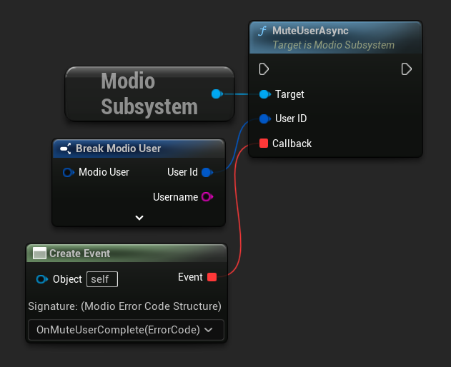
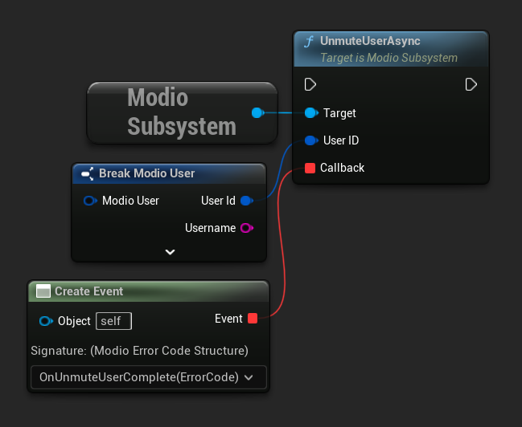
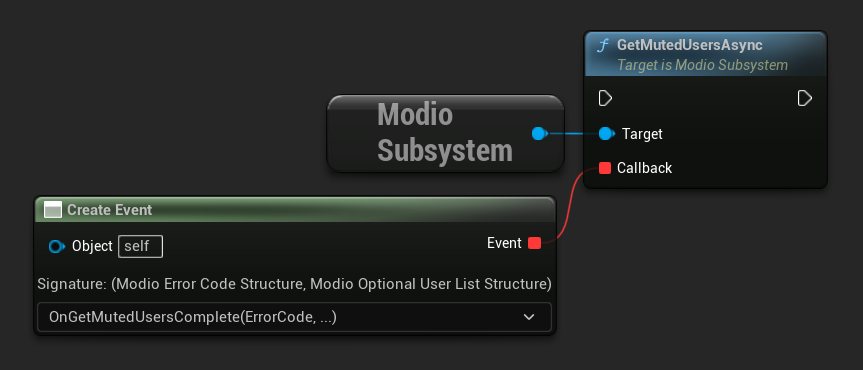

import Tabs from '@theme/Tabs';
import TabItem from '@theme/TabItem';

Users have the ability to disable updates from other user’s mods. This will prevent mod.io from returning mods authored by the muted user. There are three actions available to take: mute a user, unmute a user, and list muted users

:::note
To perform any of these actions, the muting user must be authenticated.
:::

## Mute a user

To mute a user, call [`MuteUserAsync`](/unreal/refdocs/#muteuserasync) with the corresponding `ModioUserID` and a callback.

<Tabs group-id="languages">
  <TabItem value="blueprint" label="Blueprint">




  </TabItem>
  <TabItem value="c++" label="C++" default>


 ```cpp

void UModioManagerSubsystem::MuteAUser(FModioUserID UserID)
{
	if (UModioSubsystem* Subsystem = GEngine->GetEngineSubsystem<UModioSubsystem>())
	{
		Subsystem->MuteUserAsync(UserID, FOnErrorOnlyDelegateFast::CreateUObject(this, &UModioManagerSubsystem::OnMuteUserComplete));
	}
}

void UModioManagerSubsystem::OnMuteUserComplete(FModioErrorCode ErrorCode)
{
	if (!ErrorCode)
	{
		// User successfully muted 
	}
}

```

  </TabItem>
</Tabs>

## Unmute a user

To perform the inverse operation call [`UnmuteUserAsync`](/unreal/refdocs/#unmuteuserasync) with the corresponding `ModioUserID` and a callback.

<Tabs group-id="languages">
  <TabItem value="blueprint" label="Blueprint">




  </TabItem>
  <TabItem value="c++" label="C++" default>


 ```cpp

void UModioManagerSubsystem::UnmuteAUser(FModioUserID UserID)
{
	if (UModioSubsystem* Subsystem = GEngine->GetEngineSubsystem<UModioSubsystem>())
	{
		Subsystem->UnmuteUserAsync(UserID, FOnErrorOnlyDelegateFast::CreateUObject(this, &UModioManagerSubsystem::OnUnmuteUserComplete));
	}
}

void UModioManagerSubsystem::OnUnmuteUserComplete(FModioErrorCode ErrorCode)
{
	if (!ErrorCode)
	{
		// User successfully unmuted 
	}
}
```

  </TabItem>
</Tabs>

## List muted users

[`GetMutedUsersAsync`](/unreal/refdocs/#getmutedusersasync) returns a list of users previously muted by an authenticated user. 

<Tabs group-id="languages">
  <TabItem value="blueprint" label="Blueprint">



  </TabItem>
  <TabItem value="c++" label="C++" default>


 ```cpp

void UModioManagerSubsystem::ListMutedUsers()
{
	if (UModioSubsystem* Subsystem = GEngine->GetEngineSubsystem<UModioSubsystem>())
	{
		Subsystem->GetMutedUsersAsync(FOnMuteUsersDelegateFast::CreateUObject(this, &UModioManagerSubsystem::OnListMutedUsersComplete));
	}
}

void UModioManagerSubsystem::OnListMutedUsersComplete(FModioErrorCode ErrorCode, FModioOptionalUserList MutedUsers)
{
	if (!ErrorCode)
	{
		// List of muted users successfully retrieved 
	}
}

```

  </TabItem>
</Tabs>