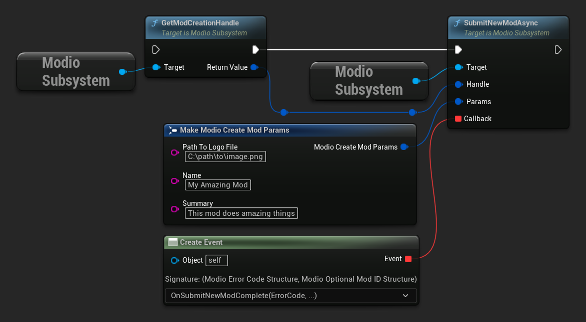

import Tabs from '@theme/Tabs';
import TabItem from '@theme/TabItem';

Submitting a mod from inside your game and making it visible to other players involves two steps:

* Submission of the mod
* Submission of the mod’s data (aka "the mod file")

These steps are outlined below. Mods can also be edited after submission, as [detailed here](edit-mods)

## Submitting a new mod

To submit a mod, you must first create a mod handle using [`GetModCreationHandle`](/unreal/refdocs/#getmodcreationhandle), and use that handle when calling [`SubmitNewModAsync`](/unreal/refdocs/#submitnewmodasync). Note that the newly created mod will remain hidden until a mod file is added in the next step.
<Tabs group-id="languages">

  <TabItem value="blueprint" label="Blueprint">

  </TabItem>

  <TabItem value="c++" label="C++" default>
 ```cpp
void UModioManagerSubsystem::SubmitNewMod()
{
	if (UModioSubsystem* Subsystem = GEngine->GetEngineSubsystem<UModioSubsystem>())
	{
		FModioModCreationHandle Handle = Subsystem->GetModCreationHandle();

		FModioCreateModParams Params;
		Params.Name = TEXT("My Amazing Mod");
		Params.Description = TEXT("This mod does amazing things");
		Params.PathToLogoFile = TEXT("C:\\path\\to\\image.png");

		Subsystem->SubmitNewModAsync(Handle, Params, FOnSubmitNewModDelegateFast::CreateUObject(this, &UModioManagerSubsystem::OnSubmitNewModComplete));
	}
}

void UModioManagerSubsystem::OnSubmitNewModComplete(FModioErrorCode ErrorCode, TOptional<FModioModID> ModId)
{
	if (!ErrorCode)
	{
		// Mod was successfully submitted 
		// We can now call SubmitNewModFileForMod with this ModId
	}
}
```
  </TabItem>
</Tabs>

## Submitting a file for a mod

Once you have successfully submitted a mod, you can submit a mod file for that mod using [`SubmitNewModFileForMod`](/unreal/refdocs/#submitnewmodfileformod). When you submit a mod file, you pass a [`ModioCreateModFileParams`](/unreal/refdocs/#modiocreatemodfileparams) containing the directory containing all the files that you want to submit. The plugin will compress this folder into a .zip file and upload it as the active version of the mod. 

In the future, if the mod is updated and requires a new mod file, `SubmitNewModFileForMod` can be called again. The most recent mod file uploaded by `SubmitNewModFileForMod` will be set as the active version. 

:::note
There is no callback for `SubmitNewModFileForMod`; you’ll be notified of the completed upload by your [**mod management callback**](mod-subscriptions#installation-management).
:::

<Tabs group-id="languages">
  <TabItem value="blueprint" label="Blueprint">

After the callback for submitting a mod has completed, you can get the Mod Id to use for file submission.


  </TabItem>
  <TabItem value="c++" label="C++" default>

 ```cpp
void UModioManagerSubsystem::SubmitNewModFile(FModioModID ModId)
{
	if (UModioSubsystem* Subsystem = GEngine->GetEngineSubsystem<UModioSubsystem>())
	{
		FModioCreateModFileParams Params;
		Params.PathToModRootDirectory = TEXT("C:\\path\\to\\mod-folder");
		Subsystem->SubmitNewModFileForMod(ModId, Params);
	}
}
```

  </TabItem>
</Tabs>