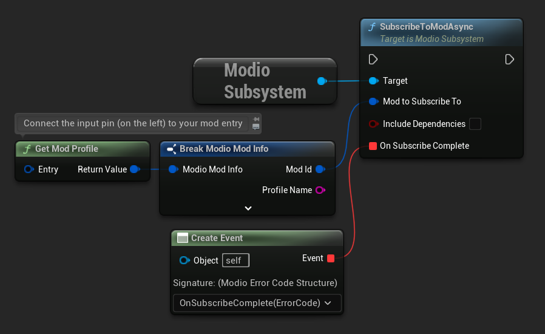
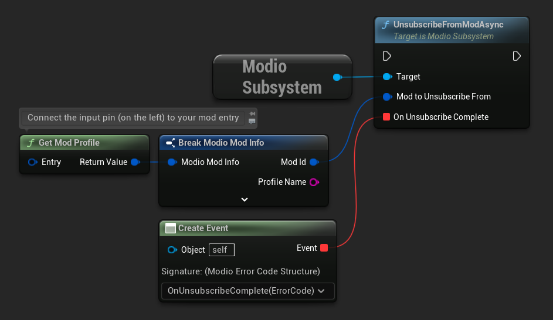
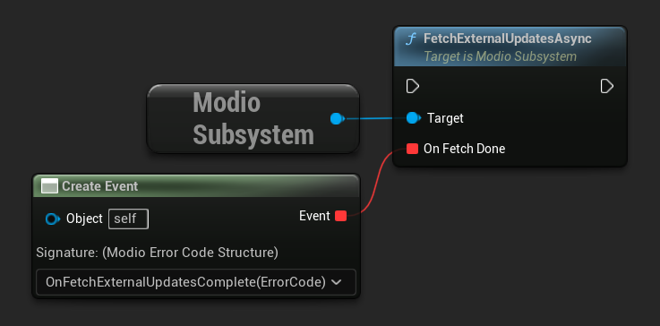
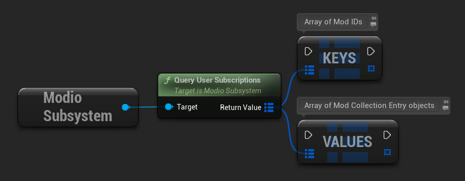
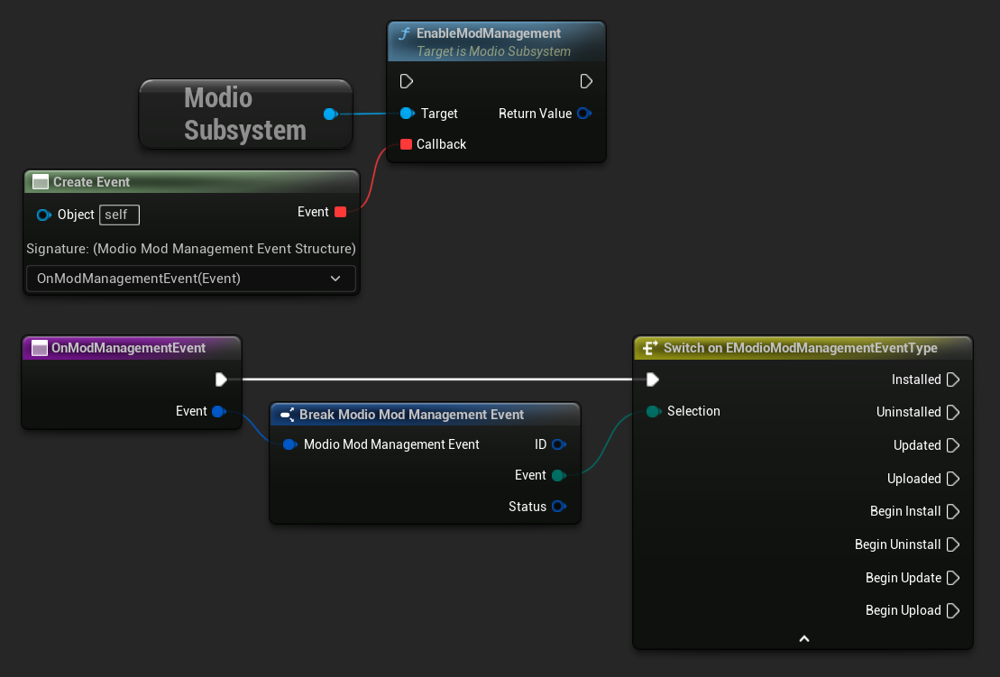
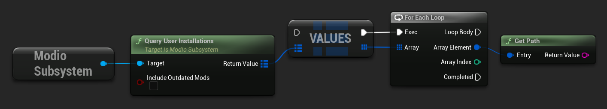

import Tabs from '@theme/Tabs';
import TabItem from '@theme/TabItem';

So you’ve [shown the user some mods](browsing-mods), and they've picked one they’d like to install. How do you begin the installation process? Once the mod is installed, how do you know what files to load into memory?

## Mod subscriptions

Users indicate they want to install a mod by **subscribing** to it. Subscriptions are stored on the mod.io servers and are associated with a user’s mod.io account, so subscribed mods for a given game will be installed to all devices where a user logs into mod.io for that game.  Similarly, when a user **unsubscribes** from a mod, that mod will be uninstalled from every device they’re logged into mod.io with for that game. 

Subscriptions are managed with calls to either [`SubscribeToModAsync`](/unreal/refdocs/#subscribetomodasync) or [`UnsubscribeFromModAsync`](/unreal/refdocs/#unsubscribefrommodasync) containing the desired `ModioModID` and a delegate to receive the status of the request.

:::note
To subscribe or unsubscribe from a mod, [**`EnableModManagement`**](/unreal/refdocs/#enablemodmanagement) *must* be called beforehand.
:::

`SubscribeToModAsync` also takes a bool indicating whether or not to to subscribe to any and all dependencies for the given `ModioModID`. 

:::note
When dependencies are included in the `SubscribeToModAsync` call, they will *not* download automatically. **Only the primary mod specified by `ModioModID` will download automatically.**  To download all subscribed content including dependencies, call [`FetchExternalUpdatesAsync`](/unreal/refdocs/#fetchexternalupdatesasync) after `SubscribeToModAsync` successfully completes.
:::

<Tabs group-id="languages">
  <TabItem value="blueprint" label="Blueprint">





  </TabItem>
  <TabItem value="c++" label="C++" default>

 ```cpp
void UModioManagerSubsystem::SubscribeToMod(FModioModID ModToSubscribeTo, bool IncludeDependencies)
{
	if (UModioSubsystem* Subsystem = GEngine->GetEngineSubsystem<UModioSubsystem>())
	{
		Subsystem->SubscribeToModAsync(ModId, IncludeDependencies, FOnErrorOnlyDelegateFast::CreateUObject(this, &UModioManagerSubsystem::OnSubscribeToModComplete, ModId));
	}
}

void UModioManagerSubsystem::OnSubscribeToModComplete(FModioErrorCode ErrorCode, FModioModID ModId)
{
	if (!ErrorCode)
	{
		// Indicate success to your user. This ModId's files will begin installing.
		// Call FetchExternalUpdatesAsync if dependencies were included 
	}
}

void UModioManagerSubsystem::UnsubscribeFromMod(FModioModID ModId)
{
	if (UModioSubsystem* Subsystem = GEngine->GetEngineSubsystem<UModioSubsystem>())
	{
		Subsystem->UnsubscribeFromModAsync(ModId, FOnErrorOnlyDelegateFast::CreateUObject(this, &UModioManagerSubsystem::OnUnsubscribeFromModComplete, ModId));
	}
}

void UModioManagerSubsystem::OnUnsubscribeFromModComplete(FModioErrorCode ErrorCode, FModioModId ModId)
{
	if (!ErrorCode)
	{
		// Indicate success to your user. This ModID's files will begin uninstalling.
	}
}
```
  </TabItem>
</Tabs>


## External subscription changes

Because mod.io's services are available via our website, users can manage their subscriptions outside of your application. This means that we need to be able to query the server for any external subscription changes. 

Call [`FetchExternalUpdatesAsync`](/unreal/refdocs/#fetchexternalupdatesasync) to synchronise the server state with the plugin’s local subscriptions.  Any required installations or uninstallations based on the updated user subscriptions will be processed automatically.

<Tabs group-id="languages">
  <TabItem value="blueprint" label="Blueprint">



  </TabItem>
  <TabItem value="c++" label="C++" default>


 ```cpp

void UModioManagerSubsystem::FetchExternalUpdates()
{
	if (UModioSubsystem* Subsystem = GEngine->GetEngineSubsystem<UModioSubsystem>())
	{
		Subsystem->FetchExternalUpdatesAsync(FOnErrorOnlyDelegateFast::CreateUObject(this, &UModioManagerSubsystem::OnFetchExternalUpdatesComplete));
	}
}

void UModioManagerSubsystem::OnFetchExternalUpdatesComplete(FModioErrorCode ErrorCode)
{
	// error handling etc.
}

```
  </TabItem>
</Tabs>

:::warning
Call [`FetchExternalUpdatesAsync`](/unreal/refdocs/#fetchexternalupdatesasync) sparingly, only when required to ensure that the local state is up-to-date such as on game start-up or based on user input (i.e. as a button on your UI). It should **NOT** be called on tick.
:::

## Checking the user subscription list

To see which mods the user has subscribed to, call [`QueryUserSubscriptions`](/unreal/refdocs/#query-user-subscriptions).  This retrieves a `TMap` of [`ModioModCollectionEntry`](/unreal/refdocs/#modiomodcollectionentry) objects, one for each subscribed mod. Each `ModioModCollectionEntry` object contains the mod’s state, profile information, ID and more.

:::note
This collection includes mods that are still in the process of being installed! Make sure to check the result of [`GetModState`](/unreal/refdocs/#get-mod-state) before attempting to load files from the mods in this collection.  Alternatively, use [`QueryUserInstallations`](/unreal/refdocs/#query-user-installations) as described in [**Retrieving mod directory paths for loading**](#retrieving-mod-directory-paths-for-loading).
:::

<Tabs group-id="languages">
  <TabItem value="blueprint" label="Blueprint">



  </TabItem>
  <TabItem value="c++" label="C++" default>


 ```cpp
void UModioManagerSubsystem::QueryUserSubscriptions()
{
	if (UModioSubsystem* Subsystem = GEngine->GetEngineSubsystem<UModioSubsystem>())
	{
		TMap<FModioModID, FModioModCollectionEntry> SubscribedMods = Subsystem->QueryUserSubscriptions();
		// Do something with SubscribedMods e.g. display on a UI
	}
}
```
  </TabItem>
</Tabs>

## Installation management

So a subscription marks a mod as requiring installation, and an unsubscription indicates uninstallation, but how do you actually control when the plugin **does** those things? After all, you don’t want a mod to be uninstalled after your main program has loaded those files into memory, locking them from deletion. Likewise, you probably don’t want to be using networking or processor resources during gameplay for downloading mods. To give you control over when these processes occur without forcing you to shut down the plugin, you can call [`EnableModManagement`](/unreal/refdocs/#enablemodmanagement) and [`DisableModManagement`](/unreal/refdocs/#disable-mod-management).

To notify your users when a mod is finished installing or updating, [`EnableModManagement`](/unreal/refdocs/#enablemodmanagement) asks you to provide it with a callback. This callback will be invoked **every time** a [`ModioModManagementEvent`](/unreal/refdocs/#modiomodmanagementevent) occurs i.e. whenever a mod is installed, updated, uninstalled, or uploaded by the plugin’s internal event loop. This behavior persists until a corresponding call to [`DisableModManagement`](/unreal/refdocs/#disable-mod-management) or [`ShutdownAsync`](/unreal/refdocs/#shutdownasync) is made.

:::note
[`EnableModManagement`](/unreal/refdocs/#enablemodmanagement) is not an async function.  It does not end with the `*Async` suffix. Its callback operates differently to asynchronous result callbacks used elsewhere in the mod.io plugin. 
:::

<Tabs group-id="languages">
  <TabItem value="blueprint" label="Blueprint">

  </TabItem>
  <TabItem value="c++" label="C++" default>

 ```cpp
void UModioManagerSubsystem::EnableModManagement()
{
	if (UModioSubsystem* Subsystem = GEngine->GetEngineSubsystem<UModioSubsystem>())
	{
		Subsystem->EnableModManagement(FOnModManagementDelegateFast::CreateUObject(this, &UModioManagerSubsystem::ModManagementCallback));
	}
}

void UModioManagerSubsystem::ModManagementCallback(FModioModManagementEvent ModManagementEvent)
{
	if (ModManagementEvent.Status)
	{
		// error handling
	}
	switch(ModManagementEvent.Event)
	{
		case EModioModManagementEventType::BeginInstall:
		case EModioModManagementEventType::BeginUninstall:
		case EModioModManagementEventType::BeginUpdate:
		case EModioModManagementEventType::BeginUpload:
			UE_LOG(LogModioGame, Log, TEXT("Begin processing Mod %s"), *ModManagementEvent.ID.ToString());
			break;
		case EModioModManagementEventType::Installed:
			UE_LOG(LogModioGame, Log, TEXT("Received an Installed event for Mod %s"), *ModManagementEvent.ID.ToString());
			break;
		case EModioModManagementEventType::Uninstalled: 
			UE_LOG(LogModioGame, Log, TEXT("Received an Uninstalled event for Mod %s"), *ModManagementEvent.ID.ToString());
			break;
		case EModioModManagementEventType::Updated:
			UE_LOG(LogModioGame, Log, TEXT("Received an Updated event for Mod %s"), *ModManagementEvent.ID.ToString());
			break;
		case EModioModManagementEventType::Uploaded:
			UE_LOG(LogModioGame, Log, TEXT("Received an Uploaded event for Mod %s"), *ModManagementEvent.ID.ToString());
			break;
		default:;
	}
}
```
  </TabItem>
</Tabs>

While mod management is enabled, the plugin assumes that it has the ability to make changes to the filesystem, including deleting mods that the user has no longer subscribed to. As a result you should make sure that you don’t have any open handles to files inside the mod directories when you call [`EnableModManagement`](/unreal/refdocs/#enablemodmanagement).

When you want to be able to freely open files in the mod directories, call [`DisableModManagement`](/unreal/refdocs/#disable-mod-management). The plugin will finish the current operation but will not continue any others. 

Call [`IsModManagementBusy`](/unreal/refdocs/#is-mod-management-busy) to see if mod management is currently processing a mod. 

<Tabs group-id="languages">
  <TabItem value="c++" label="C++" default>

 ```cpp
void UModioManagerSubsystem::DisableModManagement()
{
	if (UModioSubsystem* Subsystem = GEngine->GetEngineSubsystem<UModioSubsystem>())
	{
		if (!Subsystem->IsModManagementBusy())
		{
			Subsystem->DisableModManagement();
		}
	}
}
```
  </TabItem>
</Tabs>

### Retrieving mod directory paths for loading

So now we have the user picking mods and marking them for installation, we’re enabling mod management at a point where we don’t mind the plugin changing the filesystem, and mods are being installed by the plugin. We now need to know where they are on disk, otherwise you can’t load them into your game!

The easiest way to do this is by using [`QueryUserInstallations`](/unreal/refdocs/#query-user-installations). This function returns a `TMap` of [`ModioModCollectionEntry`](/unreal/refdocs/#modiomodcollectionentry) objects that can be queried for folder paths to use for loading a mod's files into your game. `QueryUserInstallations` also allows you to specify whether or not to include outdated mods.

<Tabs group-id="languages">
  <TabItem value="c++" label="C++" default>
 ```cpp
void UModioManagerSubsystem::GetInstalledMods()
{
	if (UModioSubsystem* Subsystem = GEngine->GetEngineSubsystem<UModioSubsystem>())
	{
		TMap<FModioModID, FModioModCollectionEntry> InstalledMods = Subsystem->QueryUserInstallations(false);
		
		// Do something with each installed mod, ie adding paths/loading the content appropriately
	}
}
```
  </TabItem>
  <TabItem value="blueprint" label="Blueprint">



  </TabItem>

</Tabs>