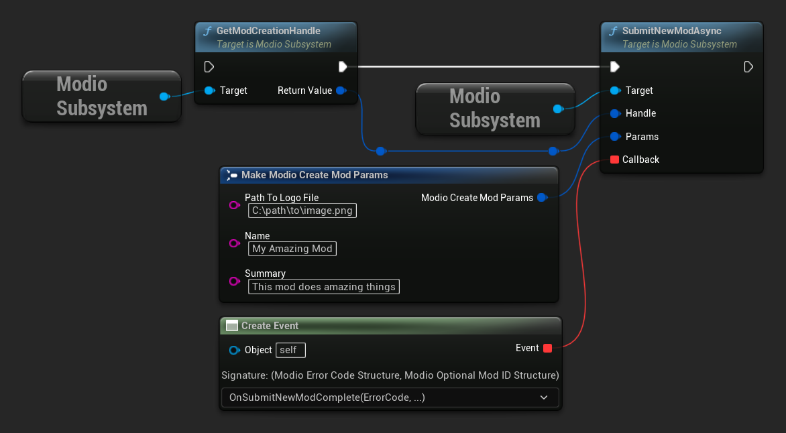
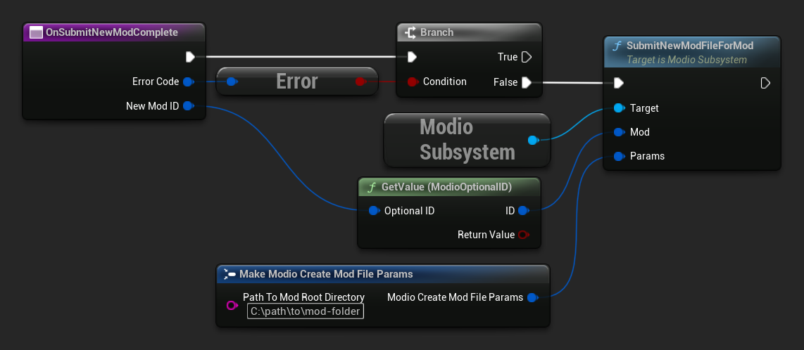
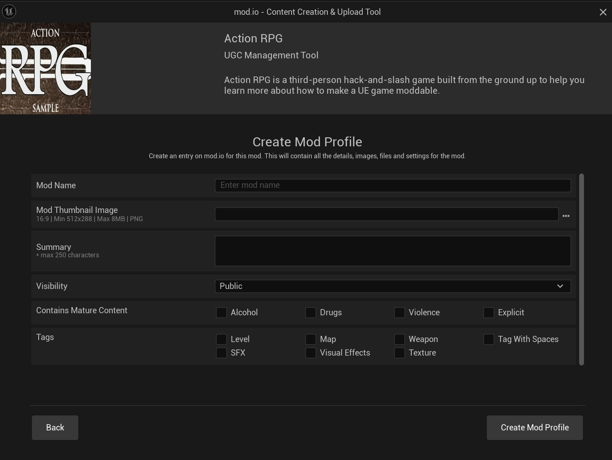
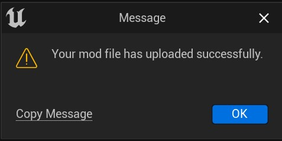
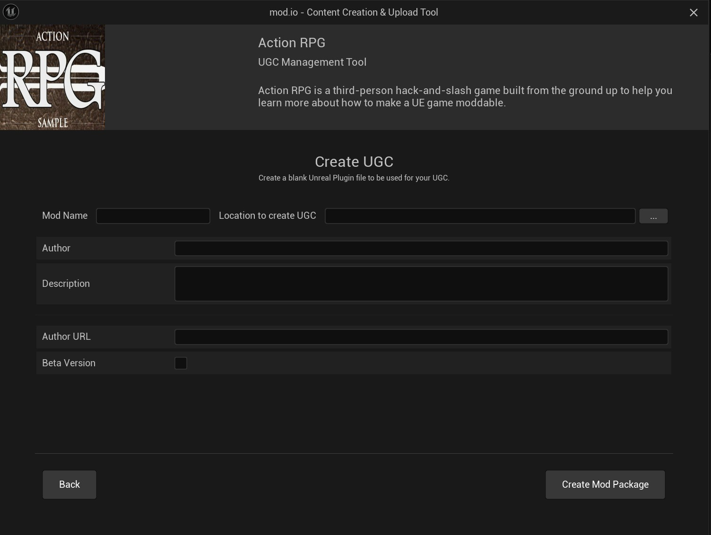

# Adding UGC

There are a few ways to allow users to add their UGC creations to your game. You can either let users build and submit UGC from inside your game, or you could take advantage of Unreal Engine's built-in tooling.

This guide covers:

* [In-game UGC submissions](#in-game-ugc-submissions)
* [Unreal Engine Creation & Upload Tool](#mod-creation--upload-tool)

## In-game UGC submissions

Submitting UGC from inside your game and making it visible to other players involves two steps:

1. Submitting new UGC
2. Submitting the data of the UGC (aka "the mod file")

These steps are outlined below. UGC can also be edited after submission, which you can learn via the [API Reference](/unreal/refdocs).

### Submitting new UGC

To submit a piece of UGC, you must first create a mod handle using [`GetModCreationHandle`](/unreal/refdocs#getmodcreationhandle), and use that handle when calling [`SubmitNewModAsync`](/unreal/refdocs#submitnewmodasync). Note that newly created UGC will remain hidden until a mod file is added in the next step.
<Tabs group-id="languages">

  <TabItem value="blueprint" label="Blueprint">

  </TabItem>

  <TabItem value="c++" label="C++" default>
 ```cpp
void UModioManagerSubsystem::SubmitNewMod()
{
	if (UModioSubsystem* Subsystem = GEngine->GetEngineSubsystem<UModioSubsystem>())
	{
		FModioModCreationHandle Handle = Subsystem->GetModCreationHandle();

		FModioCreateModParams Params;
		Params.Name = TEXT("My Amazing Mod");
		Params.Description = TEXT("This mod does amazing things");
		Params.PathToLogoFile = TEXT("C:\\path\\to\\image.png");

		Subsystem->SubmitNewModAsync(Handle, Params, FOnSubmitNewModDelegateFast::CreateUObject(this, &UModioManagerSubsystem::OnSubmitNewModComplete));
	}
}

void UModioManagerSubsystem::OnSubmitNewModComplete(FModioErrorCode ErrorCode, TOptional<FModioModID> ModId)
{
	if (!ErrorCode)
	{
		// Mod was successfully submitted 
		// We can now call SubmitNewModFileForMod with this ModId
	}
}
```
  </TabItem>
</Tabs>

### Submitting the data for the UGC

Once you have successfully submitted a piece of UGC, you can submit a mod file for that UGC using [`SubmitNewModFileForMod`](/unreal/refdocs#submitnewmodfileformod). When you submit a mod file, you pass a [`ModioCreateModFileParams`](/unreal/refdocs#modiocreatemodfileparams) containing the directory containing all the files that you want to submit. The plugin will compress this folder into a .zip file and upload it as the active version of the UGC. 

In the future, if the mod is updated and requires a new mod file, `SubmitNewModFileForMod` can be called again. The most recent mod file uploaded by `SubmitNewModFileForMod` will be set as the active version. 

:::note
There is no callback for `SubmitNewModFileForMod`; you’ll be notified of the completed upload by your [**mod management callback**](/unreal/subscribing#installation-management).
:::

<Tabs group-id="languages">
  <TabItem value="blueprint" label="Blueprint">

After the callback for submitting UGC has completed, you can get the Mod Id to use for file submission.



  </TabItem>
  <TabItem value="c++" label="C++" default>

 ```cpp
void UModioManagerSubsystem::SubmitNewModFile(FModioModID ModId)
{
	if (UModioSubsystem* Subsystem = GEngine->GetEngineSubsystem<UModioSubsystem>())
	{
		FModioCreateModFileParams Params;
		Params.PathToModRootDirectory = TEXT("C:\\path\\to\\mod-folder");
		Subsystem->SubmitNewModFileForMod(ModId, Params);
	}
}
```

  </TabItem>
</Tabs>

## Mod Creation & Upload Tool

The mod.io Unreal Engine plugin includes an integrated editor module that provides a comprehensive Content Creation and Upload Tool for seamless mod management.

### Editor-specific Plugin Modules

| Module Name | Description | Module Type |
|   ---           |   ---           |   ---           |
| ModioEditor | Editor details customization and asset factories for UE content creation and upload tool classes | Editor |

### Opening the Tool
To access the tool, click the mod.io icon in the Unreal Engine toolbar to display the dropdown menu, then select **Create & Upload**. Upon launch, the tool may require authentication with mod.io.
Click the "Login to Modio" button and follow the authentication process to proceed.

### Managing UGC
After successful authentication, you will have access to the full suite of User-Generated Content (UGC) management functions, including Upload, Manage, Create, and Package capabilities.


### Upload and Manage UGC
This section provides tools to edit existing mods or create new mod profiles.

#### Create Mod

The **Add New Mod Listing** function enables you to create a new mod profile.

#### Edit Mods

The **Edit Mod Listing** function allows you to modify existing mods, upload mod files, or cook new mod files.

### Creating a New Mod
The plugin streamlines the mod creation process directly within Unreal Engine with the following workflow:

#### Create Mod

1. Click **Add New Mod Listing** and complete the following required fields:

**Create Mod Properties**

| Field | Description |
|   ---      |   ---           |
| Path to Logo File | Browse to select a **.png** file for your mod logo |
| Name | The name of your mod |
| Summary | A concise description of your mod |
| Visibility | Set the mod's visibility status (Public or Hidden) |
| Contains Mature Content | Specify any mature content categories included in your mod |
| Tags | Select relevant tags that accurately categorize your mod |



2. After completing all required fields, click **Create Mod Profile** to finalize your mod creation.

3. Upon successful submission, you will be returned to the mod browser where you can manage your newly created mod.

### Editing Existing Mods
The plugin provides a straightforward interface for modifying existing mods directly within Unreal Engine:

#### Edit Mods

1. Click **Edit Mods** to display a list of your available mods.
2. Select a mod from the list by clicking on it.

**Browse Mods**

| Column | Description |
|   ---      |   ---           |
| Name | The mod's display name |
| Description | Brief description of the mod |
| Created date | Date when the mod was initially created |
| Moderation Status | Current moderation state of the mod |
| Visibility | Current visibility status (Public or Hidden) |

3. After selecting a mod, click **Edit Mod** to access the editing interface.

**Edit Mod Properties**

| Field | Description |
|   ---      |   ---           |
| Path to Logo File | Browse to select a new **.png** file for your mod logo |
| Name | Edit the mod's display name |
| Summary | Update the mod's description |
| Visibility | Adjust the mod's visibility (Public or Hidden) |
| Contains Mature Content | Modify mature content categorization as needed |


4. Make your desired changes to the mod properties, then click **Save** to apply your modifications.

### Uploading a New Modfile
To upload content for your mod, you must specify a workspace directory and complete the following steps:

1. Click **New Modfile**

2. Complete the required fields:

> **Note:** You may receive an error dialog if the game does not support your selected platform or if the game is locked.

**Upload Mod File**

| Field | Description |
|   ---     |   ---           |
| Mod Root Directory | Specify the path to your workspace directory containing mod assets |
| Platform | Select the target platform(s) for this mod file |
| Version String | Provide a version identifier for this release |
| Changelog | Document changes or additions in this version |
| Set as Active Release | Determine whether this upload should be set as the current active release |


3. Review and accept the terms and privacy policy by checking the acknowledgment box.

4. Click **Upload Mod File** to begin the upload process.

5. A progress indicator will display the status as your workspace directory is compressed and uploaded along with the provided metadata.

#### Mod File Upload Completion
After successful upload, your mod file will be available on the mod.io platform.



### Cooking a New Source file
To cook a new source file for your mod, follow these steps:

1. Click **New Source File**.

2. Complete the required fields:

> **Note:** You may receive an error dialog if the game does not support your selected platform or if the game is locked.

**Cook Source File**

| Field | Description |
|   ---     |   ---           |
| Mod Root Directory | Specify the path to your workspace directory containing mod assets |
| Platform | Select the target platform(s) for this mod file |
| Version String | Provide a version identifier for this release |
| Changelog | Document changes or additions in this version |

3. Review and accept the terms and privacy policy by checking the acknowledgment box.

4. Click **Cook Source File** to begin the cooking process.

#### Source File Cooking Completion
After successful cooking, your new source file will be available for use in your mod.

### Creating UGC
This section enables you to create new User-Generated Content for your game using predefined templates.

| Field | Description |
|   ---     |   ---           |
| Mod Name | Specify a name for your User-Generated Content |
| Location to create UGC | Select the directory where UGC files will be created |
| Author | Provide the name of the content creator |
| Description | Enter a detailed description of the UGC |
| Author URL | Optionally include a URL to the author's website or profile |
| Beta Version | Specify if this content is in beta stage |



### Packaging UGC
This interface allows you to compile your created plugins for distribution across multiple platforms.

| Field | Description |
|   ---     |   ---           |
| Select plugin to Package | Choose the plugin you want to package from the available options |
| Platform | Select the target platform for this package |
| Package output path | Specify the directory where the packaged content will be saved |


