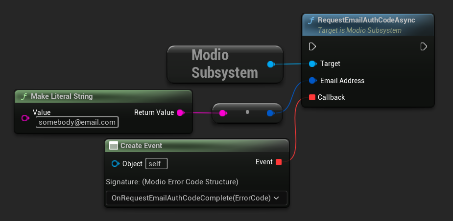
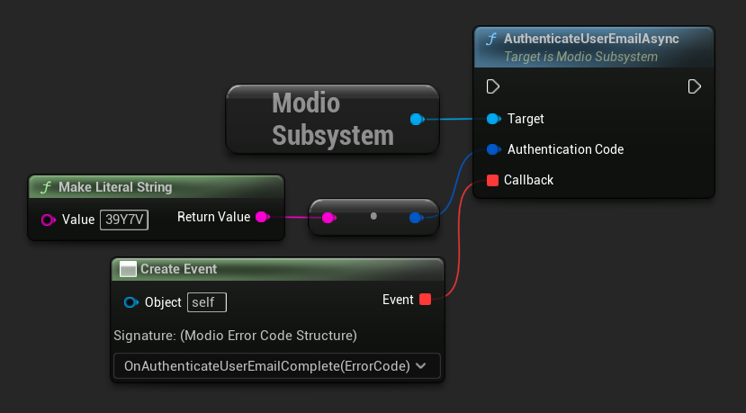
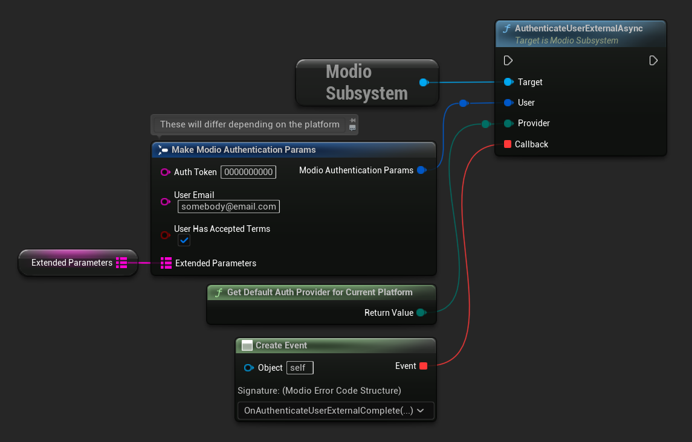

# User Authentication for Unreal

Authentication is required before users can interact with UGC, and this can take many forms. We recommend utilizing our [Single Sign-On (SSO)](#single-sign-on-authentication) features, as this is the quickest and most streamlined experience for your users. You can further explore these options in our overarching [Authentication](https://docs.mod.io/authentication/) guide.

This guide covers:

* [Best practices](#best-practices)
* [Terms & user consent](#terms--user-consent)
* [Authentication methods](#authentication-methods)
* [Using the Unreal Online Subsystem](#using-the-unreal-online-subsystem)
* [Token lifetime and re-authentication](#token-lifetime-and-re-authentication)

## Best practices
We recommend creating a new game-instance based subsystem (e.g. `ModioManagerSubsystem`) that depends on `ModioSubsystem`, and is responsible for managing the full initialization and authentication flow for your game.

### Recommended flow
- Create a subsystem to manage mod.io initialization and authentication.  
- Perform [Online Subsystem (OSS) login](#using-the-unreal-online-subsystem) in your subsystem's `Initialize` function to ensure you have a valid platform auth token ready when its time to authenticate to mod.io using [Single Sign-On (SSO)](#single-sign-on-authentication).
	- Log in with the online identity provider.
	- On success, get a linked account token for the current user.
	- On success, get an authentication token from the linked account or from the online identity.
- [Initialize](initialization) the mod.io plugin with the required environment parameters for the current platform.
- Display the mod.io [Terms of Service](/terms).  Ensure they are accepted by the user.
- Authenticate the user using [SSO](#single-sign-on-authentication).

:::note
If the Online Subsystem login fails at any point in the above process, fall back to simply initializing the plugin and offer email authentication as an alternative.
:::

## Terms & user consent 

Users must accept the mod.io Terms of Service before using any mod.io services.  The Terms of Service can be fetched from mod.io using [`GetTermsOfUseAsync`](/unreal/refdocs#gettermsofuseasync).  Before attempting authentication, ensure these terms are displayed to and accepted by the user.  

See our full [Terms & User Consent](/terms) documentation for further details.

When authenticating via SSO, the `bUserHasAcceptedTerms` parameter should be set to **false** by default. If the user has already accepted the latest terms, they will be authenticated automatically. If they haven't accepted the latest terms, an error `403 Forbidden (error_ref 11074)` will be returned. When you receive this error, you must display the terms dialog to the user, and if they accept, resubmit the authentication flow with `bUserHasAcceptedTerms` set to **true** for that specific request only. All subsequent authentication attempts should revert to using **false** for this parameter.

## Authentication methods

The mod.io Unreal Engine plugin provides two ways for users to create an account to use the service: 

1. [Email authentication](#email-authentication)
2. [Single Sign-On (SSO)](#single-sign-on-authentication) through an external authentication partner

:::tip
For the best user experience, we recommend using SSO wherever possible. 
:::

## Email authentication

Users can authenticate to mod.io with just an email address.  

This involves:

* Requesting a one-time authentication code be sent from mod.io to an email address provided by the user
* Submitting the received code to mod.io

#### Requesting an authentication code

Request a one-time authentication code by calling [`RequestEmailAuthCodeAsync`](/unreal/refdocs#requestemailauthcodeasync).  Pass in a user-provided email address as the first argument.

<Tabs groupId="languages">
  <TabItem value="blueprint" label="Blueprint">

  </TabItem>
  <TabItem value="cpp" label="C++" default>
 ```cpp
void UModioManagerSubsystem::RequestEmailAuthCode(const FString &EmailAddress)
{
	if (UModioSubsystem* Subsystem = GEngine->GetEngineSubsystem<UModioSubsystem>())
	{
		Subsystem->RequestEmailAuthCodeAsync(FModioEmailAddress(*EmailAddress), FOnErrorOnlyDelegateFast::CreateUObject(this, &UModioManagerSubsystem::OnRequestEmailAuthCodeComplete));
	}
}

void UModioManagerSubsystem::OnRequestEmailAuthCodeComplete(FModioErrorCode ErrorCode)
{
	UE_LOG(LogModioGame, Log, TEXT("Email auth code request complete with result: %s"), *ErrorCode.GetErrorMessage());
}
```
  </TabItem>
</Tabs>

When your callback is invoked, inspect the `ModioErrorCode` for a successful result.  On success, prompt the user to check their emails and enter the authentication code they have received into your game.

#### Submitting an authentication code

To finalize the user's authentication, submit the code they have entered to mod.io by calling [`AuthenticateUserEmailAsync`](/unreal/refdocs#authenticateuseremailasync).  Pass the user's code in as the first argument.

<Tabs groupId="languages">
  <TabItem value="blueprint" label="Blueprint">

  </TabItem>
  <TabItem value="cpp" label="C++">

 ```cpp
void UModioManagerSubsystem::AuthenticateUserEmail(const FString& AuthCode)
{
	if (UModioSubsystem* Subsystem = GEngine->GetEngineSubsystem<UModioSubsystem>())
	{
		Subsystem->AuthenticateUserEmailAsync(FModioEmailAuthCode(*AuthCode), FOnErrorOnlyDelegateFast::CreateUObject(this, &UModioManagerSubsystem::OnAuthenticateUserEmailComplete));
	}
}

void UModioManagerSubsystem::OnAuthenticateUserEmailComplete(FModioErrorCode ErrorCode)
{
	UE_LOG(LogModioGame, Log, TEXT("Email auth code submission complete with result: %s"), *ErrorCode.GetErrorMessage());
}
```
  </TabItem>
</Tabs>

When your callback is invoked, inspect the `ModioErrorCode` for a successful result.  On success, user authentication is complete.

## Single Sign-On authentication

The mod.io Unreal Engine plugin features **Single Sign-On (SSO)** authentication from a number of [external providers](/unreal/refdocs/#EModioAuthenticationProvider). 

There are two types of SSO to consider:

1. [**Custom SSO**](https://docs.mod.io/authentication/openid/): Custom SSO harnesses your studio's authentication process as the single point of authentication. 

2. [**Platform SSO**](https://docs.mod.io/authentication/platform/): Platform SSO uses a given platform's authentication process as the single point of authentication. 

	The platforms included in this process are:

	* [Xbox Live](https://docs.mod.io/platforms/gdk/#authentication)
	* [Steam](https://docs.mod.io/platforms/steam/authentication)
	* [GOG Galaxy](https://docs.mod.io/platforms/gog/authentication)
	* itch.io
	* [Nintendo Switch](https://docs.mod.io/platforms/switch/#authentication)
	* Discord
	* [PlayStation™Network](https://docs.mod.io/platforms/playstation/#authentication)
	* [Epic Online Services](https://docs.mod.io/platforms/epic/authentication)
	* [Meta Quest](https://docs.mod.io/platforms/meta/authentication)
	* [Google](https://docs.mod.io/platforms/google/authentication)

Each platform has their own requirements and prerequisites for performing SSO.  Platform-specific authentication can be found in the respective [platform documentation](https://docs.mod.io/getting-started/#expand-with-cross-platform-functionality).  SSO is performed by calling [`AuthenticateUserExternalAsync`](/unreal/refdocs/#authenticateuserexternalasync).  This function takes a [`ModioAuthenticationParams`](/unreal/refdocs/#modioauthenticationparams) containing provider-specific parameters, and a [`ModioAuthenticationProvider`](/unreal/refdocs/#EModioAuthenticationProvider) indicating the provider you're using.   

[Unreal Engine's Online Subsystem](#using-the-unreal-online-subsystem) provides a convenient way to get a token for `ModioAuthenticationParams.AuthToken`. [`GetDefaultAuthProviderForCurrentPlatform`](/unreal/refdocs#get-default-auth-provider-for-current-platform) can be used to get the default provider for the current platform. 

:::note
The plugin will automatically URL encode parameters (such as the auth token) when making the request.
:::

<Tabs groupId="languages">
  <TabItem value="blueprint" label="Blueprint">

  </TabItem>
  <TabItem value="cpp" label="C++">

 ```cpp
void UModioManagerSubsystem::AuthenticateWithSSO(const FModioAuthenticationParams& AuthParams)
{
	if (UModioSubsystem* Subsystem = GEngine->GetEngineSubsystem<UModioSubsystem>())
	{
		Subsystem->AuthenticateUserExternalAsync(AuthParams, UModioPlatformHelpersLibrary::GetDefaultAuthProviderForCurrentPlatform(), FOnErrorOnlyDelegateFast::CreateUObject(this, &UModioManagerSubsystem::AuthenticateUserExternalComplete));
	}
}

void UModioManagerSubsystem::AuthenticateUserExternalComplete(FModioErrorCode ErrorCode)
{
	UE_LOG(LogModioGame, Log, TEXT("SSO complete with result: %s"), *ErrorCode.GetErrorMessage());
}
```
  </TabItem>
</Tabs>

## Using the Unreal Online Subsystem

Since Unreal Engine 5.2, most of the authentication methods supported by mod.io are abstracted by Unreal's [Online Subsystem](https://dev.epicgames.com/documentation/en-us/unreal-engine/API/Plugins/OnlineSubsystem/IOnlineSubsystem). Below are some code snippets demonstrating the flow to get a linked account token from Unreal's Online Subsystem.

- Create a subsystem to manage mod.io initialization and authentication that depends on the `ModioSubsystem`.  During your subsystem's initialization, perform an Online Subsystem (OSS) login. This guarantees you will have a valid platform auth token ready when needed for mod.io SSO authentication.

<Tabs group-id="languages">
	<TabItem value="c++" label="C++" default>
 ```cpp
const IOnlineSubsystem* OnlineSubsystem = IOnlineSubsystem::GetByPlatform();
if (OnlineSubsystem != nullptr && OnlineSubsystem->GetIdentityInterface() != nullptr)
{
	// Get the Identity interface from our OnlineSubsystem and perform login
	const IOnlineIdentityPtr OnlineIdentity = OnlineSubsystem->GetIdentityInterface();
	OnlineIdentity->AddOnLoginCompleteDelegate_Handle(
		0, FOnLoginCompleteDelegate::CreateLambda(
			   [this](int32 LocalUserNum, bool bWasSuccessful, const FUniqueNetId& UserId, const FString& Error) {
				   this->OnSubsystemLoginComplete(LocalUserNum, bWasSuccessful, UserId, Error);
			   }));
	OnlineIdentity->Login(0, FOnlineAccountCredentials());
}
else
{
	// If we don't have a valid OnlineSubsystem, just initialize the mod.io plugin
	InitializeModio();
}
```
	</TabItem>
</Tabs>

- After a successful OSS login, request the linked account token.

<Tabs group-id="languages">
	<TabItem value="c++" label="C++" default>
 ```cpp
void UModioManagerSubsystem::OnSubsystemLoginComplete(int32 LocalUserNum, bool bWasSuccessful, const FUniqueNetId& UserId, const FString& Error)
{
	if (bWasSuccessful)
	{
		auto OnlineIdentity = IOnlineSubsystem::GetByPlatform()->GetIdentityInterface();
		OnlineIdentity->GetLinkedAccountAuthToken(0, FString(), IOnlineIdentity::FOnGetLinkedAccountAuthTokenCompleteDelegate::CreateUObject(this, &UModioManagerSubsystem::OnGetLinkedAccountTokenComplete)); 
	}
}
```
	</TabItem>
</Tabs>

- On success, the callback received from `GetLinkedAccountAuthToken` will contain a token that you can use to perform SSO. This will contain either a byte array `TokenData` (e.g. for Steam SSO) or `TokenString` for a plaintext string.  These need to be handled appropriately.

<Tabs group-id="languages">
	<TabItem value="c++" label="C++" default>
 ```cpp
void UModioManagerSubsystem::OnGetLinkedAccountTokenComplete(int LocalUserNum, bool bWasSuccessful, const FExternalAuthToken& AuthToken)
{
	if (AuthToken.IsValid())
	{
		if (AuthToken.HasTokenData())
		{
			AuthTokenString = FBase64::Encode(AuthToken.TokenData);		
		} 
		else if (AuthToken.HasTokenString())
		{
			AuthTokenString = AuthToken.TokenString;
		}
	}
}
```
	</TabItem>
</Tabs>

## Token lifetime and re-authentication

By default, tokens issued via email token exchange have a lifetime of 1 year. You can verify that a user has been successfully authenticated with [`VerifyUserAuthenticationAsync`](/unreal/refdocs#verifyuserauthenticationasync). 

If a user is not authenticated for any reason (e.g. their token has been invalidated by changing their password, or their profile data has been removed from their device) then you should prompt them to re-authenticate.

## Next steps

Now that you've set up the authentication process, the next step is to allow users to find UGC, which is outlined in the [Searching for UGC](/unreal/searching-ugc) guide.

If you've already done this, we recommend working your way through the [Unreal Getting Started Guides](/unreal/#unreal-engine-core-plugin-guides) as they will teach you how to implement the fundamentals of the Unreal Engine Plugin before moving onto exploring our [Features](/features/).