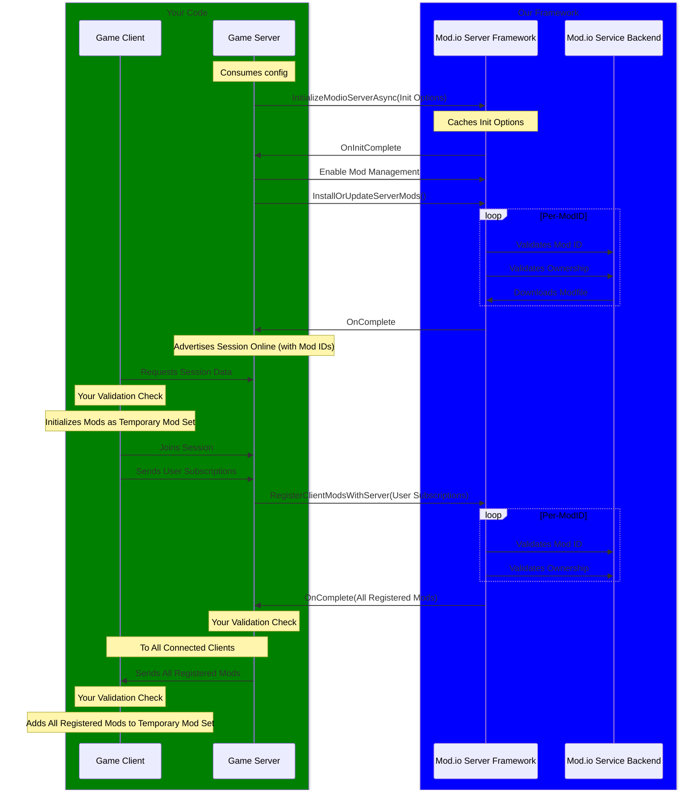
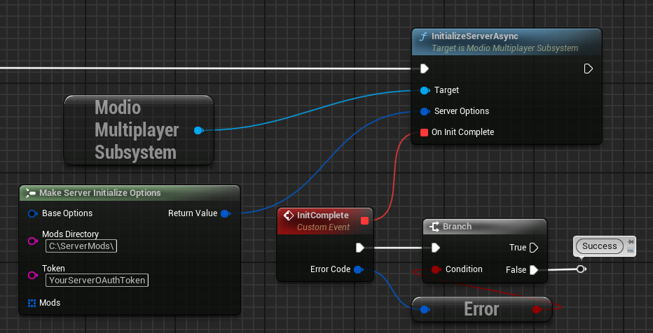
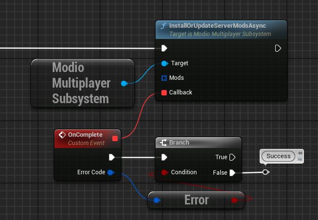
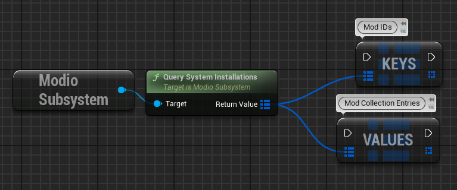
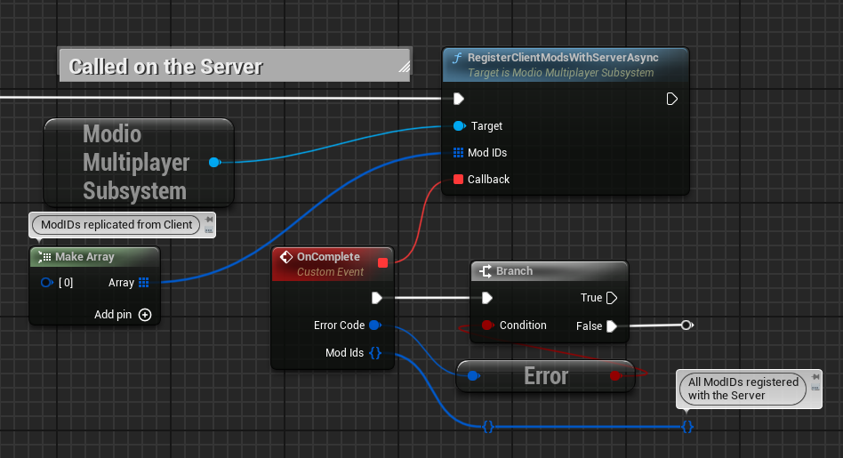
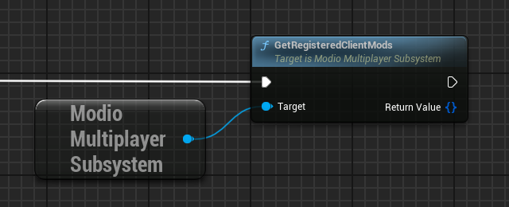
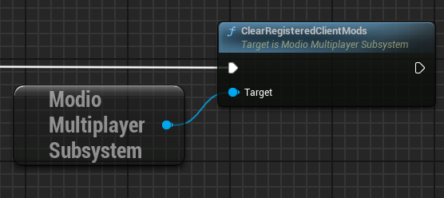
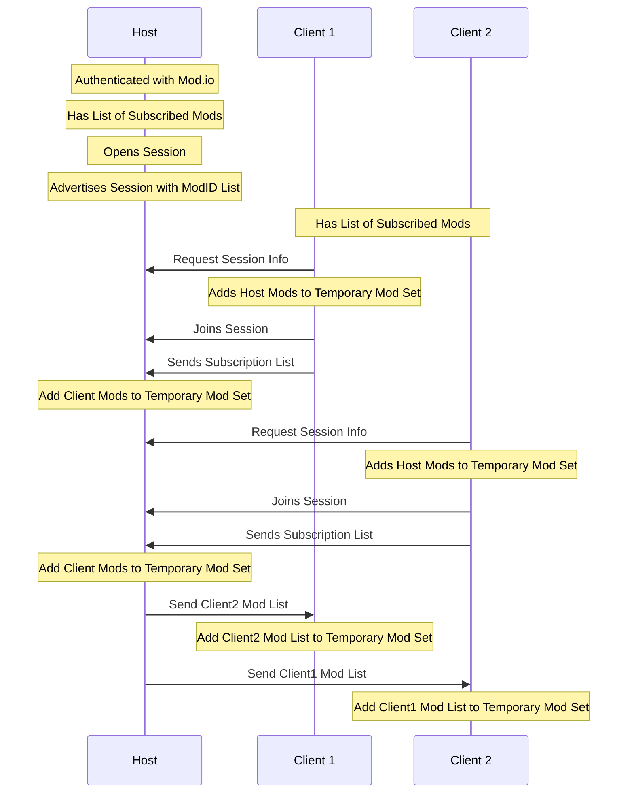

import Tabs from '@theme/Tabs';
import TabItem from '@theme/TabItem';

:::warning[Experimental Feature]
This is an experimental feature and is subject to change. 
:::

## Dedicated Server

The mod.io Unreal Engine Plugin provides a framework of features to support multiplayer servers, be they headless dedicated servers, or player hosted P2P/listen servers.

This framework does *not* take the place of any kind of online matchmaking, server advertising, joining, replication, communication, or any form of information transfer between clients and the server; it enables the authentication of the mod.io subsystems in a headless environment, as well a providing helpers for tracking the use of UGC by players on your server, and providing a single source of truth for the full list of UGC in use by the Server and all Clients.

A general example of how the framework is intended to be used is as follows:



As you can see, our framework is intended to only be directly interacted with via the dedicated server itself; clients still authenticate and acquire mods via the conventional mod.io subsystem, and it is up the the developer to get that list of subscribed mods to the server itself. The server can then utilize our framework to manage its UGC, as well as maintain an up-to-date list of client UGC across all clients.

At certain points in the above diagram you will note "Your Validation Step". These indicates places in the execution chain where you can insert you own steps for thing like validation, the accepting or refusing of UGC, and filtering based on things like tags and content. These steps allow you have more direct control over what UGC is utilized by both clients and the server. You could even add your own step to fully download all client UGC onto the server in a temporary mod set, if you wanted.

### Initialization

Dedicated Servers require a specific initialization process to properly authenticate with the mod.io service in order to acquire UGC. Part of this initialization process is the creation of an OAuth token on the mod.io website which provides scoped-permissions for the Server to properly acquire UGC.

To do this, a user must go to their [API Settings](https://mod.io/me/access) on the mod.io website and create an OAuth token for their Server to use. Once they have this token the dedicated server must pass this OAuth token, along with a number of other initialization parameters in addition to the [standard initialization options](initialization/#initialization):

- `ModsDirectory` - the directory on the server machine that UGC files should be stored in.
- `Token` - the OAuth token discussed above.
- `Mods` - An array of Mod IDs indicating what mods this Server should download.

These options can be configured by the server owner however the developer wishes: config files, launch arguments, etc, and are up to the developer to implement and capture prior to initialization.

These should be passed to `UModioMultiplayerSubsystem::InitializeServerAsync`:

<Tabs group-id="languages">
  <TabItem value="blueprint" label="Blueprint">

  

  </TabItem>
  <TabItem value="c++" label="C++" default>

 ```cpp
 /// On the Server
void UModioServerManagerSubsystem::InitializeServer()
{

	if (UModioMultiplayerSubsystem* Subsystem = GEngine->GetEngineSubsystem<UModioMultiplayerSubsystem>())
	{
        // Your Init Settings
        FModioServerInitializeOptions InitOptions;

		Subsystem->InitializeServerAsync(InitOptions, FOnErrorOnlyDelegateFast ::CreateUObject(this, &UModioServerManagerSubsystem::OnInitializationComplete));
	}
}

void UModioServerManagerSubsystem::OnInitializationComplete(FModioErrorCode ErrorCode)
{
	if (!ErrorCode)
	{
		// The Server was successfully authenticated with the mod.io service.
	}
}
```

</TabItem>
</Tabs>

:::note
* The error-handling in this sample has been omitted. See our [**Error Handling quick-start guide**](error-handling) for more information. 
* `InitializeServerAsync` is a asynchronous function, therefore you *must* wait for the callback for confirmation that the initialization is complete.
:::

### UGC Acquisition

To actually download the mods listed in the Initialization parameters, and/or additional mods, you must call `UModioMultiplayerSubsystem::InstallOrUpdateServerModsAsync` to trigger the download of mods at your discretion. This function accepts an Array of ModIDs to download, which will be acquired in addition to any listed during initialization.

:::note
Mod Management *needs* to be enabled for the Server to acquire its mods, and as such the call will fail if it is not enabled.
:::

<Tabs group-id="languages">
  <TabItem value="blueprint" label="Blueprint">

  

  </TabItem>
  <TabItem value="c++" label="C++" default>

 ```cpp
 /// On the Server
void UModioServerManagerSubsystem::GetServerMods()
{

	if (UModioMultiplayerSubsystem* Subsystem = GEngine->GetEngineSubsystem<UModioMultiplayerSubsystem>())
	{
        // These listed mods will be acquired *in addition* to any specified during Initialization
        TArray<FModioModID> Mods;
        Mods.Add(12345);
        Mods.Add(54321);

		Subsystem->InstallOrUpdateServerModsAsync(Mods, FOnErrorOnlyDelegateFast ::CreateUObject(&UModioServerManagerSubsystem::OnGetServerModsComplete));
	}
}

void UModioServerManagerSubsystem::OnGetServerModsComplete(FModioErrorCode ErrorCode)
{
	if (!ErrorCode)
	{
		// The Server successfully got the mods.
	}
}
```

</TabItem>
</Tabs>

:::note
* The error-handling in this sample has been omitted. See our [**Error Handling quick-start guide**](error-handling) for more information. 
* `InstallOrUpdateServerModsAsync` is a asynchronous function, therefore you *must* wait for the callback for confirmation that the mod acquisition process is complete.
:::

### Querying Server UGC

You can query the base mod.io subsystem for the list of UGC currently *installed* on the server. As you can add UGC after initialization with `InstallOrUpdateServerModsAsync` and UGC can fail (bad IDs, network issues) this can be useful to confirm what UGC is available on-disk.

<Tabs group-id="languages">
  <TabItem value="blueprint" label="Blueprint">

  

  </TabItem>
  <TabItem value="c++" label="C++" default>

 ```cpp
 /// On the Server
void UModioServerManagerSubsystem::GetServerMods()
{

	// Note that this is the base Mod.io Subsystem, *not* the Mod.io Multiplayer Subsystem
	if (UModioSubsystem* Subsystem = GEngine->GetEngineSubsystem<UModioSubsystem>())
	{
		for(const TPair<FModioModID, FModioModCollectionEntry>& Mod :Subsystem->QuerySystemInstallations())
		{
			Mod.Key; 	// The Mod ID
			Mod.Value; 	// The Mod Collection Entry
		}
	}
}
```

</TabItem>
</Tabs>

### Joining Client UGC

In cases where Clients who are joining a Dedicated Server have UGC of their own, it may be necessary for the Server to inform other clients of this UGC. For example, if a player has a custom hat, when they join the server all the other players will need to be able to see said hat. Similarly, if any of those players already on the server have their own UGC cosmetics, the new player will need to download those as well.

The mod.io Unreal Engine Plugin handles this via maintaining a simple set of ModIDs in-use on the server. The mod.io plugin does not download these mods on the server itself (as they are considered client-only), it only stores their IDs for easy tracking and replication. You will need to replicate a given Client's list of UGC to the Server and call `UModioMultiplayerSubsystem::RegisterClientModsWithServerAsync` which, upon completion, will return the complete list of ModIDs that have been added, which you will then need to replicate back to all connected clients for initializing/adding to a [Temporary Mod Set](temporary-mods).

<Tabs group-id="languages">
  <TabItem value="blueprint" label="Blueprint">

  

  </TabItem>
  <TabItem value="c++" label="C++" default>

 ```cpp
 /// On the Server, Mods have been replicated from the joining Client
void UModioServerManagerSubsystem::RegisterClientMods(TArray<FModioModID> JoiningClientMods)
{

	if (UModioMultiplayerSubsystem* Subsystem = GEngine->GetEngineSubsystem<UModioMultiplayerSubsystem>())
	{
		Subsystem->RegisterClientModsWithServerAsync(JoiningClientMods, FAddClientModsDelegateFast ::CreateUObject(&UModioServerManagerSubsystem::OnRegisterClientModsComplete));
	}
}

void UModioServerManagerSubsystem::OnRegisterClientModsComplete(FModioErrorCode ErrorCode, TSet<FModioModID> ModIds)
{
	if (!ErrorCode)
	{
		// The Server successfully got the mods.
        
        // ModIds is a TSet containing the full list of Client Mods on the Server
        // They will need to be replicated to all Clients.
        UYourGameState::ReplicateClientModList(ModIds);
	}
}

// On all Clients
void UYourGameState::ReplicateClientModList(TSet<FModioModID> ModIds)
{
    if (UModioSubsystem* Subsystem = GEngine->GetEngineSubsystem<UModioSubsystem>())
	{
        Subsystem->InitTempModSet(ModIds);
    }
}
```

</TabItem>
</Tabs>

:::note
* The error-handling in this sample has been omitted. See our [**Error Handling quick-start guide**](error-handling) for more information. 
* `RegisterClientModsWithServerAsync` is a asynchronous function, therefore you *must* wait for the callback for confirmation that the mod listing.
:::

### Querying Client UGC

This allows you to query the server's full list of client UGC as added via `GetRegisteredClientMods`. This returns the full list.

<Tabs group-id="languages">
  <TabItem value="blueprint" label="Blueprint">

  

  </TabItem>
  <TabItem value="c++" label="C++" default>

 ```cpp
 /// On the Server
void UModioServerManagerSubsystem::GetClientMods()
{

	if (UModioMultiplayerSubsystem* Subsystem = GEngine->GetEngineSubsystem<UModioMultiplayerSubsystem>())
	{
		for(const TSet<FModioModID>& Mod :Subsystem->GetRegisteredClientMods())
		{
			// "Mod" is an FModId
		}
	}
}
```

</TabItem>
</Tabs>

### Clearing Client UGC

It is not intended that you would deregister a player's UGC from a Server when they leave; they may return, or another player use it in the future (or be using it when the other player left) so to minimize excessive API calls and network usage, we provide only a function to *clear* the registered client UGC list. It is expected that this will only be called when it is safe to do so, such as when the Server is empty or when starting a new match/round.

<Tabs group-id="languages">
  <TabItem value="blueprint" label="Blueprint">

  

  </TabItem>
  <TabItem value="c++" label="C++" default>

 ```cpp
 /// On the Server, Mods have been replicated from the joining Client
void UModioServerManagerSubsystem::ClearRegisteredClientMods()
{
	if (UModioMultiplayerSubsystem* Subsystem = GEngine->GetEngineSubsystem<UModioMultiplayerSubsystem>())
	{
		Subsystem->ClearRegisteredClientModList();
	}
}
```

</TabItem>
</Tabs>

## Listen Server

A listen server (or P2P multiplayer) is, from the perspective of initialization and authentication with mod.io services, no different from a normal player. All clients joining a P2P/listen hosted game session should replicate their mods to one another for initialization as a [Temporary Mod Set](/getting-started/temporary-mods/), using the host the marshal them together. Upon leaving the session each client can simply close their temp mod set which will uninstall the relevant UGC.

## Client

A client, whether joining a dedicated server, or a listen server P2P session, is expected to initialize all Server UGC, as well as any UGC in use by other clients that is needed for the game experience, to be initialized as a [Temporary Mod Set](/getting-started/temporary-mods/).

An example of communication between a listen server (the Host) and its Clients would be as follows:

