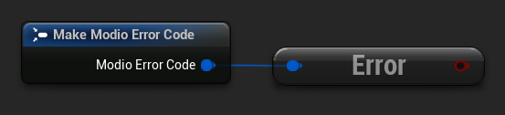
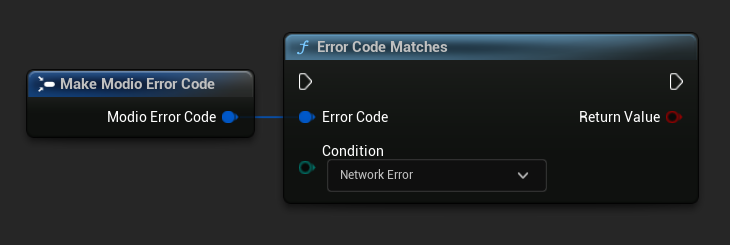

# Unreal Engine Plugin Structure

Our Unreal Engine Plugin connects mod.io's UGC solution with your game, but understanding exactly how this functions will help you get the most out of its core features. 

This guide covers:

* [ModioSubsystem](#modiosubsystem)
* [Value objects](#value-objects)
* [Guarantees](#guarantees)
* [Non-blocking, asynchronous interface](#non-blocking-asynchronous-interface)
* [Error handling](#error-handling)
* [User sessions](#user-sessions)
* [Mod data directory](#mod-data-directory)


## `ModioSubsystem`
The mod.io Unreal Engine Plugin consumes our native [C++ SDK](https://docs.mod.io/cppsdk) internally, and its public API is similar. The C++ SDK exposes a number of free functions within the `Modio` namespace, and this plugin wraps those functions in a [Subsystem](https://dev.epicgames.com/documentation/en-us/unreal-engine/programming-subsystems-in-unreal-engine).

The lifetime of the [`ModioSubsystem`](/unreal/refdocs#modiosubsystem) is automatically managed by the engine and provides a convenient way to access the plugin's functionality.  This is broadly grouped into the following categories:

* Plugin management (initialization, teardown, event loop)
* User authentication
* UGC browsing and querying
* UGC management (subscription, unsubscription, and installation)

## Value objects
All data returned by the plugin is presented using a small set of `USTRUCTs`, containing information such as:

* Details for UGC that is available for installation
* Progress information about UGC being installed
* Details and load paths for installed UGC

As structs, these are value types, so if you want to hold onto them once you’ve shut down the plugin you can do so. They do not expose any methods that "talk back" to the `ModioSubsystem`, so their methods are safe to call. This allows you, for instance, to initialize the plugin, query the installed UGC, and retain that list even after shutting down the plugin and its event loop. 

## Guarantees 

### UTF-8 guarantees

The plugin uses UTF8 for all strings, as does the mod.io REST API. 

### Thread-safety guarantees

The mod.io plugin is thread-safe with the exception of [`RunPendingHandlers`](/unreal/refdocs#run-pending-handlers). If you are calling `RunPendingHandlers` manually, you must always call it on the same thread.

:::note
The plugin event loop, any internal event handlers, and all callbacks you provide to the mod.io plugin will be run on the thread invoking `RunPendingHandlers`.
:::

## Non-blocking, asynchronous interface

The plugin communicates with the mod.io servers, the filesystem on the device you’re using, and platform-provided services for authentication. These may not return results immediately, so many functions provided by the `ModioSubsystem` are non-blocking and asynchronous. 

:::note
All async methods in the public API end with the suffix `Async`. 
:::

### Callback conventions

All of these asynchronous methods take a delegate as an argument, which will be invoked **exactly once** with the results of the requested operation. Every async callback takes a [`ModioErrorCode`](/unreal/refdocs#modioerrorcode) as its first parameter, with any optional results wrapped in `TOptional` so that you can easily check if a result is valid.

Async functions should not be considered complete until their callback is invoked.  For example, although `InitializeAsync` returns immediately, you must wait for its callback (with a successful `ModioErrorCode`) before you are able to call any other functions from the `ModioSubsystem`.

Any return values provided to your callback are passed-by-value; the plugin doesn’t expect you to have to call `release` or otherwise free up resources given to you. 

:::note
Even if the plugin is shut down while asynchronous operations are in-flight, your delegates will still be invoked **exactly once**. In this instance, the `ModioErrorCode` the delegate receives will indicate a cancellation state, and you should check for this as part of your error handling in your delegates.
:::

### Maintaining the plugin event loop

In order to provide a non-blocking implementation, the plugin operates an internal event loop. This event loop will only ever run on the thread which calls [`RunPendingHandlers`](/unreal/refdocs#run-pending-handlers).  `RunPendingHandlers` is the function we provide to tick the internal event loop and process any pending work the plugin needs to perform.

You should either enable the [configuration setting](/unreal/installation#plugin-configuration) to allow the plugin to manage a background thread which automatically calls `RunPendingHandlers`, or invoke it on tick in the game thread yourself. 

:::note
This means that if you stop calling `RunPendingHandlers`, any pending asynchronous API methods you have called will not complete and their associated callbacks will not be invoked, nor will the internal data allocated for those operations be freed.
:::

## Error handling

Many of the plugin's functions utilize the [`ModioErrorCode`](/unreal/refdocs#modioerrorcode) type.  For example, all [async](#non-blocking-asynchronous-interface) functions take a `ModioErrorCode` as the first parameter for the function's delegate. This is essentially an opaque wrapper around a numeric error code with a category and an associated string message. 

The plugin doesn’t attempt to predict what your error-handling logic or requirements are.  Instead, we return the error code to you so you can decide what to do. For instance, if you call a function and receive an error code matching a network error condition, do you want to close down the plugin? Retry again according to custom back-off logic? That decision is left to the consuming application. 

:::note
Error handling in Blueprint is still undergoing improvement. Please let us know if you have any feedback or suggestions for improving it!
:::

### Checking for errors

A "truthy" error code represents an error.  In Blueprint, you can check if a `ModioErrorCode` represents a success or failure by using the `IsError` node.

<Tabs group-id="languages">
  <TabItem value="blueprint" label="Blueprint">

  </TabItem>
  <TabItem value="c++" label="C++" default>
 ```cpp
void UModioManagerSubsystem::MyCallback(FModioErrorCode ErrorCode)
{
	if (ErrorCode)
    {
        // Failure
    }
    else
    {
        // Success
    }
}
```
  </TabItem>
</Tabs>

### Inspecting `ModioErrorCode` more deeply

Sometimes this information will be all that is required; just a simple 'success/fail' that you can handle. 

In many cases, however, you will want to perform some degree of inspection on an `ModioErrorCode` to determine specific information about that error - if nothing else, so that you can display a reason for the failure to the end user.

#### Semantic queries

In your application, there are many errors that will likely be handled the same way.  For example, you probably don’t need to handle different network errors in different ways. The semantics of networking errors are largely "try the function again later".

This is where [`ErrorCodeMatches`](/unreal/refdocs#error-code-matches) comes in. It allows you to query if the error satisfies a particular condition, such as "does this code represent some kind of networking error", without needing to explicitly check the code against all the individual errors in the category.



By querying if an error meets a specific condition, you can focus on handling a family of errors (in this case, network transmission errors) without needing to deal with individual errors within that group. No more manually checking against individual HttpError values, just a single query.

These semantic checks help you to consolidate your error handling into limited set of generic error handlers rather than dealing with each potential outcome individually. 


### Parameter validation errors

Some of the plugin functions may return errors that indicate a parameter or data validation failure. For these cases, the plugin parses the error response from the mod.io API and stores the information about which parameters failed validation until the next network request is performed. If a plugin function returns an error which matches `EModioErrorCondition::InvalidArgsError`, you can call `GetLastValidationError` in your callback to retrieve those errors and display appropriate feedback to the end user. 


## User sessions

The mod.io plugin runs on a per-platform-user basis. If you are using the plugin on a platform that requires user switching support, you must call [`ShutdownAsync`](/unreal/refdocs#shutdownasync) and re-initialize the plugin by calling [`InitializeAsync`](/unreal/refdocs#initializeasync) with a different [Session ID](#session-ids). 

Generating a stable platform-specific Session ID for each user will ensure that an incoming user who has already authenticated with mod.io on the current device and game won’t need to re-authenticate unless their authentication token has expired.

### Session IDs
Session IDs are chosen by the developer.  They can be whatever you like as long as they are deterministic and stable. Session IDs create a scope or a local profile for the current user to live in so that a single system can support multiple authenticated users side-by-side without requiring de-authentication of the previous user. Internally, the Session ID is used to create a folder containing the authentication information and cached profile of the authenticated user.

On console platforms, we suggest that the Session ID should be a string representation of the platform-provided user ID. This gives the best experience when it comes to things like user switching. For example, a game on Xbox using a sanitized string representation of the Xbox Live ID as the Session ID would have a folder structure in persistent storage like the following:

```
<persistent storage>/mod.io/<game ID>/<Xbox Live ID #1>/<cached profile data for Xbox Live User #1>
<persistent storage>/mod.io/<game ID>/<Xbox Live ID #2>/<cached profile data for Xbox Live User #2>
```

With this example, you can detect the user associated with the current controller on game start and initialize the mod.io plugin with the Session ID set to the stable string representation of that user's Xbox Live ID.  As a result, the user's authentication status will be maintained from the previous session on that device.

In the case of a Windows title with user-provided profile names, the same folder structure would be more like the following:

```
%USERDATA%/mod.io/<game ID>/ProfileName1/<cached profile data for mod.io account #1>
%USERDATA%/mod.io/<game ID>/ProfileName2/<cached profile data for mod.io account #2>
%USERDATA%/mod.io/<game ID>/ProfileName3/<cached profile data for mod.io account #3>
```

This allows multiple players, for example siblings, to each have their own session living in the same Windows account.

## Mod data directory

The plugin stores mods in a game-specific directory in the following directory by default:

| Windows | Linux | macOS | iOS |
| --- | --- | --- | --- |
| `${FolderID_Public}/mod.io` | `${USER_HOME}/mod.io` | `${USER_HOME}/Library/Application Support/mod.io` | `${APP-DIRECTORY}/Documents/mod.io` |

However, this value can be overridden in one of two ways:

### Globally for a system account

On first run of a game using the plugin, `${FOLDERID_LocalAppData}/mod.io/globalsettings.json` will be created. 

This JSON object contains a `RootLocalStoragePath` element - changing the string here to a valid path on disk will globally redirect the mod installation directory for **ALL** games using the mod.io Unreal Engine Plugin or Native SDK for the current system account. 

:::warning
Changing this value while the SDK is initialized is not supported and behaviour is undefined.
:::

### Per-game for a system account   

Per-game settings are stored in `${FOLDERID_LocalAppData}/mod.io/${GameId}/${mod.io user string}/user.json`. 

Adding a `RootLocalStoragePath` element to this file will redirect the mod installation directory for this specific game only for the current system account. Removing this value will cause the game to revert back to the global value in `globalsettings.json`.

:::note 
In Linux and macOS, mods and cached data binds to a single user. Other client have their own instance in their home directory.
:::

## Next steps

Now you know more about how the plugin works, it's time to set up [User Authentication](/unreal/user-authentication) or skip straight to [Searching for UGC](/unreal/searching-ugc).

If you've already completed these steps, we recommend working your way through the [Unreal Getting Started Guides](/unreal#unreal-engine-core-plugin-guides) as they will teach you how to implement the fundamentals of the Unreal Engine Plugin before moving onto exploring our [Features](https://docs.mod.io/features).

