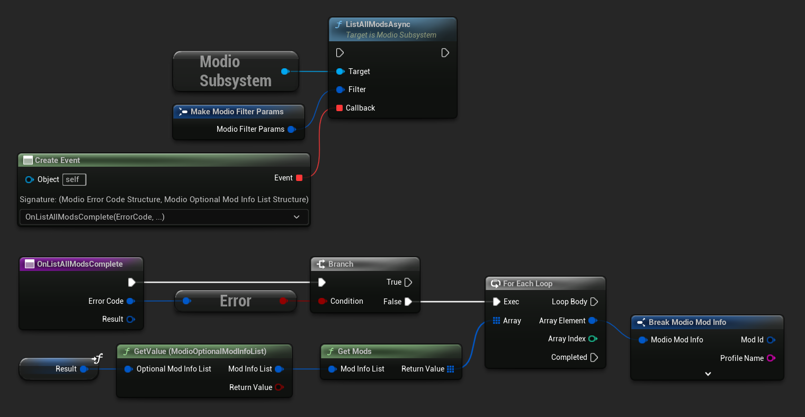
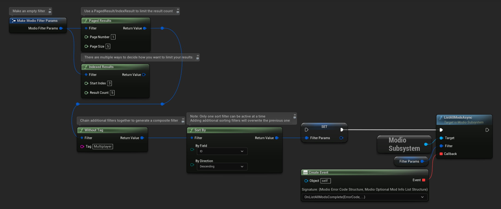

# Searching for UGC

When setting up UGC in your game, you'll want users to be able to search for UGC before they subscribe to and install it. This guide will run you through the basics on how to do so. 

This guide covers:

* [Browsing UGC](#browsing-ugc)
* [Next steps](#next-steps)

## Browsing UGC

After [initializing the plugin](/unreal/initialization) and [authenticating a user](/unreal/user-authentication), you can query the available mods using [`ListAllModsAsync`](/unreal/refdocs/#listallmodsasync). 

`ListAllModsAsync` supports filtering by name, tag, author, mature content, and more using [`ModioFilterParams`](/unreal/refdocs#modiofilterparams).  You can sort results as specified by `ModioSortFieldType`, and request paginated or indexed results. By default, `ModioFilterParams` asks for the first 100 results (the maximum number returnable in a query) sorted by `ModioModID`.

<Tabs group-id="languages">
  <TabItem value="blueprint" label="Blueprint">
The primary way this is done is through [K2_ListAllModsAsync](/unreal/refdocs#listallmodsasync).



To search for a specific query string, sort in a different order, or combine different filters, you can use a [ModioFilterParams](/unreal/refdocs#modiofilterparams) object like this:



  </TabItem>
  <TabItem value="c++" label="C++" default>
 ```cpp
void UModioManagerSubsystem::ListAllMods()
{
	if (UModioSubsystem* Subsystem = GEngine->GetEngineSubsystem<UModioSubsystem>())
	{
		FModioFilterParams Filter;
		// Build the filter by chaining together multiple calls
		Filter.PagedResults(1, 5).IndexedResults(3, 5).WithTags("Multiplayer").SortBy(EModioSortFieldType::ID, EModioSortDirection::Descending);

		Subsystem->ListAllModsAsync(Filter, FOnListAllModsDelegateFast::CreateUObject(this, &UModioManagerSubsystem::OnListAllModsComplete));
	}
}

void UModioManagerSubsystem::OnListAllModsComplete(FModioErrorCode ErrorCode, TOptional<FModioModInfoList> OptionalModList)
{
	// Ensure ListAllModsAsync was successful
	if (!ErrorCode)
	{
		// ModList is guaranteed to be valid if there is no error
		TArray<FModioModInfo> ModInfoArray = OptionalModList.GetValue().GetRawList();

		// Do something with ModInfoArray

		// You can use OptionalModList().GetValue().Paged related methods to make further paginated requests if required
	}
}

 ```
  </TabItem>
</Tabs>

## Next steps

Now your users can find UGC in your game, it's time to set up the ability to subscribe to and download UGC by implementing the [Subscribing to UGC](/unreal/subscribing) guide.

If you've already done this, we recommend working your way through the [Unreal Getting Started Guides](/unreal/#unreal-engine-core-plugin-guides) as they will teach you how to implement the fundamentals of the Unreal Engine Plugin before moving onto exploring our [Features](/features/).