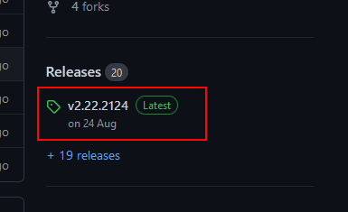
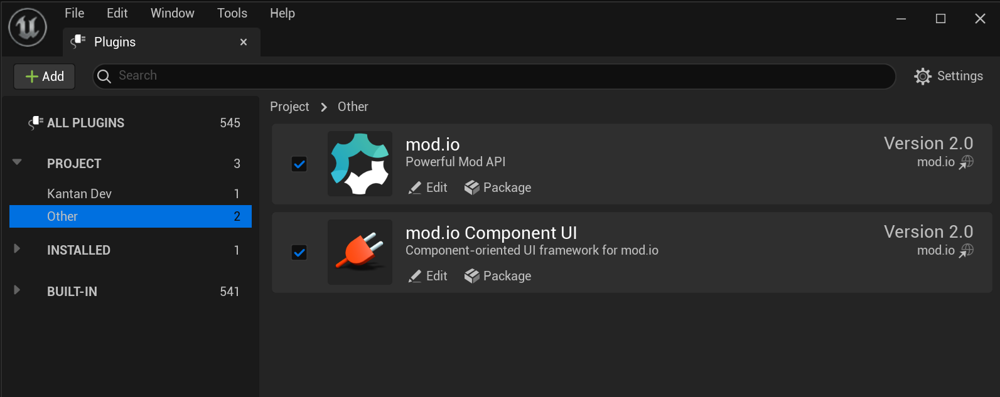
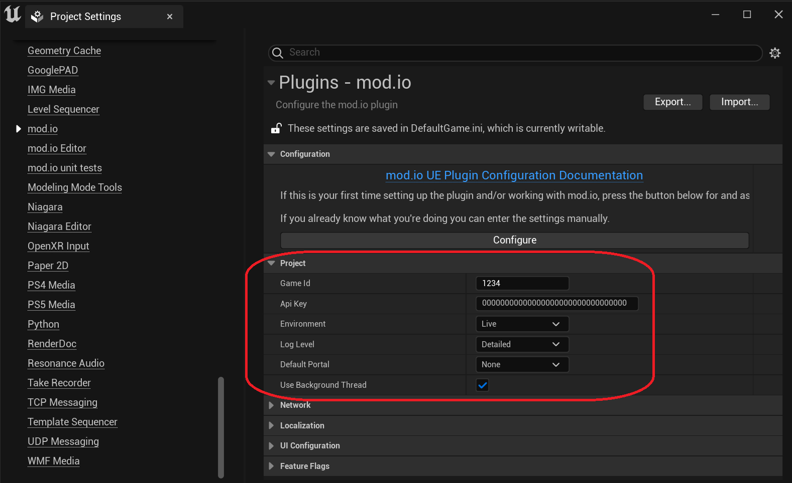

## Adding plugin files to your project

Download the Unreal Engine plugin from the [mod.io GitHub repository](https://github.com/modio/modio-ue) using one of the following methods:

### As a git submodule

- In the directory with your `.uproject` file, add and download the mod.io plugin as a git submodule with the command: 

   `git submodule add https://github.com/modio/modio-ue.git Plugins/Modio`

- Next, initialize our submodules and dependencies: 
   
   `git submodule update --init --recursive`

### In a non-git project, or without submodules

- Grab the latest release zip from the [releases section](https://github.com/modio/modio-ue/releases) on GitHub and extract the contents to your project’s `Plugins/Modio` directory

 

:::note
GitHub's automatically generated zips will not work! They do not contain our submodule dependencies. Ensure you download the zip file from the releases page as highlighted above.
:::

## Enabling the plugin

Start the editor and enable the plugin in the Unreal Engine plugin settings.

## Plugin configuration

The plugin requires some initial configuration to behave correctly. You can access these settings in the Project Settings window:

The settings have the following parameters:

| Property | Description |
| --- | --- |
| Game Id | Your mod.io-provided Game Id for the target environment |
| API Key | Your mod.io-provided API key for the target environment |
| Environment | Your target environment, `Live` or `Test` |
| Log Level | The default logging level to use. Messages with a lower log level will be silently discarded. |
| Portal | The default portal to use. This usually corresponds to the store your game will be distributed through. |
| Use Background Thread | Enables or disables the use of a [background thread](#using-a-background-thread) for the plugin's work. |

:::note
The Test environment is available for usage in limited circumstances only. **[All games should be set up on the Live environment](/unreal/installation-and-setup/#using-the-live-environment)**. Set your game to **hidden** to restrict access during the testing phase. If you require access to Test, please contact us.
:::

## Using a background thread

[`RunPendingHandlers`](/unreal/refdocs/#run-pending-handlers) is responsible for running any pending plugin work, including invoking callbacks passed to asynchronous operations.  With `Use Background Thread`  set to `true`, the mod.io plugin will automatically spin up a background thread and continually call `RunPendingHandlers` for you. This decouples the frequency of the plugin’s work from your game's main thread, and improves performance of the plugin overall.

Calling methods from the [`ModioSubsystem`](/unreal/refdocs/#modiosubsystem) will marshall all callbacks back to the game thread.  All other plugin call guarantees remain the same.

## Using the `Live` environment

All games should be set up on the `Live` environment for full access to the mod.io REST API's capabilities. 

If your game or it's modding capabilities are not yet publicly available, set your game to **hidden** on the `Live` environment.  This allows you to restrict access to specific accounts and perform QA against the production environment without exposing your title to the public. 

Once you are ready, change the state from **hidden** to **public** for a full release of your game’s modding capabilities.

## Next Steps
 
* Our [Getting Started Guide](/unreal/getting-started/) page contains a series of quick-start guides with code samples demonstrating the plugin's core functionality.
* A sample project demonstrating basic mod.io functionality is available [here](https://go.mod.io/ue5-sample).
