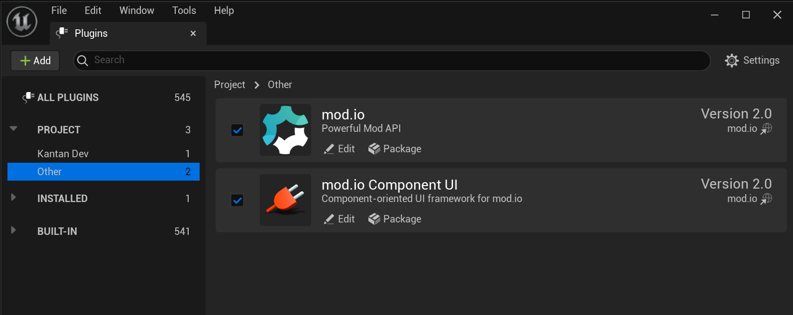

== Getting started

=== Installation and configuration

Simply extract the plugin archive to the `Plugins/Modio` directory of your project.  

Enable the plugin in the Unreal Engine settings:

Once this is done, you can configure the plugin and get started.

'''
=== Plugin Configuration

The plugin requires some configuration information to behave correctly. You can access the configuration settings in the Project Settings window:

image::img/plugin_settings.png[]

The settings have the following parameters:

[.stretch,stripes=odd,frame=none, cols="25%,~"]
|===
|[.paramname]#Game Id#|Your mod.io-provided Game Id for the target environment
|[.paramname]#API Key#|Your mod.io-provided API key for the target environment
|[.paramname]#Environment#|Your current environment, Live or Test
|[.paramname]#Log Level#|The default logging level to use. Messages with a lower log level will be silently discarded.
|[.paramname]#Portal#|The default portal to use. This usually corresponds to the store your game will be being distributed through.
|[.paramname]#Use Background Thread#|Run the mod.io plugin on a managed background thread.
|===

NOTE: The Test environment is available for usage in limited circumstances. All games should be setup on the Live environment. If you require access to Test, please contact us.

==== Using background thread

The mod.io plugin can be run on a background thread. Rather than calling <<RunPendingHandlers>> yourself, the mod.io plugin will spin up a background thread and continually call RunPendingHandlers for you. This option can be enabled in the mod.io project settings. This allows you to decouple the frequency with which you perform the plugin's "work" from your games main thread, which improves performance of the plugin.

Calling methods from the ModioSubsystem will marshall all callbacks back to the game thread, and all other plugin call guarantees remain the same.

'''

=== Setting up your game

Before release, you will be able to setup a "hidden" Live environment that will allow you to perform QA against the production environment before release, without exposing your title to the public. At this stage, only selected accounts are able to see your game page, and mods that are uploaded for your title. Once you are ready, you can change the state from "hidden" to "public" to make a full release of your game’s modding capabilities.

=== Plugin structure and concepts

[[modio_subsystem,ModioSubsystem]]
==== ModioSubsystem
The mod.io Unreal Engine Plugin consumes our Native SDK internally, and its public API is similar. Where the Native SDK exposes a number of free functions within the `Modio` namespace, for ease of integration we have wrapped those in a https://docs.unrealengine.com/4.26/en-US/ProgrammingAndScripting/Subsystems/[Subsystem].

The <<ModioSubsystem,ModioSubsystem's>> lifetime is automatically managed by the engine for you, and provides a convenient way to access the plugin functionality, which is broadly grouped into the following categories:

* Plugin management (initialization, teardown, event loop)
* User authentication
* Mod browsing and querying
* Mod management (subscription, unsubscription, and installation)

==== Value objects
All data returned by the plugin is presented using a small set of USTRUCTs, containing information such as:

* Details for mods that are available for installation
* Progress information about mods being installed
* Details, and load paths, for installed mods

As structs, these are value types, so if you want to hold onto them once you've shut down the plugin you can do so, and they do not expose any methods that 'talk back' to the Subsystem, so their methods are safe to call.
This allows you, for instance, to initialize the plugin, query the installed mods, and retain that list even after shutting down the plugin again so you can stop running the plugin's event loop. 

==== UTF-8 guarantees

The plugin uses UTF8 for all strings, as does the mod.io REST API. 

==== Thread-safety guarantees

The mod.io plugin is thread-safe with the exception of <<RunPendingHandlers>>. If you are calling RunPendingHandlers manually, you must always call it on the same thread.

NOTE: The plugin event loop, any internal event handlers, and all callbacks you provide to the mod.io plugin, will be run on the thread invoking <<RunPendingHandlers>>.

==== Non-blocking, asynchronous interface

The plugin communicates with the mod.io servers, the filesystem on the device you're using, and platform-provided services for authentication. All of these may not return results immediately, so many functions provided by the ModioSubsystem are non-blocking and asynchronous. For example, the initialization function returns immediately. However, your game should consider the ModioSybsystem as initialized only when the init callback executes.

NOTE: All async methods in the public API end with the suffix `Async`. 

===== Callback conventions
All of these asynchronous methods take a delegate as an argument, which will be invoked *exactly once* with the results of the requested operation. 
Every async callback takes a <<ModioErrorCode>> as its first parameter, with any optional results wrapped in `TOptional` so that you can easily check if a result is valid or not. 

Any return values provided to your callback are passed-by-value - the plugin doesn't expect you to have to call `release` or otherwise free up resources given to you. 

NOTE: Even if the plugin is shut down while asynchronous operations are in-flight, your delegates will still be invoked *exactly once*. In this instance, the <<ModioErrorCode>> the delegate receives will indicate a cancellation state, and you should check for this as part of your error handling in your delegates.

===== Maintaining the plugin event loop

In order to provide a non-blocking implementation, the plugin operates an internal event loop. This event loop, will only ever run on the thread which calls <<RunPendingHandlers>>, which is the function we provide to allow you to 'tick' the event loop and process any pending work the Plugin needs to perform.

You should either enable the <<Configuration>> setting to allow the plugin to manage a background thread for you which will call <<RunPendingHandlers>>, or else invoke it on Tick on the game thread yourself. 

NOTE: This means that if you stop calling <<RunPendingHandlers>>, any pending asynchronous API methods you have called will not complete and their associated callbacks will not be invoked, nor will the internal data allocated for those operations be freed.

==== User Sessions

The mod.io plugin runs on a per-platform-user basis. If you are using the plugin on a platform that requires user switching support, it is a requirement that you call <<K2_ShutdownAsync>> and then re-initialize the plugin with <<K2_InitializeAsync>> with a different User Session. Generating a stable User Session ID per platform-specific user will ensure that if the incoming user has already authenticated to mod.io on this device for this game, they won't need to do so again unless their authentication token has expired.

==== Session IDs
Session IDs are generated by the developer and can be whatever you like as long as they are deterministic/stable. 
They essentially create a 'scope' or a 'local profile' for the current user to live in, so that a single system can support multiple authenticated users side-by-side without requiring deauthentication of the previous user. 
On console platforms, we suggest that this be a string representation of the platform-provided user ID, as this gives the best experience when it comes to things like user switching. 

Internally, the session ID is used to create a folder which then in turn contains the authentication information and cached profile of the authenticated user if any. For example, a game using the GDK on XBox, using a sanitized string representation of the xbox live ID as the session ID, would have a folder structure in the persistent storage like the following:

[source]
----
<persistent storage>/mod.io/<game ID>/<Xbox Live ID #1>/<cached auth/profile data for Xbox Live User #1>
<persistent storage>/mod.io/<game ID>/<Xbox Live ID #2>/<cached auth/profile data for Xbox Live User #2>
----

What this means, is when your game starts, you can detect the user associated with the current controller, pass in the stable string representation of their ID as the session ID, and if the user has authenticated with mod.io the previous time they played the game on that device, then their authentication status would be maintained.

In the case of a PC title with user-provided profile names, the same folder structure would be more like the following:

[source]
----
%USERDATA%/mod.io/<game ID>/MyProfile1/<cached auth/profile data for mod.io account #1>
%USERDATA%/mod.io/<game ID>/SomeOtherProfile/<cached auth/profile data for mod.io account #2>
%USERDATA%/mod.io/<game ID>/ThirdUserSpecifiedProfileName/<cached auth/profile data for mod.io account #3>
----

This allows multiple players, for example siblings, to each have their own session, that lives in the same Windows account.

==== Error handling

Many functions in the plugin interface either return, or provide as the first parameter to your delegate, a <<ModioErrorCode>> value. This is essentially an opaque wrapper around a numeric error code with a category and an associated string message. 

The plugin doesn't attempt to predict what your error-handling logic or requirements are: instead, we return the error code to you so you can decide what to do. For instance, if you call a function and receive an error code matching a network error condition, do you want to close down the plugin? Retry again according to custom back-off logic? That decision is left to the consuming application. 

For more details on the error codes and how to inspect their values, please see <<Plugin quick-start: Error Handling>> and <<ModioErrorCode>>.

==== Mod Data Directory

The plugin stores mods in a game-specific directory in the following directory by default:

[stripes=odd,frame=none,cols="1,^1,^1,^1"]
|===
| Windows                    | Linux                    | macOS 											| iOS
|`${FolderID_Public}/mod.io` | `${USER_HOME}/mod.io`    | `${USER_HOME}/Library/Application Support/mod.io` | `${APP-DIRECTORY}/Documents/mod.io`
|===

However, this value can be overridden in one of two ways:

* Globally for a system account
+
On first run of a game using the plugin, `${FOLDERID_LocalAppData}/mod.io/globalsettings.json` will be created. 
+
This JSON object contains a `RootLocalStoragePath` element - changing the string here to a valid path on disk will globally redirect the mod installation directory for *ALL* games using the mod.io Unreal Engine Plugin or Native SDK for the current system account. 
+
NOTE: Changing this value while the SDK is initialized is not supported and behaviour is undefined.

* Per-game for a system account   
+
Per-game settings are stored in `${FOLDERID_LocalAppData}/mod.io/${GameId}/${mod.io user string}/user.json`. 
+
*Adding* a `RootLocalStoragePath` element to this file will redirect the mod installation directory for this specific game only, for the current system account. Removing this value will cause the game to revert back to the global value in `globalsettings.json`.

NOTE: In Linux, macOS & iOS, mods and data binds to a single user. Every other client would have their own instance in their home directory.

'''

=== Plugin quick-start: Initialization and Teardown

As mentioned in <<Maintaining the plugin event loop>>, the plugin's internal event loop requires care and attention in the form of <<RunPendingHandlers>>.
For best performance it should be called at least once per frame, so it should either go into your project's main loop or into a `tick`-style function on an appropriate controller/manager object. 

.Blueprint Example
[%collapsible]
====

image::img/run_pending_handlers.png[]

When you are ready to initialize the plugin for the current user, you'll need to call <<K2_InitializeAsync>>, passing in an instance of `FModioInitializeOptions`, and a delegate so you know when the plugin is initialized correctly. Here, you can specify your Game ID, API Key, Environment, and https://docs.mod.io/restapiref/#targeting-a-portal[Portal]. You can get the default portal for the current platform using <<GetDefaultPortalForCurrentPlatform>> function.

image::img/initasync_customoptions.png[]

If you have configured your game's API Key, ID and environment via the Plugin Settings window as in <<Configuration>>, you can use the convenience function <<Get Project Initialize Options For Session Id>>:

image::img/initasync_getoptions.png[]

.Notes
* The error-handling in this sample has been omitted. See <<Plugin quick-start: Error Handling>> for more information on error handling. 
* To fully initialize the SDK, you must receive confirmation from the callback. Consider that most functions return after invocation, nonetheless, their effects are only visible in their callback function

====

.C++ Example
[%collapsible]
====

[source,c++]
----
void UModioManager::Init()
{
	if (GEngine->GetEngineSubsystem<UModioSubsystem>())
	{
		GEngine->GetEngineSubsystem<UModioSubsystem>()->InitializeAsync(
			UModioSDKLibrary::GetProjectInitializeOptionsForSessionId(UModioSDKLibrary::GetDefaultSessionIdWindows()), 
			FOnErrorOnlyDelegateFast::CreateUObject(this, &UModioManager::OnInitCallback));
	}
	
	UE_LOG(LogModioGame, Log, TEXT("Initializing Modio SDK"));
}

void UModioManager::OnInitCallback(FModioErrorCode ErrorCode)
{
    UE_LOG(LogModioGame, Log, TEXT("Error initializing Modio SDK, the error code was %s"), *ErrorCode.GetErrorMessage());
}

void UModioManager::Tick(float DeltaTime)
{
	if (GEngine->GetEngineSubsystem<UModioSubsystem>())
	{
		GEngine->GetEngineSubsystem<UModioSubsystem>()->RunPendingHandlers();
	}
}
----

.Notes
* You need to provide a default Session Id to initialize the SDK, for Windows we provide a method : <<GetDefaultSessionIdWindows>>.

====

Doing the reverse and shutting down the plugin is equally simple. 

.Blueprint Example
[%collapsible]
====

image::img/shutdownasync_runhandlers.png[]

====

.C++ Example
[%collapsible]
====

[source,c++]
----

void UModioManager::Shutdown()
{
	if (GEngine->GetEngineSubsystem<UModioSubsystem>())
	{
		GEngine->GetEngineSubsystem<UModioSubsystem>()->ShutdownAsync(FOnErrorOnlyDelegateFast::CreateUObject(this, &UModioManager::OnShutdownCallback));
	}
}

void UModioManager::OnShutdownCallback(FModioErrorCode ErrorCode)
{
	UE_LOG(LogModioGame, Log, TEXT("Shutdown failed, error code was %s"), *ErrorCode.GetErrorMessage());
}
----

====

.Notes
* You will need to continue to call <<RunPendingHandlers>> while the async shutdown is in progress to allow for intermediate handlers to finish running, and for your in-flight calls to return with an error code indicating cancellation.
* You MUST NOT call ShutdownAsync from within one of your completion handlers/callbacks, or the application will potentially deadlock. 

'''

=== Plugin quick-start: User Authentication

mod.io provides two ways for users to create an account to use the service: email authentication, and single sign on (SSO) through an external authentication partner. The flow for these is slightly different.

==== Email authentication

mod.io allows users to create an account on the mod.io website using an email address. Once the user has accepted the mod.io Terms of Use and created an account, they can use that email address to log in and access mod.io services in your game. 

Email authentication involves:
    1. Submitting the user's email address
    2. The user retrieving the one-time code mod.io sends to that address (externally to your application)
    3. Submitting the code provided by the user

===== Submitting an email address

You can request an email authentication code to be sent to a users email address.

.Blueprint Example
[%collapsible]
====

From Blueprint, you can use the <<K2_RequestEmailAuthCodeAsync>> node.

image::img/request_email_auth_code.png[]

====

.C++ Example
[%collapsible]
====

[source,c++]
----
void UModioManager::RequestEmailAuthCode(const FString &EmailAddress)
{
	if (GEngine->GetEngineSubsystem<UModioSubsystem>())
	{
		GEngine->GetEngineSubsystem<UModioSubsystem>()->RequestEmailAuthCodeAsync(FModioEmailAddress(*EmailAddress), FOnErrorOnlyDelegateFast::CreateUObject(this, &UModioManager::OnRequestEmailCodeMailSentCallback));
	}
}

void UModioManager::OnRequestEmailCodeMailSentCallback(FModioErrorCode ErrorCode)
{
	UE_LOG(LogModioGame, Log, TEXT("Requesting email auth code failed, error code was %s"), *ErrorCode.GetErrorMessage());
}
----

====
Once this is done, prompt the user to check their email address and provide them with a way to enter the code that was sent to them. 

This code can then be sent to the mod.io server to finalize the user's authentication. 

===== Submitting an email authentication code

Submitting an email authentication code is very similar to the process for requesting the code. 

.Blueprint Example
[%collapsible]
====

You can do this by calling <<K2_AuthenticateUserEmailAsync>>.

image::img/authenticate_user_email.png[]

====

.C++ Example
[%collapsible]
====

[source,c++]
----

void UModioManager::AuthenticateUserEmail(const FString& AuthCode)
{
	if (GEngine->GetEngineSubsystem<UModioSubsystem>())
	{
		GEngine->GetEngineSubsystem<UModioSubsystem>()->AuthenticateUserEmailAsync(FModioEmailAuthCode(*AuthCode), FOnErrorOnlyDelegateFast::CreateUObject(this, &UModioManager::OnAuthenticateUserEmailCallback));
	}
}

void UModioManager::OnAuthenticateUserEmailCallback(FModioErrorCode ErrorCode)
{
	UE_LOG(LogModioGame, Log, TEXT("Email auth code failed, error code was %s"), *ErrorCode.GetErrorMessage());
}

----

====

Once this completes successfully, the user is authenticated and you can then manage the user's subscriptions. 

==== SSO/External authentication

mod.io features single sign on authentication from a number of external providers. This currently includes:

	* Apple
	* Discord
	* Epic Games Store
	* GoG
	* Google
	* itch.io
	* Nintendo Switch
	* PlayStation™Network
	* Steam
	* Xbox Live
	* Oculus
	* OpenID

Please note that the ability to authenticate players using OpenID is a premium feature. If you are interested in mod.io premium features, please contact developers@mod.io.

To use SSO with mod.io, a user must have accepted the mod.io Terms of Use in order to create an account.

This means the external authentication flow is the following:

    1. Call <<K2_AuthenticateUserExternalAsync>> , passing in any provider-specific parameters, setting `AuthenticationParams::bUserHasAcceptedTerms` to false, and indicating which authentication provider you wish to use. You could use the <<UModioPlatformHelpersLibrary::GetDefaultAuthProviderForCurrentPlatform>> to get the default provider for the current platform, which is, for example, Steam for Windows. Alternatively, you can specify the provider manually.
    2. Check the error code in the callback - if it indicates the user has not yet created an account or accepted the terms, call <<K2_GetTermsOfUseAsync>> and display the provided information to your user.
    3. If the user clicks the OK/affirmative button on your screen displaying the terms of use, repeat the call in step 1 but setting `AuthenticationParams::bUserHasAcceptedTerms` to *true*.
    4. Check the error code in the callback - a false-y error code indicates that authentication was successful, and users can now install and manage mods and subscriptions.

Here's what steps 1 and 2 might look like in Blueprint:

image::img/authenticate_user_external.png[]

Note that the SDK will automatically URL encode parameters (such as the auth token) when making the request.

===== Steam Authentication Example

In order to use the Steam authentication functionality, you must add your games https://partner.steamgames.com/apps/sdkauth[Encrypted App Ticket Key] from Steamworks. On your games profile on mod.io, go to Edit > Options and add the key. You can then call <<K2_AuthenticateUserExternalAsync>> and provide the users Encrypted App Ticket as the Auth Token. Note that the Auth Token must be Base64 encoded when passed 

Below is a sample Blueprint method that will get the users current Encrypted App Ticket that you can use in your Authentication request. Add this to a BlueprintLibrary in your games codebase.

.C++ Example
[%collapsible]
====
[source,c++]
----
DECLARE_DYNAMIC_MULTICAST_DELEGATE_TwoParams(FOnGetTicket, int32, LocalUserNum, FString, TokenData);
UFUNCTION(BlueprintCallable)
static void GetSteamAuthTicket(int32 LocalUserNum, FOnGetTicket Callback)
{
    //Get the steam subsystem
    FOnlineSubsystemSteam* SteamSubsystem = static_cast<FOnlineSubsystemSteam*>(IOnlineSubsystem::Get());
    //Add a handler to the subsystem for when the ticket has been retrieved
    SteamSubsystem->GetEncryptedAppTicketInterface()->OnEncryptedAppTicketResultDelegate.AddLambda(
        [LocalUserNum, OnComplete = Callback](bool bEncryptedDataAvailable, int32 ResultCode) {
            
            TArray<uint8> TokenData;
            if (bEncryptedDataAvailable)
            {
                //If the ticket was retrieved successfully, get its data
                SteamSubsystem->GetEncryptedAppTicketInterface()->GetEncryptedAppTicket(TokenData);
            }
            //Call the user callback with the base64-encoded ticket, ready for submission via AuthenticateUserExternalAsync
            OnComplete.ExecuteIfBound(LocalUserNum, FBase64::Encode(TokenData));
        });
    //Begin the actual async request for the ticket, which will invoke the above lambda when it completes
    SteamSubsystem->GetEncryptedAppTicketInterface()->RequestEncryptedAppTicket(nullptr, 0);
}
----
Note that if you are on 4.27 or above, Epic provides a helper method in OnlineIdentityInterface::GetLinkedAccountAuthToken that will get the current account's auth token without having to take a direct dependency on FOnlineSubsystemSteam. Ensure that the token is Base64 encoded when being passed to <<K2_AuthenticateUserExternalAsync>>.
====

==== Token Lifetime & Re-Authentication

By default, tokens issued via email token exchange have a lifetime of 1 year. You can verify that a user has been successfully authenticated by using <<QueryUserProfile>>. A success and non-null result indicates that a user has been authenticated.

If a user is not authenticated for any reason (for instance their token has been invalidated by changing their password, or their profile data has been removed from their device) then you should prompt them for the authentication flow.

'''

=== Plugin quick-start: Browsing available mods

Now that you've followed the instructions in <<Plugin quick-start: Initialization and Teardown>> you can begin to query the available mods for information you can display to your end users. The ListMods methods support filtering, allowing for pagination, result limits, filtering by tag etc. By default, the filter asks for the first 100 results (the maximum number returnable in a query), sorting by mod ID.

.Blueprint Example
[%collapsible]
====

The primary way this is done is through <<K2_ListAllModsAsync>>.

image::img/list_all_mods.png[]

To search for a specific query string, sort in a different order, or combine different filters, you can use a <<ModioFilterParams>> object like this:

image::img/list_all_mods_filter.png[]

====

.C++ Example
[%collapsible]
====
[source,c++]
----
void UModioManager::ListAllMods()
{
	if (GEngine->GetEngineSubsystem<UModioSubsystem>())
	{
		FModioFilterParams Filter;
		Filter.PagedResults(1, 5).IndexedResults(3, 5).WithTags("Multiplayer").SortBy(EModioSortFieldType::ID, EModioSortDirection::Descending);

		GEngine->GetEngineSubsystem<UModioSubsystem>()->ListAllModsAsync(Filter, FOnListAllModsDelegateFast::CreateUObject(this, &UModioManager::OnListAllModsCallback));
	}
}

void UModioManager::OnListAllModsCallback(FModioErrorCode ErrorCode, TOptional<FModioModInfoList> OptionalModList)
{
	// Ensure we don't have an error code
	if (ErrorCode == false)
	{
		// ModList is guaranteed to be valid if there is no error
		TArray<FModioModInfo> ModInfo = OptionalModList.GetValue().GetRawList();

		// Do something with ModInfo

		// You can use OptionalModList().GetValue().Paged related methods to make further paginated requests if required
	}
}

----
====

'''

=== Plugin quick-start: Mod subscriptions and management

So you've shown the user some mods based on a query they've submitted through your UI, and the user has picked one that they'd like to install. How do you begin the installation process, and once the mod is installed how do you know what files to be loading into memory?

==== Mod subscriptions

A user indicates that they want to have a mod installed by 'subscribing' to it. Subscriptions are stored on the mod.io servers and associated to a user's mod.io account. 
When a user 'unsubscribes' to a mod, they're indicating they'd like to have that mod uninstalled from any device they're logged in on.

The API for managing subscriptions is simple and consists of a call to either <<SubscribeToModAsync>> or <<UnsubscribeFromModAsync>> with the ID of the mod in question and a callback to receive the status of the request:

NOTE: To subscribe to a mod, <<EnableModManagement>> must be called beforehand.

When subscribing to a mod, you can also pass in a bool to indicate if you want to subscribe to all dependencies for the given mod. If dependencies are also subscribed, the mod.io servers will also associate them with the current user.

NOTE: Currently when dependencies are included during subscription, they will not automatically be downloaded. To ensure the latest content is downloaded, <<FetchExternalUpdatesAsync>> must be called after subscribing.

.Blueprint Example
[%collapsible]
====

image::img/subscribe_to_mod.png[]

image::img/unsubscribe_from_mod.png[]

====

.C++ Example
[%collapsible]
====
[source,c++]
----

void UModioManager::SubscribeToMod(FModioModID ModToSubscribeTo, bool IncludeDependencies)
{
	if (GEngine->GetEngineSubsystem<UModioSubsystem>())
	{
		GEngine->GetEngineSubsystem<UModioSubsystem>()->SubscribeToModAsync(ModId, IncludeDependencies, FOnErrorOnlyDelegateFast::CreateUObject(this, &UModioManager::OnSubscribeToModCallback, ModId));
	}
}

void UModioManager::OnSubscribeToModCallback(FModioErrorCode ErrorCode, FModioModID ModId)
{
	// Do something with the successfully subscribed Mod ID
}

void UModioManager::UnsubscribeFromMod(FModioModID ModId)
{
	if (GEngine->GetEngineSubsystem<UModioSubsystem>())
	{
		GEngine->GetEngineSubsystem<UModioSubsystem>()->UnsubscribeFromModAsync(ModId, FOnErrorOnlyDelegateFast::CreateUObject(this, &UModioManager::OnUnsubscribeFromModCallback, ModId));
	}
}

void UModioManager::OnUnsubscribeFromModCallback(FModioErrorCode ErrorCode, FModioModId ModId)
{
	// Do something with the successfully unsubscribed Mod ID
}

----
====

===== External subscription changes

Because the mod.io service is available as a website as well as integration within your applications, users can manage their subscriptions (and therefore installations) outside of your application. This means that we need to be able to query the server for any external subscription changes. To do this, you will need to fetch external updates  <<K2_FetchExternalUpdatesAsync>> to synchronise the server state with the plugin's local subscriptions.

.Blueprint Example
[%collapsible]
====

You can use <<K2_FetchExternalUpdatesAsync>> from Blueprint:

image::img/fetch_external_updates.png[]

====

.C++ Example
[%collapsible]
====
[source,c++]
----

void UModioManager::FetchExternalUpdates()
{
	if (GEngine->GetEngineSubsystem<UModioSubsystem>())
	{
		GEngine->GetEngineSubsystem<UModioSubsystem>()->FetchExternalUpdatesAsync(FOnErrorOnlyDelegateFast::CreateUObject(this, &UModioManager::OnFetchExternalUpdatesCallback));
	}
}

void UModioManager::OnFetchExternalUpdatesCallback(FModioErrorCode ErrorCode)
{

}

----
====

NOTE: You should call <<K2_FetchExternalUpdatesAsync>> sparingly, at times you want to ensure that the state is up-to-date. Alternatively, we recommend calling it based on user input such as a button in your UI, so you don't make spurious update checks. 

In case you need to prepare for changes happening beforehand, call <<K2_PreviewExternalUpdates>>. This function retrieves a list of updates between the users local mod state, and the server-side state. It allows you to identify which mods will be modified when you call <<K2_FetchExternalUpdatesAsync>> next in order to perform any content management (such as unloading files) that might be required. Its use is very similar:

.C++ Example
[%collapsible]
====
[source,c++]
----
void UModioManager::PreviewExternalUpdates()
{
    if (GEngine->GetEngineSubsystem<UModioSubsystem>())
	{
		GEngine->GetEngineSubsystem<UModioSubsystem>()->PreviewExternalUpdates(FOnPreviewExternalUpdatesDelegateFast::CreateUObject(this, &UModioManager::OnFetchExternalUpdatesCallback));
	}
};

void UModioManager::OnPreviewExternalUpdatesCallback(FModioErrorCode ErrorCode, TMap<FModioModID, EModioModChangeType> PreviewMap)
{

}

----
====

===== Checking the user subscription list

In order to see which mods the user has subscribed to, call <<QueryUserSubscriptions>> to retrieve a collection of <<ModioModCollectionEntry>> objects, one for each subscribed mod. 
Each of these objects contains the mod's state, profile information, ID, and other data, suitable for showing users a list of their subscriptions.

NOTE: This collection includes mods that are still in the process of being installed! Make sure to check the result of <<GetModState>> before trying to load files from the mods in this collection, or alternatively use <<QueryUserInstallations>> as described in <<Retrieving mod directory paths for loading>>.

.Blueprint Example
[%collapsible]
====

image::img/query_user_subscriptions.png[]

====

.C++ Example
[%collapsible]
====
[source,c++]
----

void UModioManager::QueryUserSubscriptions()
{
	if (GEngine->GetEngineSubsystem<UModioSubsystem>())
	{
		TMap<FModioModID, FModioModCollectionEntry> SubscribedMods = GEngine->GetEngineSubsystem<UModioSubsystem>()->QueryUserSubscriptions();

		// Do something with Subscribed Mods ie display on a UI
	}
}

----

====

==== Installation management, mod paths

So a subscription marks a mod as requiring installation, and an unsubscription indicates uninstallation, but how do you actually control when the plugin *does* those things? After all, you don't want a mod to be uninstalled after your main program has loaded those files into memory, locking them from deletion. Likewise, you probably don't want to be using networking or processor resources during gameplay for downloading mods. In order to give you control over when these processes occur, without forcing you to shut down the plugin entirely, you can call <<K2_EnableModManagement>> and <<DisableModManagement>>.

In order to display a notification to your users when a mod is finished installing or updating, <<K2_EnableModManagement>> asks you to provide it with a callback. Because <<K2_EnableModManagement>> is not an async function (ie it doesn't end with *Async), the callback operates differently to asynchronous result callbacks you use elsewhere in the plugin. A callback given to this function will be held by the plugin until a corresponding call to <<DisableModManagement>> or <<K2_ShutdownAsync>>, and the callback will be invoked every time a mod is automatically installed, updated, or uninstalled by the plugin's internal event loop.

.Blueprint Example
[%collapsible]
====

image::img/enable_mod_management.png[]

====

.C++ Example
[%collapsible]
====
[source,c++]
----

void UModioManager::EnableModManagement()
{
	if (GEngine->GetEngineSubsystem<UModioSubsystem>())
	{
		GEngine->GetEngineSubsystem<UModioSubsystem>()->EnableModManagement(FOnModManagementDelegateFast::CreateUObject(this, &UModioManager::OnModManagementEnabledCallback));
	}
}

void UModioManager::OnModManagementEnabledCallback(FModioModManagementEvent ModioModManagementEvent)
{
	switch(ModioModManagementEvent.Event)
	{
	case EModioModManagementEventType::Installed:
		UE_LOG(LogModioGame, Log, TEXT("Received an Installed event for Mod %s"), *ModioModManagementEvent.ID.ToString());
		break;

	case EModioModManagementEventType::Uninstalled: 
		UE_LOG(LogModioGame, Log, TEXT("Received an Uninstalled event for Mod %s"), *ModioModManagementEvent.ID.ToString());
		break;
	case EModioModManagementEventType::Updated:
		UE_LOG(LogModioGame, Log, TEXT("Received an Updated event for Mod %s"), *ModioModManagementEvent.ID.ToString());
		break;

	case EModioModManagementEventType::Uploaded:
		UE_LOG(LogModioGame, Log, TEXT("Received an Uploaded event for Mod %s"), *ModioModManagementEvent.ID.ToString());
		break;

	default:;
	}
}

----
====

While mod management is enabled, the plugin assumes that it has the ability to make changes to the filesystem, including deleting mods that the user has no longer subscribed to. As a result you should make sure that you don't have any open handles to files inside the mod directories when you call <<K2_EnableModManagement>>.

When you want to be able to freely open files in the mod directories, call <<DisableModManagement>> to tell the plugin to finish the current operation but not continue any others. 

Call <<IsModManagementBusy>> to see if mod management is currently updating, installing, or uninstalling a mod. 

.Blueprint Example
[%collapsible]
====

image::img/disable_mod_management.png[]

====

.C++ Example
[%collapsible]
====
[source,c++]
----

void UModioManager::DisableModManagement()
{
	if (GEngine->GetEngineSubsystem<UModioSubsystem>())
	{
		if (GEngine->GetEngineSubsystem<UModioSubsystem>()->IsModManagementBusy() == false)
		{
			GEngine->GetEngineSubsystem<UModioSubsystem>()->DisableModManagement();
		}
	}
}

----
====

===== Retrieving mod directory paths for loading

So now we have the user picking mods and marking them for installation, we're enabling mod management at a point where we don't mind the plugin changing the filesystem, and mods are being installed by the plugin, we now need to know where they are on disk, otherwise you can't load them into your game!

The easiest way to do this is by using <<QueryUserInstallations>>. This function allows you to specify if you want to include outdated mods or not, and will return a collection of <<ModioModCollectionEntry>> objects that you can query for folder paths you can use to load files into your title. 

.Blueprint Example
[%collapsible]
====

image::img/query_user_installations.png[]

====

.C++ Example
[%collapsible]
====
[source,c++]
----

void UModioManager::GetInstalledMods()
{
	if (GEngine->GetEngineSubsystem<UModioSubsystem>())
	{
		TMap<FModioModID, FModioModCollectionEntry> InstalledMods = GEngine->GetEngineSubsystem<UModioSubsystem>()->QueryUserInstallations(false);

		// Do something with each installed mod, ie adding paths/loading the content appropriately
	}
}

----
====

'''

=== Plugin quick-start: Error Handling

NOTE: Error handling in Blueprints is still undergoing improvement. Please let us know if you have any feedback or suggestions for improving it!

Many functions in the plugin, especially asynchronous functions either return a Modio::ErrorCode, or else invoke your passed-in callback with a Modio::ErrorCode as the first parameter.

==== Checking for errors

You can check if a ModioErrorCode represents a success or failure by using the `IsError` node. If the code returns true, then it represents an error.

image::img/is_error.png[]

==== Inspecting ErrorCodes more deeply

Sometimes, this information will be all that is required, just a simple 'success/fail' that you can handle. 

In many cases, however, you will want to perform some degree of inspection on an ErrorCode in order to determine specific information about that error - if nothing else, so that you can display a reason for the failure to the end user.

===== Semantic Queries

In your application, you probably don't need to handle different network errors in different ways, for example. The semantics of networking errors are largely 'try the function again later'.

This is where <<ErrorCodeMatches>> comes in. 

It allows you to query if the error satisfies a particular condition, such as 'does this code represent some kind of networking error', without needing to explicitly check the code against all the individual errors in the category:

image::img/error_code_matches_network_error.png[]

By querying if the error meets a specific condition, you can focus on handling a family of errors (in this case, network transmission errors) without needing to deal with individual errors within that grouping. No more manually checking against individual HttpError values, just a single query. 

By grouping these codes into semantic checks, it also helps you to potentially consolidate your error handling into a more limited set of generic error handlers rather than needing to deal with each potential outcome individually. 

image::img/error_code_matches_chaining.png[]

==== Parameter Validation Errors

Some of the plugin functions may return errors that indicate a parameter or data validation failure. For these cases, the plugin parses the error response from the mod.io API and stores the information about which parameters failed validation until the next network request is performed. If a plugin function returns an error which matches `EModioErrorCondition::InvalidArgsError`, you can call `GetLastValidationError` in your callback to retrieve those errors and display appropriate feedback to the end user. 

image::img/get_last_validation_error.png[]

'''

=== Plugin quick-start: In-game mod submission

Submitting a mod from inside your game and making it visible to other players involves two steps:

* Submission of the mod
* Submission of the mod's data (aka 'the mod file')

These steps are outlined below. Mods can also be edited after submission, as detailed in <<Plugin quick-start: Edit an existing mod>>

==== Submitting a new mod

To submit a mod, you must first create a mod handle using <<K2_GetModCreationHandle>> and use that handle when calling <<K2_SubmitNewModAsync>>. Note that the newly created mod will remain hidden until a mod file is added in the next step.

.Blueprint Example
[%collapsible]
====

image::img/submit_new_mod.png[]

====

.C++ Example
[%collapsible]
====

[source,c++]
----

void UModioManager::SubmitNewMod()
{
	if (GEngine->GetEngineSubsystem<UModioSubsystem>())
	{
		FModioModCreationHandle Handle = GEngine->GetEngineSubsystem<UModioSubsystem>()->GetModCreationHandle();

		FModioCreateModParams Params;
		Params.Name = TEXT("My Awesome Mod");
		Params.Description = TEXT("This is an amazing mod");
		Params.PathToLogoFile = TEXT("C:\\temp\\image.png");

		GEngine->GetEngineSubsystem<UModioSubsystem>()->SubmitNewModAsync(Handle, Params, FOnSubmitNewModDelegateFast::CreateUObject(this, &UModioManager::OnSubmitNewModCallback));
	}
}

void UModioManager::OnSubmitNewModCallback(FModioErrorCode ErrorCode, TOptional<FModioModID> ModId)
{
	if (ErrorCode == false)
	{
		// Mod was submitted successfully. Use ModId to submit some files to it.
	}
}

----

====

==== Submitting a file for a mod

Once you have successfully submitted a mod, you can submit a file for that mod using <<K2_SubmitNewModFileForMod>>. When you submit a file, you pass a <<ModioCreateModFileParams>> containing the directory of the files that you want to submit. The plugin will compress this folder into a zip file and upload it as the active version of the mod. Note that there is no callback for this method; you'll be notified of the completed upload by the Mod Management callbacks.

.Blueprint Example
[%collapsible]
====

After the callback for submitting a mod has completed, you can get the Mod Id to use for file submission.

image::img/submit_new_mod_file.png[]

====

.C++ Example
[%collapsible]
====

[source,c++]
----

void UModioManager::SubmitNewModFile(FModioModID ModId)
{
	if (GEngine->GetEngineSubsystem<UModioSubsystem>())
	{
		FModioCreateModFileParams Params;
		Params.PathToModRootDirectory = TEXT("C:\\temp\\mod_folder");

		GEngine->GetEngineSubsystem<UModioSubsystem>()->SubmitNewModFileForMod(ModId, Params);
	}
}

----

====

=== Plugin quick-start: Edit an existing mod

Mod details can be edited in-game using <<K2_SubmitModChangesAsync>>.  This function allows you to edit multiple parameters with a single call.  It takes an <<FModioModID>> of the mod to edit, an <<FModioEditModParams>> containing one or more parameters to be altered, and a callback that will contain an optional updated <<FModioModInfo>> object on success.

Note that updating the mod file itself is done via <<K2_SubmitNewModFileForMod>>, as detailed in <<Submitting a file for a mod>>.

.Blueprint Example
[%collapsible]
====

image::img/edit_mod.png[]

====

.C++ Example
[%collapsible]
====

Note that it would be more appropriate to pass an <<FModioEditModParams>> with your desired parameters into `UModioManager::EditMod()`, however this example shows their creation within the function to illustrate their use.

[source,c++]
----

void UModioManager::EditMod(FModioModID ModID)
{
	if (GEngine->GetEngineSubsystem<UModioSubsystem>())
	{
		FModioEditModParams EditParams;

		// Add one or more parameters to edit
		EditParams.Name = TEXT("My Edited Mod Name");
		EditParams.Summary = TEXT("My edited summary");
		
		GEngine->GetEngineSubsystem<UModioSubsystem>()->SubmitModChangesAsync(ModID, EditParams, FOnGetModInfoDelegateFast::CreateUObject(this, &UModioManager::OnSubmitModChangesCallback));
	}
}

void UModioManager::OnSubmitModChangesCallback(FModioErrorCode ErrorCode, FModioOptionalModInfo UpdatedInfo)
{
	if (ErrorCode == false)
	{
		// Mod successfully updated. Can display new details from UpdatedInfo etc.
	}
}

----

====

=== Plugin quick-start: User mute/unmute functions

Users have the ability to disable updates from other user's mods. This will prevent mod.io from returning mods authored by the muted user. There are three functions to perform these actions:

* Mute a user
* Unmute a user
* List muted users

NOTE: To perform any of these actions, the muting user must be authenticated.

==== Mute a user

To mute a user, call <<K2_MuteUserAsync>> with the corresponding UserID and a callback, given the asynchronous nature of the function

.Blueprint Example
[%collapsible]
====

image::img/mute_user.png[]

====

.C++ Example
[%collapsible]
====

[source,c++]
----

void UModioManager::MuteAUser(FModioUserID UserID)
{
	if (GEngine->GetEngineSubsystem<UModioSubsystem>())
	{
		GEngine->GetEngineSubsystem<UModioSubsystem>()->MuteUserAsync(UserID, FOnErrorOnlyDelegateFast::CreateUObject(this, &UModioManager::OnMuteUserCallback));
	}
}

void UModioManager::OnMuteUserCallback(FModioErrorCode ErrorCode)
{
	if (ErrorCode == false)
	{
		// User muted successfully.
	}
}

----

====

==== Unmute a user

To perform the inverse operation, unmute a user, call <<K2_UnmuteUserAsync>> with the corresponding UserID and a callback, given the asynchronous nature of the function

.Blueprint Example
[%collapsible]
====

image::img/unmute_user.png[]

====

.C++ Example
[%collapsible]
====

[source,c++]
----

void UModioManager::UnmuteAUser(FModioUserID UserID)
{
	if (GEngine->GetEngineSubsystem<UModioSubsystem>())
	{
		GEngine->GetEngineSubsystem<UModioSubsystem>()->UnmuteUserAsync(UserID, FOnErrorOnlyDelegateFast::CreateUObject(this, &UModioManager::OnUnmuteUserCallback));
	}
}

void UModioManager::OnUnmuteUserCallback(FModioErrorCode ErrorCode)
{
	if (ErrorCode == false)
	{
		// User unmuted successfully.
	}
}
----

====

==== List muted users

<<K2_GetMutedUsersAsync>> returns a list of users previously muted by an authenticated user. 

.Blueprint Example
[%collapsible]
====

image::img/get_muted_users.png[]

====

.C++ Example
[%collapsible]
====

[source,c++]
----

void UModioManager::ListMutedUsers()
{
	if (GEngine->GetEngineSubsystem<UModioSubsystem>())
	{
		GEngine->GetEngineSubsystem<UModioSubsystem>()->GetMutedUsersAsync(FOnMuteUsersDelegateFast::CreateUObject(this, &UModioManager::OnListMutedUsersCallback));
	}
}

void UModioManager::OnListMutedUsersCallback(FModioErrorCode ErrorCode, FModioOptionalUserList MutedUsers)
{
	if (ErrorCode == false)
	{
		// List of muted users retrieved successfully.
	}
}

----

====

=== SDK quick-start: Temporary Mod Sets

In some situations, you may want mods to only exist on a temporary basis - for instance, in Multiplayer environments where you don't want to subscribe a user to a piece of content. Temporary Mod Sets allow management of these more transient pieces of content separately from subscriptions. Temp Mod Sets do not require authentication to be used, however Mod Management must still be enabled to use Temp Mods.

Temp Mods are downloaded in a folder separately from subscriptions, and are not updated or handled when you call `FetchExternalUpdatesAsync`. That means you can prioritize download and installation of Temp Mods outside of the regular subscription flow.

To use Temp Mods, you can start a TempModSet by calling `InitTempModSet` and passing a list of Mod IDs to be downloaded and extracted. At anytime while a TempModSet is open, you can call <<AddToTempModSet>> to add mods to the set (which will be instantly downloaded and extracted). If you no longer need a mod, you can call <<RemoveFromTempModSet>> which will remove the file. Once you have finished with a TempModSet, you can call <<CloseTempModSet>> which will delete all temporary mods. Temporary mods are also deleted the next time you re-initialize the SDK.

Like regular mods, Temp Mods can be queried using <<QueryTempModSet>> to get a ModCollectionEntry with an installation path.

==== Installing Temporary Mods

.Blueprint Example
[%collapsible]
====

image::img/temp_mod_init.png[]

====

.C++ Example
[%collapsible]
====

[source,cpp]
----
Modio::EnableModManagement(
{
    if (ModEvent.Status && ModEvent.Event == Modio::ModManagementEvent::EventType::Installed)
    {
        std::cout << "Mod with ID: " << ModEvent.ID << " is installed" << std::endl;
    }
    else 
    {
        std::cout << "Mod with ID: " << ModEvent.ID << " failed to install: " << ModEvent.Status.message() << std::endl;
    }
});
std::vector<Modio::ModID> ModIds = {8, 4, 5};
Modio::InitTempModSet(ModIds);
while(Modio::IsModManagementBusy())
{
    Modio::RunPendingHandlers();
}
----

====

This call will start a TempModSet and install Mods with IDs 8, 4 and 5.

Note | If you add an already subscribed mod to TempModSet, it will not download be downloaded as the player will already have that content. If you try to unsubscribe from it while it's in TempModSet, the SDK it will wait for it to be removed from TempModSet before processing the unsubscribe.

== Plugin quick-start: Monetization

The Mod.io Unreal Engine Plugin supports a range of Monetization features, allowing you to sell a per-game virtual currency to your players that they can use to purchase mods, with a share of the revenue split between creators and your studio. Visit https://docs.mod.io/monetization[here] for an overview of the mod.io monetization system.

Every platform requires specific setup for monetization features to work, with regards to the virtual currency configuration and API calls, however the following documentation is generically applicable, with only small differences per-platform that are documented within the platform-specific monetization documentation.

=== Initialization

The mod.io monetization features are enabled as part of the onboarding process on your game profile. Once that is setup, there is nothing further you need to do for initialization in the Plugin.

Ensure that you have set the appropriate Portal when initializing the SDK for the portal you are using for purchasing - for instance, on Steam, you must initialize with Modio::Portal::Steam in order to redeem entitlements for Steam.

=== Getting the user's wallet

On startup, you can make a call to `UModioSubsystem::GetUserWalletBalanceAsync` to get the balance of the current user's wallet. If no wallet exists for the user, one will be created for them automatically. This call returns the users wallet balance for the current game. The only time you need to make this call is on startup.

We recommend that you cache the value of this result in your game code rather than making consistent calls to `UModioSubsystem::GetUserWalletBalanceAsync` and update your local state from the return values of other calls that affect wallet balance.

.Blueprint Example
[%collapsible]
====

image::img/get_user_wallet.png[]

====

.C++ Example
[%collapsible]
====

[source,cpp]
----
void UModioManager::GetUserWallet()
{
	if (GEngine->GetEngineSubsystem<UModioSubsystem>())
	{
		GEngine->GetEngineSubsystem<UModioSubsystem>()->GetUserWalletBalanceAsync(FOnGetUserWalletBalanceDelegate::CreateUObject(this, &UModioManager::OnGetUserWalletCallback));
	}
}

void UModioManager::OnGetUserWalletCallback(FModioErrorCode ErrorCode, FModioOptionalUInt64 WalletBalance)
{
	if (ErrorCode == false)
	{
		// Wallet Balance Successfully Retrieved
	}
}
----

====

=== Querying & Purchasing Mods

As part `UModioSubsystem::ListAllModsAsync`, you can include an additional filter for whether you list paid mods. By default, only free mods are shown, but you can set `RevenueType` on the [ModioFilterParams](#ModioFilterParams) object passed to `UModioSubsystem::ListAllModsAsync` to include free and paid content, or just paid content. All mods returned will have a `Price` property, indicating the virtual currency price that must be paid in order to purchase.

Currently filtering for Paid/Unpaid content is not exposed to Blueprint.

==== Purchasing Mods

You can call `UModioSubsystem::PurchaseModAsync` to purchase a given mod. PurchaseModAsync takes two parameters = the ModID of the mod to purchase, and the ExpectedPrice, which is the price displayed to the user from `UModioSubsystem::ListAllModsAsync`. You must include this parameter for safety, so the user is not charged more or less than the price displayed to them in case the price of the mod has changed between the call to ListAllModsAsync and purchase time.

Once a mod is purchased, it is automatically subscribed to for the user.

You should validate that the user has enough virtual currency to make the purchase by comparing it to the balance you received from `UModioSubsystem::GetUserWalletBalanceAsync`. Note this is purely for user experience (ie for graying out the purchase button in the UI, or upselling the user a virtual currenct pack), and `UModioSubsystem::PurchaseModAsync` will return an error if the user does not have enough in their wallet.

The updated wallet balance after the purchase amount is subtracted is returned in the callback of `UModioSubsystem::PurchaseModAsync`.

.Blueprint Example
[%collapsible]
====

image::img/purchase_mod.png[]

====

.C++ Example
[%collapsible]
====

[source,cpp]
----
void UModioManager::PurchaseMod(FModioModID ModId, FModioUnsigned64 ExpectedPrice)
{
	if (GEngine->GetEngineSubsystem<UModioSubsystem>())
	{
		GEngine->GetEngineSubsystem<UModioSubsystem>()->PurchaseModAsync(ModId, ExpectedPrice, FOnPurchaseModDelegate::CreateUObject(this, &UModioManager::OnPurchaseModCallback));
	}
}

void UModioManager::OnPurchaseModCallback(FModioErrorCode ErrorCode, FModioOptionalTransactionRecord Transaction)
{
	if (ErrorCode == false)
	{
		// Mod Purchase Successful
	}
}
----

====

=== Showing user purchases

Even though all purchased mods are automatically subscribed, the user can still unsubscribe from them and uninstall them; however, they still remain owned and purchased by the user. They must re-subscribe to the mod in order to have it installed. This is facilitated by `UModioSubsystem::FetchUserPurchasesAsync`, which will fetch a list of a users purchased mods. After a successful call, you can then display them with `UModioSubsystem::QueryUserPurchasedMods`, allowing re-subscription if necessary.

.Blueprint Example
[%collapsible]
====

image::img/show_user_purchases.png[]

====

.C++ Example
[%collapsible]
====

[source,cpp]
----
void UModioManager::FetchUserPurchases()
{
	if (GEngine->GetEngineSubsystem<UModioSubsystem>())
	{
		GEngine->GetEngineSubsystem<UModioSubsystem>()->FetchUserPurchasesAsync(FOnFetchUserPurchasesDelegate::CreateUObject(this, &UModioManager::OnFetchUserPurchasesCallback));
	}
}

void UModioManager::OnFetchUserPurchasesCallback(FModioErrorCode ErrorCode)
{
	if (ErrorCode == false)
	{
		// Purchases Successfully Fetched
		if (GEngine->GetEngineSubsystem<UModioSubsystem>())
		{
			// We can now access the list of purchased mods directly
			TMap<FModioModID, FModioModInfo> PurchasedMods = GEngine->GetEngineSubsystem<UModioSubsystem>()->QueryUserPurchasedMods();
		}
	}
}
----

====

=== Getting a User Delegation Token

User Delegation Tokens can be used by a backend server for S2S (Server to Server) transactions/functionality. You can get one for the current user by calling `UModioSubsystem::GetUserDelegationTokenAsync`, the callback for which contains the Token as a `FString`.

.Blueprint Example
[%collapsible]
====

image::img/get_user_delegation_token.png[]

====

.C++ Example
[%collapsible]
====

[source,cpp]
----
void UModioManager::GetUserDelegationToken()
{
	if (GEngine->GetEngineSubsystem<UModioSubsystem>())
	{
		GEngine->GetEngineSubsystem<UModioSubsystem>()->GetUserDelegationTokenAsync(FOnGetUserDelegationTokenDelegateFast::CreateUObject(this, &UModioManager::OnGetUserDelegationTokenCallback));
	}
}

void UModioManager::OnGetUserDelegationTokenCallback(FModioErrorCode ErrorCode, FString UserDelegationToken)
{
	if (ErrorCode == false)
	{
		// Successfully got User Delegation Token
	}
}
----

====
