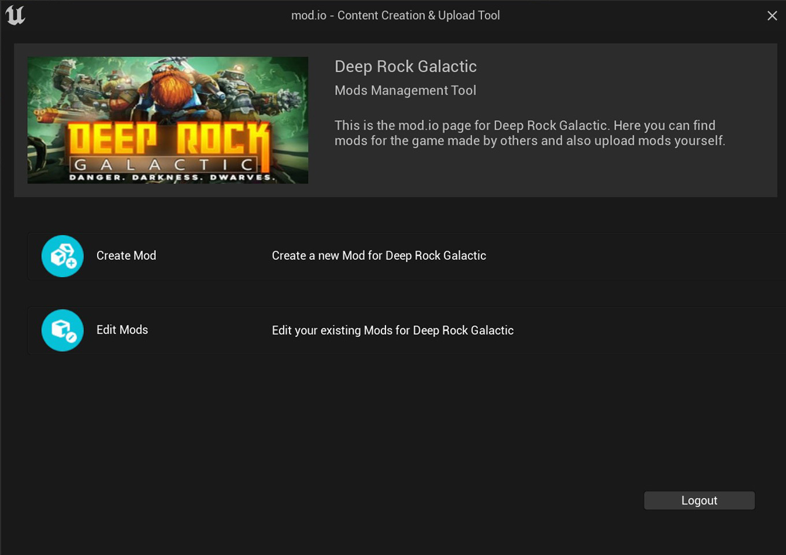
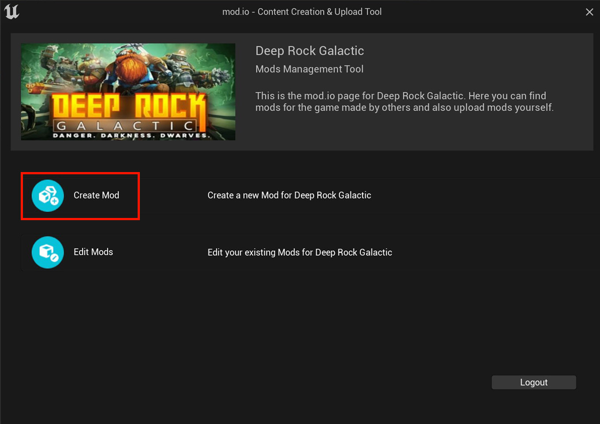
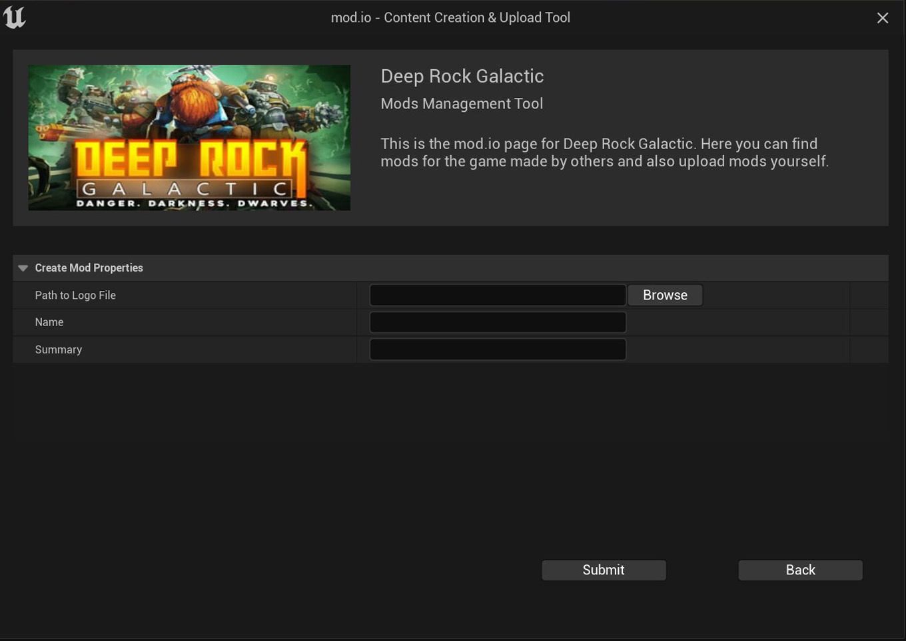
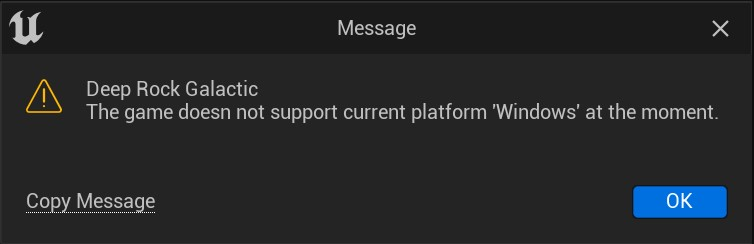
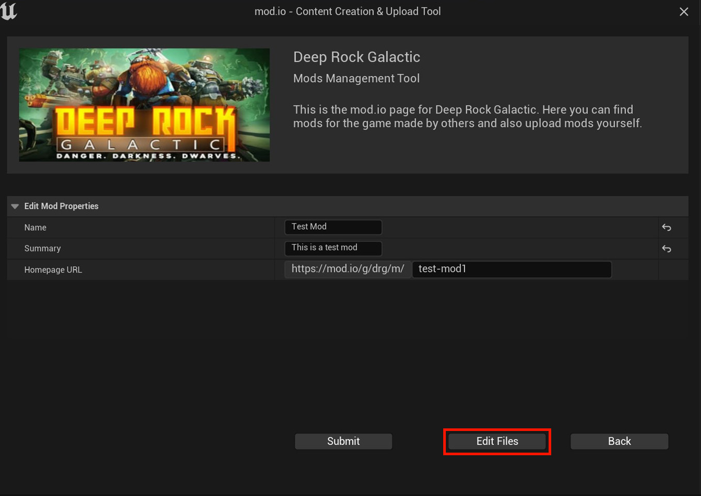
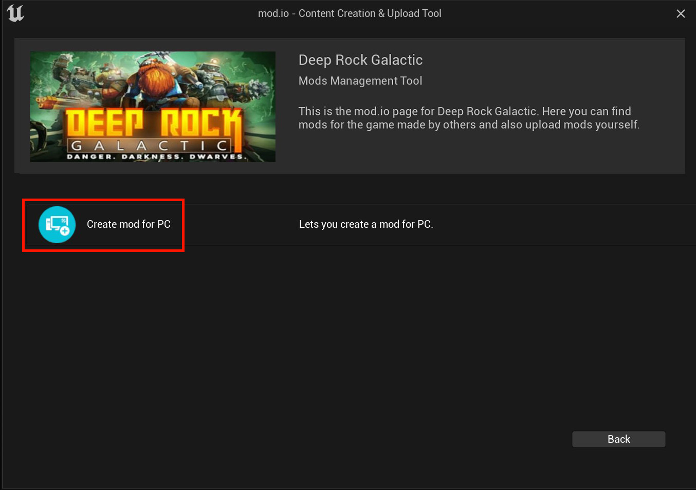
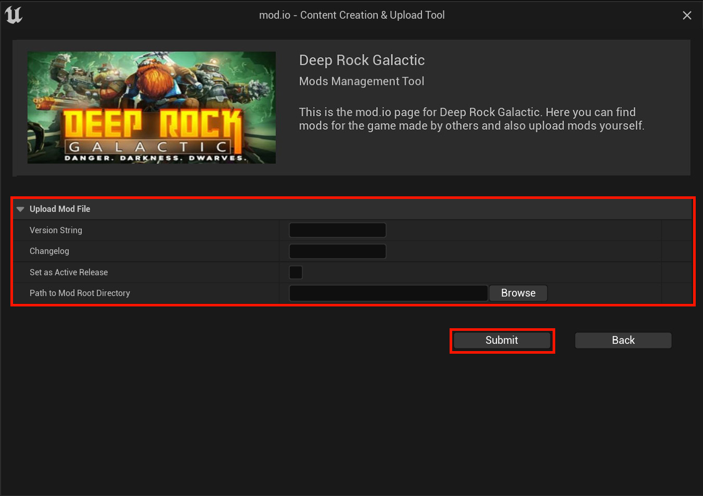

== mod.io - CONTENT CREATION & UPLOAD TOOL
The mod.io Unreal Engine's plugin includes an editor module which provides an embedded mod.io - Content Creation and Upload Tool.

=== *EDITOR-SPECIFIC PLUGIN MODULE*
[.stretch,stripes=odd,frame=none, cols="25%,~,"]
|===
|*Module Name*|*Description*|*Module Type*
|ModioEditor|Editor details customization and asset factories for UE content creation and upload tool classes|Editor
|===
This modules is mandatory for studios to know how contents are created and uploaded right from the editor without the need to go to the official website.

=== *STEP 1: HOW TO OPEN THE TOOL*
Click the mod.io icon in Unreal Engine to show a drop down menu, click the *Create & Upload* menu. Once opened, it may require mod.io authentication as below.

image::img/Tool/how_to_open_tool.jpg[]

=== *STEP 2: AUTHENTICATION IS REQUIRED*

Authentication may be required either being a first time user of the module or not logged in previously. If you are already logged in, you will automatically be redirected to *STEP 3*.

=== *Authentication*

The user will be authenticated if not already logged in to mod.io account.

*Email:*
Enter your email in the text box shown below and click *Login*, a verification code will be sent to the submitted email address.

image::img/Tool/auth_enter_email.jpg[]

=== *Verification Code*

*Verification Code:* Enter the code received in your email and click *Authenticate*.

image::img/Tool/auth_enter_code.jpg[]

If everything goes correctly, you will be authenticated successfully.

=== *STEP 3: CREATE OR UPLOAD MOD*
After successfull authentication, you can either *Create Mod* or *Edit Mods*.

=== *Create Mod*

*Create Mod* lets you create a new mod.

=== *Edit Mods*

*Edit Mods* lets you edit existing mods and change any specific values or mod files on them.

image::img/Tool/edit_mods.jpg[]

=== *STEP 4: CREATE A MOD*
Creating a mod is made easy directly from within Unreal Engine described in the
process below.

=== *Create Mod*

Click *Create Mod* and fill the following required fields:
|===
|*Create Mod Properties*
|===
|===
|Fields |Description

|Path to Logo File
|Browse to select your *.png* file for logo

|Name
|Name of the mod

|Summary
|A brief summary of the mod
|===

Once filled all the required fields, click *Submit* to create the mod.

image::img/Tool/create_mod_properties_submit.jpg[]

TIP: You may get an error dialog if the game doesn't support your platform or the game is locked.

image::img/Tool/error_game_locked.jpg[]

Once everything goes successful you will be asked  if you also want to upload a mod file right away. 

image::img/Tool/mod_created_modfile_prompt.jpg[]

If *Yes* is selected you will be redirected to *STEP 6*.

=== *STEP 5: EDIT EXISTING MODS*
Editing existing mods is made easy in the same way as creating a mod directly from within Unreal Engine described in the process below.

=== *Edit Mods*

By clicking *Edit Mods*, a list of mods will be shown to edit. You can select a mod by clicking on it.
|===
|*Browse Mods*
|===

|===
|Name |Description

|Your mod name
|Your mod description
|===

image::img/Tool/browse_mods.jpg[]

Once a mod is selected, click *Edit Mod* to edit the mod.

image::img/Tool/browse_mods_edit_mods.jpg[]

|===
|*Edit Mod Properties*
|===

|===
|Field |Description

|Name
|Your mod name

|Summary
|Your mod summary

|Homepage URL
|Your mod homepage url
|===

image::img/Tool/edit_mod_properties.jpg[]

If you want to change the mod properties, make desirable changes to above fields and click *Submit*. 

image::img/Tool/edit_mod_properties_submit.jpg[]

Then click *Edit Files* to see list of existing mod files.

|===
|*Modfile*
|===

|===
|Name |Platform|Version|Status

|Your mod file name
|Your mod platform
|Your mod file version
|Your mod file status
|===

image::img/Tool/browse_modfile.jpg[]

=== *STEP 6: UPLOADING A NEW MOD FILE*
To upload a mod file, a workspace directory path is mandatory which is described in the process below.

Click *New Modfile* 

image::img/Tool/browse_modfile_new_modfile.jpg[]

You may need to select *Create mod for PC*

Fill the required fields:

TIP: You may get an error dialog if the game doesn't support your platform or the game is locked.

|===
|*Upload Mod File*
|===
|===
|Field |Description

|Version
|Your mod file version

|Changelog
|Your mod file changelog

|Set as Active Release
|Whether to set as Active Release

|Path to Mod Root Directory
|Path to the workspace directory
|===

image::img/Tool/upload_modfile.jpg[]

Once all fields are filled out, click *Submit*

Once submitted, the progress bar will be displayed about the workspace directory being zipped and uploaded with all other information provided for the new mod file.

image::img/Tool/upload_modfile_submit_status.jpg[]

=== *MOD FILE UPLOADED SUCCESSFULLY*
TIP: You may get an error dialog if the game doesn't support your platform or the game is locked or any error that occurs due to internet or any other circumstances.

image::img/Tool/modfile_successfully_uploaded.jpg[]
