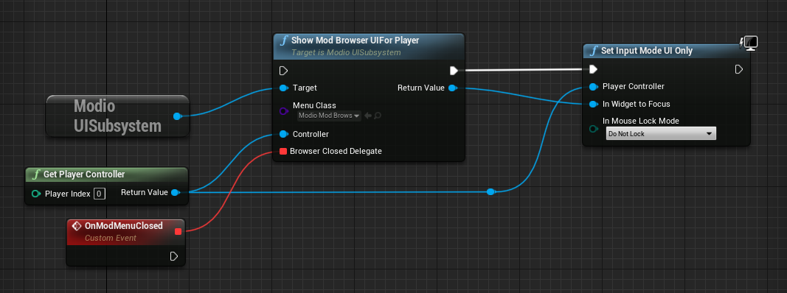
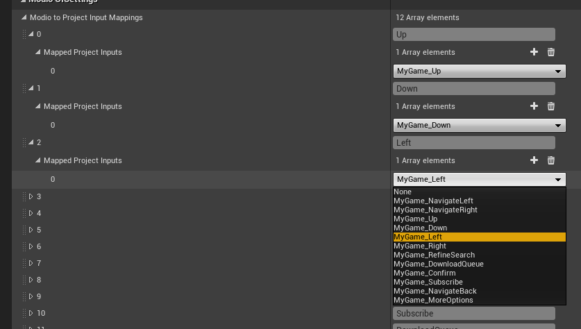
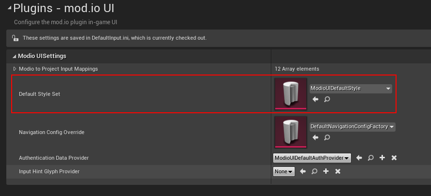
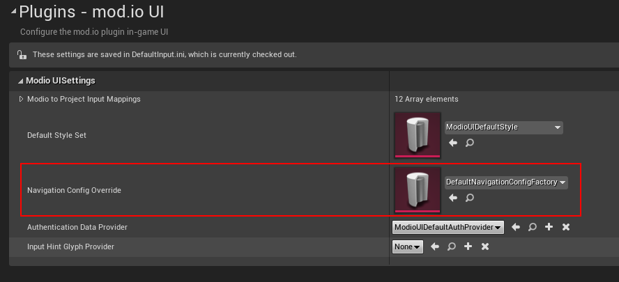
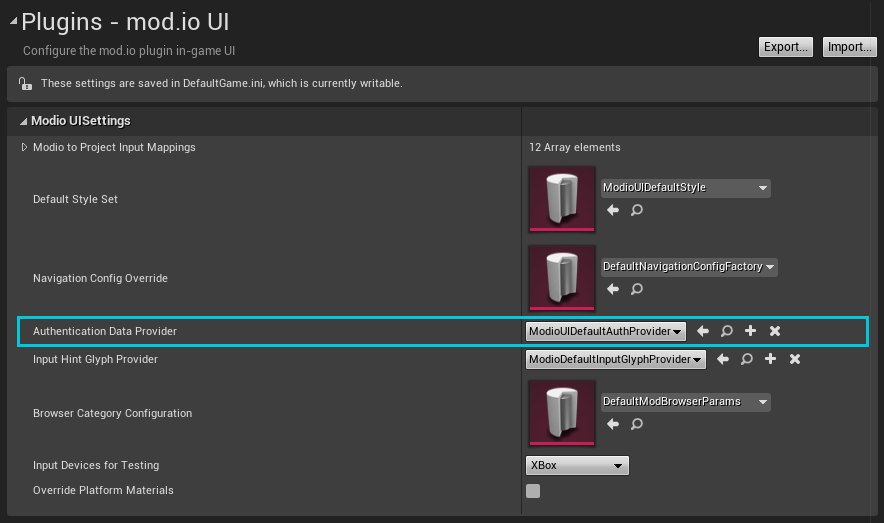
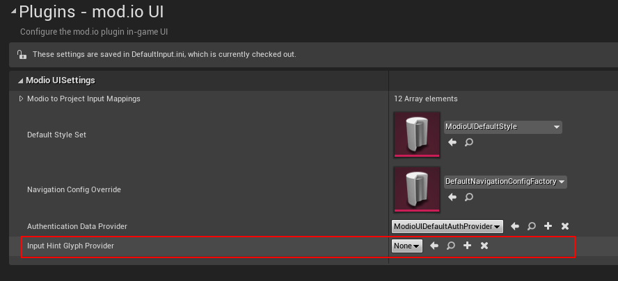
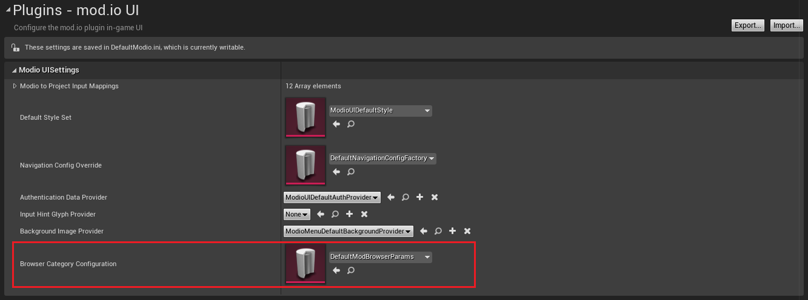
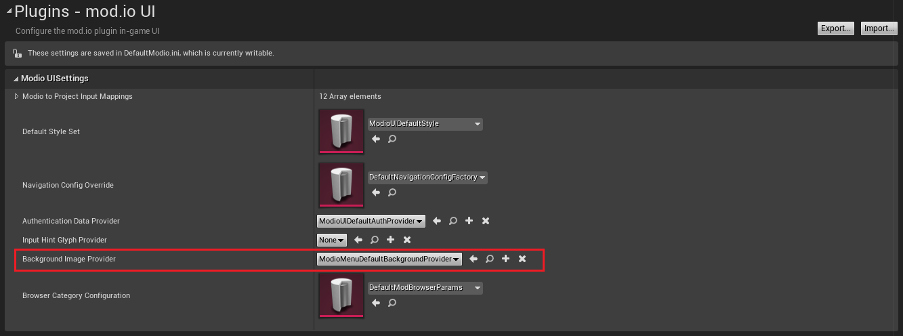
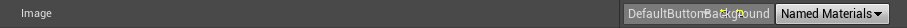
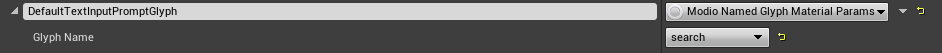

== mod.io Mod Browser UI

=== UI-Specific Plugin Modules

The mod.io UE Plugin also includes a series of additional modules which provide an embedded mod browser and manager you can include in your own game.

[.stretch,stripes=odd,frame=none, cols="25%,~,"]
|===
|Module Name|Description|Module Type

|ModioUI|Core UI module containing all Slate and UMG widgets for the UI|Runtime
|ModioUIEditor|Editor details customization and asset factories for UI classes|Editor
|MSDFSupport|Module containing material expression for rendering MSDF textures as pseudo-vectors|Runtime
|MSDFSupportEditor|Importer for SVGs that will convert them to MSDF textures the UI can render|Editor
|===

These modules are optional - you can remove them, the UI folder in the Plugin Content directory, and the associated entries in the modio.uplugin file, and the core functionality from the Modio module will remain available in your project.

=== Displaying the Mod Browser

The main Mod Browser widget is located at /Modio/UI/Browser/Views/ModioModBrowserWidget.ModioModBrowserWidget. Once the Plugin has been initialized, you can show the Mod Browser via a new UI-focused subsystem, `UModioUISubsystem`.
Currently the mod browser does not support being embedded inside your own UI hierarchy, so you must load it directly (for instance, from a button on your main menu).

.Blueprint Example
[%collapsible]
====

From Blueprint, you can use the <<ShowModBrowserUIForPlayer>> node.

====

.C++ Example
[%collapsible]
====

[source,c++, subs="+macros"]
----
// After you've called <<K2_InitializeAsync>> and the plugin is initialized successfully:

if (UModioUISubsystem* Subsystem = GEngine->GetEngineSubsystem<UModioUISubsystem>())
{
    if (UWorld* CurrentWorld = GetWorld())
    {
        if (APlayerController* PC = CurrentWorld->GetFirstPlayerController())
        {
            // Create and bind a delegate to be invoked when the browser is closed
            FOnModBrowserClosed BrowserClosedDelegate;
            // OnModBrowserClosed needs to be marked UFUNCTION()
            BrowserClosedDelegate.BindDynamic(this, &ASomeActor::OnModBrowserClosed);

            // Get a reference to the mod browser implementation (this will be exposed in the UI Settings object
            // in a future release)
            FSoftClassPath MenuClassReference =
                "/modio/UI/Browser/Views/ModioModBrowserWidget.ModioModBrowserWidget_C";
            UClass* ReferencedClass = MenuClassReference.ResolveClass();
            if (ReferencedClass)
            {
                // Request the browser widget be instantiated and displayed
                UModioMenu* MenuWidget =
                    Subsystem->ShowModBrowserUIForPlayer(ReferencedClass, PC, BrowserClosedDelegate);
                if (MenuWidget)
                {
                    // Focus the user on the browser
                    UWidgetBlueprintLibrary::SetInputMode_UIOnlyEx(PC, MenuWidget);
                }
            }
        }
    }
}
----
====

=== Configuration

The mod.io Mod Browser will utilise the configuration that you provided on the mod.io Plugin Settings page referenced above; however, there are a number of additional UI-specific settings you will need to update to match your project's requirements. These are all accessible on the `mod.io UI` settings page in your project settings.

==== Input Mappings

The mod.io Mod Browser requires you to map your project's input actions and axes to the virtual keys we use internally, so that the UI automatically respects your bindings, as well as any rebinding functionality you support.

To configure these mappings, expand the `Modio to Project Input Mappings` section. For each of our virtual keys, map at least one, but optionally more, Input Actions or Axes from your project. The UI will resolve any keypresses it receives, against the actions and axes you specify, to respond to user input. 

==== UI StyleSet

The mod.io Mod Browser uses the asset specified here to define 

* Global Color palette for the UI
* Styles for each of the default widget implementations
* Named pseudo-vector glyphs for symbols used in the UI
* Default input glyphs for input hints

NOTE: It is currently not recommended to alter this variable to point to a new style sheet, but simply alter the existing one to meet your needs. Stylesheets are currently binary assets with a lot of internal cross-references (to allow multiple styles to share a single named material for a brush, for instance) and there's substantial improvements coming with this system.

==== NavigationConfig Factory

Unreal uses a NavigationConfig object to specify configuration information regarding tab navigation, digital versus analog directional navigation, and translation between keypresses and navigation actions or directions.

The mod.io Mod Browser allows you to specify a UModioNavigationConfigFactoryBase-derived class here, which will return an instance of a native FNavigationConfig object (or subclass) which can override the default behaviour for performing these tasks. 

NOTE: The FNavigationConfig class is a native-only class, so you will need to implement your overriding class in C++ if you wish to provide an alternative factory class, as we cannot return instances of FNavigationConfig directly from Blueprint functions.

==== Authentication Data Provider

mod.io supports a number of authentication providers, including email authentication, Steam, XBox Live, and so on.

To tell the UI which authentication methods you wish to support, create a new class that implements `IModioUIAuthenticationDataProvider` and overrides the following functions:

* GetAuthenticationTypes(Blueprint)/NativeGetAuthenticationTypes(C++)
+ 
This function provides an array of FModioUIAuthenticationProviderInfo objects. Each object contains a field for you to specify an authentication method you want to support, and localized text to display for that authentication method in the UI.

* ShouldOfferEmailAuthentication(Blueprint)/NativeShouldOfferEmailAuthentication(C++)
+
This function returns a boolean indicating if the UI should offer email authentication as an option in the authentication dialog.
+
NOTE: If you either don't specify an authentication data provider, or your data provider returns an empty list of authentication methods, then email authentication will be offered as a fallback.

* GetAuthenticationParams(Blueprint)/NativeGetAuthenticationParams(C++)
+
This function is invoked by the mod.io UI with an `EModioAuthenticationProvider` enum value (based on the set that you returned in `GetAuthenticationTypes`) in order for you to populate it with the appropriate data. Perform whatever platform specific calls you need to make in order to retrieve the relevant authentication token, populate a `FModioAuthenticationParams` object, and return it. 

==== Input Hint Glyph Provider

The mod.io Mod Browser supports remapping inputs within your project, as mentioned above. Classes implementing `IModioUIInputHintGlyphProvider` allow the UI to query your project for a specific material displaying an input hint.

* GetInputGlyphMaterialForInputType(Blueprint)/NativeGetInputGlyphMaterialForInputType(C++)
+
This function will be invoked by the UI to offer your project a chance to return a specific material for a particular combination of virtual input and input device. Return `nullptr` from this function to fallback to the default implementation, which uses glyphs specified in the default style sheet. 

==== Featured Rows & Categories

The mod.io Mod Browser allows you to customize the Featured row and secondary category rows with custom search criteria suitable for your game. By default, the browser uses the `Modio/UI/Browser/DefaultModBrowserParams` object, which you are free to modify to suit your needs. However, you can also create your own by creating a Data Asset inheriting from ModioModBrowserParams, and specifying that object as the `BrowserCategoryConfiguration` in the mod.io UI Settings.

By default, the browser contains a single Featured Mods row (based off daily downloads), and additional rows of Highest Rated, Most Popular, Most Subscribers, Recently Added and Recently Updated.

==== Background Customization

The mod.io Mod Browser supports a custom background or removal of a background altogether. Classes implementing `IModioMenuBackgroundProvider` allow the UI to query your project for a specific material to be used for the background. This is configurable in the mod.io UI Settings.

=== Styling and Customization

==== Color, Material, Style References

Palettized Colors, Materials and Widget Styles use special FName-based references so that visual elements of the UI can 'pull' information from the central Style Sheet asset at runtime.
These references are visible in the Editor and use Details Customizations so that you can select from a dropdown list of valid elements to reference.

* FModioUIStyleRef 
+
image::img/plugin_ui_styleref.png[]
This struct creates a reference to a specific named widget style defined in the `Widget Styles` property on the Style Sheet. Metadata on the UPROPERTY declaration in C++ is used to specify which specific type of Widget Style can be referenced.
* FModioUIMaterialRef
+

This struct creates a reference to a specific named material from the `Named Brush Materials` property on the style sheet, and is primarily intended to allow for procedural material instances to be shared between multiple Brushes.
* FModioUIColorRef
+
image::img/plugin_ui_colorref.png[]
This struct references a specific named color from the `Color Presets` table in the style sheet.

==== Customizing Colors

Widgets in the Mod Browser reference a centrally defined color palette in the style sheet. You can alter these colors by changing entries in the 'Color Presets' list there.

NOTE: Changing the names of the existing colors will break references in widgets. You can, however, add additional colors to the palette and reference them in widgets or styles.

Referencing a palette entry in a widget style is simple - just click the 'Color Presets' dropdown and select the new palette entry you wish to reference.

==== Customizing Materials

The Mod Browser style sheet maintains a list of named materials and named material instance parameters that can be referenced by name in styles and therefore easily shared between multiple widgets. 
The parameters for a named material are exposed in the `Named Brush Materials` property. There's currently 3 different types of parameters that can be specified:

* Specified Material Params
+
image::img/plugin_ui_specifiedmaterial.png[]
This parameter simply references a material from the project - it's basically just a wrapper to allow us to easily refer to the material by a centralised FName key.
* Rounded Rectangle Material Params
+
image::img/plugin_ui_roundedrectmaterial.png[]
This parameter set specifies a dynamic material instance of the 'RoundedRectangle' named material. It sets the included parameters on the new material instance.
* Named Glyph Material Params
+ 

This parameter set specifies a dynamic material instance of the DefaultGlyphMaterial which displays the specific named SDF glyph or icon.

==== Customizing Styles

image::img/plugin_ui_editstyle.png[]

To create a new widget style, add a new entry to the `Widget Styles` map and select the type of style you wish to create, then populate the values as required.

To customize a widget style, simply expand its entry in the `Widget Styles` map and make changes as you see fit.

=== Known Issues

The mod.io Mod Browser is currently considered a beta release and therefore is shipping with several known issues.

* Unreal Engine 5 is not officially supported, therefore there may be some display or functionality issues related to the mod browser.
* Gamepad navigation is only partially implemented and not yet officially supported. There is a limited set of controller functionality available.
* When using a gamepad, some input hint glyphs may not be available.
* Input hint glyphs are not available when keyboard input is used.
* Logos and images for mods are displayed at a lower resolution (1280x720 images are not yet supported by the plugin)
* Offline mode is not supported. If there are connectivity issues to the mod.io API then the UI behavior is currently undefined.
* The "Search and Filter" tag list may not display a scrollbar with a large list of tags.
* Audio for UI interaction is currently not supported.
* When making style set or configuration changes inside of the editor, some options may not be re-loaded correctly, and therefore stale state inside of PIE may be possible.
* Changing users by logging out and logging back in as a new user may result in some inconsistent UI state related to mod collections. This does not occur after restarting.
* Transparent PNGs retrieved for mod galleries, logos etc may not display correctly
* Colors directly referenced in Materials or Material Instances that exist as project assets (rather than being generated on-the-fly as a Named Brush Material) currently require manual updates if you change the color palette.
