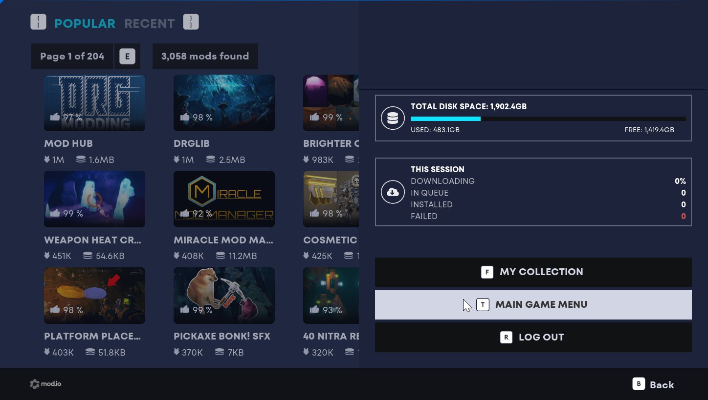
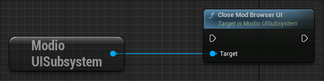

== mod.io Mod Browser UI

=== UI-Specific Plugin Modules

The mod.io UE Plugin also includes a series of additional modules which provide an embedded mod browser and manager you can include in your own game.

[.stretch,stripes=odd,frame=none, cols="25%,~,"]
|===
|Module Name|Description|Module Type
|ModioUI|UI module containing all Slate and UMG widgets for the UE5 Common UI|Runtime
|ModioUICore|Core UI module containing all shared entities for UE5 UIs|Runtime
|ModioUIEditor|Editor details customization and asset factories for UE5 UI classes|Editor
|MSDFSupport|Module containing material expression for rendering MSDF textures as pseudo-vectors|Runtime
|MSDFSupportEditor|Importer for SVGs that will convert them to MSDF textures the UI can render|Editor
|===

These modules are optional - you can remove them, the UI folder in the Plugin Content directory, and the associated entries in the modio.uplugin file, and the core functionality from the Modio module will remain available in your project.

=== Displaying the Mod Browser

The main Mod Browser widget is located at `Modio/Content/UI5/Default/Widgets/ModBrowser/W_ModioCommonModBrowser`. After the Plugin has been initialized, you can show the Mod Browser via a new UI-focused subsystem `UModioUISubsystem` using the function `ShowModBrowserUIForPlayer()`.
Currently the mod browser does not support being embedded inside your own UI hierarchy, so you must load it directly (for instance, from a button on your main menu).

NOTE: When showing the Mod Browser UI, you can pass in a `FOnModBrowserCloseRequested` delegate. You can use this delegate first to check conditions before finally closing the browser, more details below in <<Closing the Mod Browser>>.

.Blueprint Example
[%collapsible]
====

From Blueprint, you can use the <<ShowModBrowserUIForPlayer>> node.

image::img/plugin_ui_showforplayer.png[]

====

.C++ Example
[%collapsible]
====

[source,c++, subs="+macros"]
----
// After you've called <<K2_InitializeAsync>> and the plugin is initialized successfully:

if (UModioUISubsystem* Subsystem = GEngine->GetEngineSubsystem<UModioUISubsystem>())
{
    if (UWorld* CurrentWorld = GetWorld())
    {
        if (APlayerController* PC = CurrentWorld->GetFirstPlayerController())
        {
            // Create and bind a delegate to be invoked when the browser is closed
            FOnModBrowserCloseRequested OnBrowserCloseRequestedDelegate;
            // OnModBrowserCloseRequested needs to be marked UFUNCTION()
            OnBrowserCloseRequestedDelegate.BindDynamic(this, &ASomeActor::OnModBrowserCloseRequested);

            // Get a reference to the mod browser implementation (this will be exposed in the UI Settings object
            // in a future release)
            FSoftClassPath MenuClassReference =
                "/modio/UI/Browser/Views/ModioModBrowserWidget.ModioModBrowserWidget_C";
            UClass* ReferencedClass = MenuClassReference.ResolveClass();
            if (ReferencedClass)
            {
                // Request the browser widget be instantiated and displayed
                UModioMenu* MenuWidget =
                    Subsystem->ShowModBrowserUIForPlayer(ReferencedClass, PC, OnBrowserCloseRequestedDelegate);
                if (MenuWidget)
                {
                    // Focus the user on the browser
                    UWidgetBlueprintLibrary::SetInputMode_UIOnlyEx(PC, MenuWidget);
                }
            }
        }
    }
}
----
====

=== Closing the Mod Browser

The Mod Browser can currently be closed from within the Quick Access tab - accessed by via the user profile icon at the top right of the window - and clicking on the 'Main Game Menu' button. 
This widget is located at `/Modio/Content/UI5/Default/Widgets/QuickAccess/W_ModioCommonQuickAccessTabView`, containing a `MainGameMenuButton` button, the input action for which can be customized in:

`Project Settings -> Modio Common UI Settings -> QuickAccess -> Quick Access Params -> MainGameMenuInputAction`

NOTE: As mentioned in the <<Displaying the Mod Browser>> section a `FOnModBrowserCloseRequested` delegate is passed in, which is what is being called by the back button above.

The Mod Browser can be closed by calling `CloseModBrowserUI()` on the ModioUISubsystem, or conditionally after receiving the `FOnModBrowserCloseRequested` delegate callback.

.Blueprint Example
[%collapsible]
====

From Blueprint, you can use the <<CloseModBrowserUI>> node to manually close the mod browser.

Or to perform the same logic being done with the back button, use <<ExecuteOnModBrowserCloseRequestedDelegate>> and then handle that callback to finally close the UI as above.

image::img/plugin_ui_closemodbrowser_2.png[]

====

.C++ Example
[%collapsible]
====

[source,c++, subs="+macros"]
----
if (UModioUISubsystem* Subsystem = GEngine->GetEngineSubsystem<UModioUISubsystem>())
{
    Subsystem->CloseModBrowserUI();
}
----

Or to perform the same logic being done with the back button, use <<ExecuteOnModBrowserCloseRequestedDelegate>> and then handle that callback to finally close the UI as above.

[source,c++, subs="+macros"]
----
if (UModioUISubsystem* Subsystem = GEngine->GetEngineSubsystem<UModioUISubsystem>())
{
    Subsystem->ExecuteOnModBrowserCloseRequestedDelegate();
}
----
====

include::ui5-documentation.adoc[]