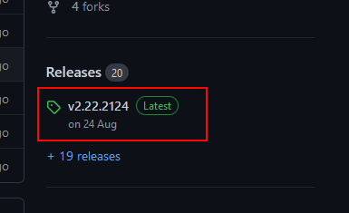
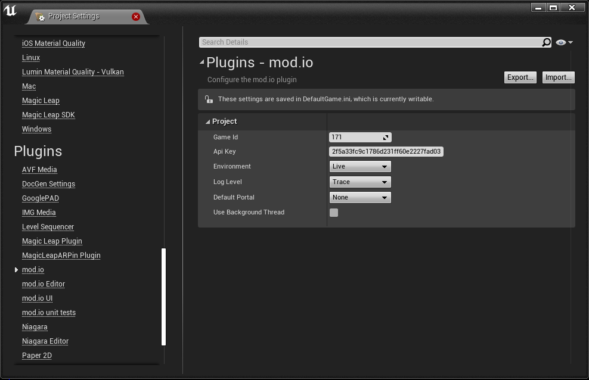

++++

++++
# mod.io Unreal Engine Plugin

image:https://img.shields.io/badge/license-MIT-brightgreen.svg[alt="License", link="https://github.com/modio/modio-sdk/blob/master/LICENSE"]
image:https://img.shields.io/discord/389039439487434752.svg?label=Discord&logo=discord&color=7289DA&labelColor=2C2F33[alt="Discord", link="https://discord.mod.io"]
image:https://img.shields.io/badge/docs-master-green.svg[alt="Master Docs", link="https://go.mod.io/ue-docs"]
image:https://img.shields.io/badge/Unreal-4.26%2B-dea309[alt="Unreal Engine", link="https://www.unrealengine.com"]

Welcome to the mod.io Unreal Engine plugin repository. It allows game developers to host and automatically install user-created mods in their games which use *UE 4.26*, *UE 5.0* or newer. It provides a UI for mod discovery, installation and collection management, and a C++ and Blueprint interface around the mod.io SDK, which connects to the https://docs.mod.io[mod.io REST API]. We have a https://test.mod.io[test environment] available, and developers can create a game profile there to evaluate the plugin with. 

++++
<!--- 

 --->
++++

## Platform Support

|===
|Platform       | UE4.26 | UE4.27 | UE5.0 | UE5.1 | UE 5.2 |
|Windows        | ✔ | ✔ | ✔ | ✔ |  ✔ | 
|Windows (GDK)  | - | ✔ | ✔ | ✔ | ✔ | <<contact-us,(Contact Us)>>
|XBox (GDK)     | - | ✔ | ✔ | ✔ | ✔ | <<contact-us,(Contact Us)>>
|PlayStation 4  | - | ✔ | ✔ | ✔ | ✔ | <<contact-us,(Contact Us)>>
|PlayStation 5  | - | ✔ | ✔ | ✔ | ✔ | <<contact-us,(Contact Us)>>
|Nintendo Switch| - | ✔ | ✔ | ✔ | ✔ | <<contact-us,(Contact Us)>>
|Linux          | ✔ | ✔ | ✔ | ✔ | ✔ |
|macOS          | ✔ | ✔ | ✔ | ✔ | ✔ |
|===

## Features

* C++ and Blueprint support
* Permissive MIT/BSL-license
* Async delegate-based interface
* Non-blocking IO
* Automatic downloads and updates
* Email / Steam / EGS / Consoles / Custom SSO authentication
* Mod Browsing / Filtering

== Installation

=== Adding plugin files to your project
==== As a git submodule

. Add this repository as a submodule to your repository in your project's `Plugins/Modio` directory
+
In the directory with your .uproject file: `git submodule add https://github.com/modio/modio-ue Plugins/Modio`
. Initialize our submodules with `git submodule update --init --recursive`

==== In a non-git project, or without submodules

. Grab the latest release zip from the Releases section on this page, and extract the contents to your project's `Plugins/Modio` directory

 image:Doc/img/get_latest_release2.png[]

NOTE: The automatically generated zips in on the release page, or the 'Code' dropdown here, will not work! They do not contain our submodule dependencies. 

=== Enabling the plugin

Start the editor, then enable the plugin in the Unreal Engine settings:

image::Doc/img/plugin_window.png[]

Once this is done, you can configure the plugin and get started.

=== Plugin Configuration

The plugin requires some configuration information to behave correctly. You can access the configuration settings in the Project Settings window:

The settings have the following parameters:

[.stretch,stripes=odd,frame=none, cols="25%,~"]
|===
|[.paramname]#Game Id#|Your mod.io-provided Game Id for the target environment (Live, or Test)
|[.paramname]#API Key#|Your mod.io-provided API key for the target environment (Live, or Test)
|[.paramname]#Environment#|Your current environment, Live or Test (check difference below)
|[.paramname]#Log Level#|The default logging level to use. Messages with a lower log level will be silently discarded.
|[.paramname]#Portal#|The default portal to use. This usually corresponds to the store your game will be being distributed through.
|===

==== Endpoint Environment

The mod.io plugin can connect to different endpoint environments depending on the development stage your game is in. The 'test' environment is intended for use by developers while they perform initial integration of mod.io into their title.

Before release, you will be able to setup a "hidden" Live environment that will allow you to perform QA against the production environment before release, without exposing your title to the public. At this stage, only selected accounts are able to see your game page, and mods that are uploaded for your title. Once you are ready, you can change the state from "hidden" to "public" to make a full release of your game's modding capabilities.

In summary, here are the three steps:

* Test Environment: Used for integration between your game and mod.io
* Live Environment, Hidden: Used for quality assurance and pre-release mods
* Live Environment, Public: It is open for everyone to see.

== Setting up the Browser UI
If you do not wish to create your own UI implementation you can use our default UI that comes built in to the plugin.

* For UE 4, examples of how the UI looks are provided below, which can be themed by changing the colors.
* For UE 5, a modular UI framework using Common UI is currently being developed.

image::Doc/img/promo-plugin-ui.png[]

image::Doc/img/promo-plugin-ui-collection.png[]

== Further reading

To begin using the Plugin, either from Blueprint or from C++, please read our https://go.mod.io/ue-docs[Getting Started Guide] for a detailed explanation of initialization and usage.

* https://go.mod.io/ue-docs#_plugin_quick_start_initialization_and_teardown[SDK initialization and event loop]
* https://go.mod.io/ue-docs#_plugin_quick_start_user_authentication[Authentication]
* https://go.mod.io/ue-docs#_plugin_quick_start_browsing_available_mods[Mod Browsing]
* https://go.mod.io/ue-docs#_plugin_quick_start_mod_subscriptions_and_management[Mod Subscription Management]

=== User Interface

The plugin ships with a fully functional UI, featuring mod browsing, searching and collection management. If you want to use the UI in the game, you can read the link:Doc/ui-documentation.adoc[UI Documentation]

=== Profiling

The mod.io SDK ships with some profiling features that are integrated into Unreal's stat commands. You can read more about enabling profiling link:Doc/profiling.adoc[here].

=== Sample Projects

A UE4.26 and UE4.27-compatible sample is available at link:https://go.mod.io/ue-samples[this location].

For UE5.0 and 5.1, you can find a sample project at link:https://go.mod.io/ue5-sample[this location].

== Game studios and Publishers [[contact-us]]

If you need assistance with 1st party approvals, or require a private, white-label UGC solution. mailto:developers@mod.io[Contact us] to discuss.

== Contributions Welcome

Our Unreal Engine plugin is public and open source. Game developers are welcome to utilize it directly, to add support for mods in their games, or fork it for their games customized use. Want to make changes to our plugin? Submit a pull request with your recommended changes to be reviewed.

== Other Repositories

Our aim with https://mod.io[mod.io], is to provide an https://docs.mod.io[open modding API]. You are welcome to https://github.com/modio[view, fork and contribute to our other codebases] in use.

