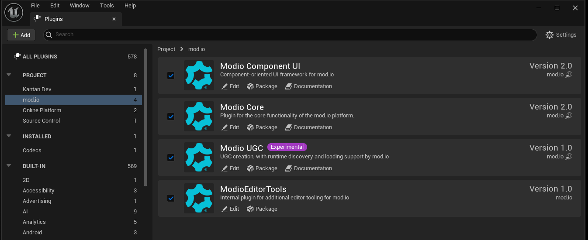
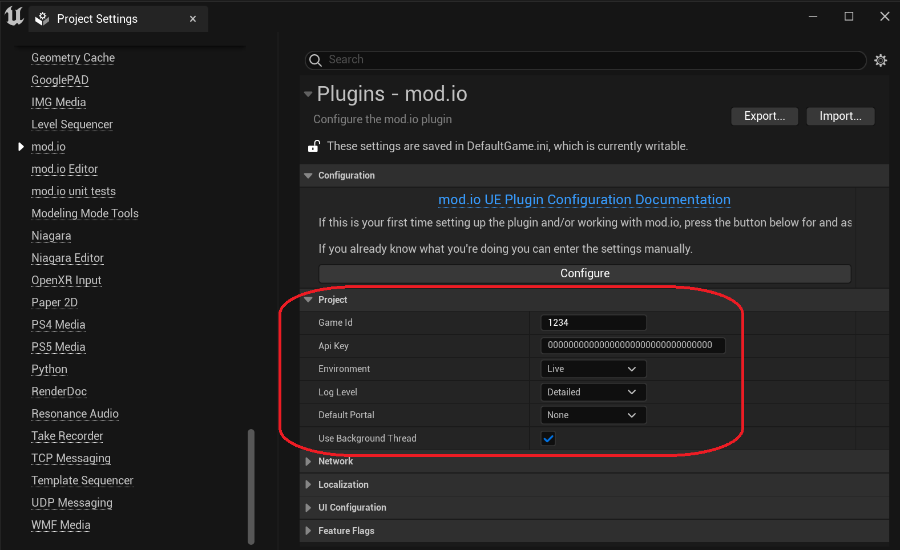

++++

++++
# mod.io Unreal Engine Plugin

image:https://img.shields.io/badge/license-MIT-brightgreen.svg[alt="License", link="https://github.com/modio/modio-sdk/blob/master/LICENSE"]
image:https://img.shields.io/discord/389039439487434752.svg?label=Discord&logo=discord&color=7289DA&labelColor=2C2F33[alt="Discord", link="https://discord.mod.io"]
image:https://img.shields.io/badge/Unreal-4.26%2B-dea309[alt="Unreal", link="https://www.unrealengine.com"]

Welcome to the mod.io Unreal Engine Plugin public repository. It allows game developers to host and automatically install user-created mods in their games which use UE 4.26 or newer. It provides a C++ and Blueprint interface around the mod.io SDK, which connects to the https://docs.mod.io[mod.io REST API]. We have a https://test.mod.io[test environment] available, and developers can create a game profile there to evaluate the plugin with. 

++++
<!--- 

 --->
++++

## Features

* C++ and Blueprint support
* Permissive MIT/BSL-license
* Async delegate-based interface
* Non-blocking IO
* Automatic downloads and updates
* Email / Steam / GoG authentication
* Mod Browsing / Filtering

== Installation

=== Adding plugin files to your project
==== As a git submodule

. Add this repository as a submodule to your repository in your project's `Plugins/Modio` directory
+
In the directory with your .uproject file: `git submodule add https://github.com/modio/modio-ue4 Plugins/Modio`
. Initialize our submodules with `git submodule update --init --recursive`

==== In a non-git project, or without submodules

. Grab the latest release zip from this page, and extract the contents to your project's `Plugins/Modio` directory

=== Enabling the plugin

Start the editor, then enable the plugin in the Unreal Engine settings:

Once this is done, you can configure the plugin and get started.

=== Plugin Configuration

The plugin requires some configuration information to behave correctly. You can access the configuration settings in the Project Settings window:

The settings have the following parameters:

[.stretch,stripes=odd,frame=none, cols="25%,~"]
|===
|[.paramname]#Game Id#|Your mod.io-provided Game Id for the target environment (Live, or Test)
|[.paramname]#API Key#|Your mod.io-provided API key for the target environment (Live, or Test)
|[.paramname]#Environment#|Are you targeting the production/live environment or the private/test environment?
|[.paramname]#Log Level#|The default logging level to use. Messages with a lower log level will be silently discarded.
|[.paramname]#Portal#|The default portal to use. This usually corresponds to the store your game will be being distributed through.

|===

== Further reading

To begin using the Plugin, either from Blueprint or from C++, please read our link:Doc/getting-started.adoc[Getting Started Guide] for a detailed explanation of initialization and usage.

* link:Doc/getting-started.adoc#plugin-quick-start-initialization-and-teardown[SDK initialization and event loop]
* link:Doc/getting-started.adoc#plugin-quick-start-user-authentication[Authentication]
* link:Doc/getting-started.adoc#plugin-quick-start-browsing-available-mods[Mod Browsing]
* link:Doc/getting-started.adoc#plugin-quick-start-mod-subscriptions-and-management[Mod Subscription Management]

== Large studios and Publishers
A private white label option is available to license, if you want a fully featured mod-platform that you can control and host in-house. mailto:developers@mod.io[Contact us,Whitelabel Inquiry] to discuss.

== Contributions Welcome
Our SDK is public and open source. Game developers are welcome to utilize it directly, to add support for mods in their games, or fork it for their games customized use. Want to make changes to the SDK? Submit a pull request with your recommended changes to be reviewed.

== Other Repositories
Our aim with https://mod.io[mod.io], is to provide an https://docs.mod.io[open modding API]. You are welcome to https://github.com/modio[view, fork and contribute to our other codebases] in use.
